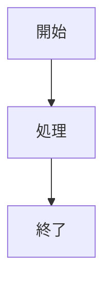

# 機能設計書

## 1. 概要

<!-- 対象機能の目的と位置づけ。関連する要件定義書の機能ID(F-xx)を書く -->

| 項目 | 内容 |
|---|---|
| 対象機能 | |
| 関連要件 | F-xx |
| 利用者 | |

## 2. 機能仕様

<!-- 機能を構成する項目ごとに、入力・処理・出力を表にする -->

| ID | 機能 | 概要 | 入力 | 出力 | 備考 |
|---|---|---|---|---|---|
| FD-01 | | | | | |

## 3. 画面設計

<!-- 画面ごとに、目的・表示項目・操作・遷移先を書く。画面がない機能は「対象外」と書く -->

### 画面一覧

| 画面 | 目的 | 主な表示項目 | 主な操作 | 遷移先 |
|---|---|---|---|---|
| | | | | |

## 4. 処理フロー

<!-- 主要な処理の流れ。Mermaid の図で書いてよい -->

## 5. データ設計

<!-- 扱うデータ(エンティティ)と項目 -->

| エンティティ | 項目 | 型 | 必須 | 説明 |
|---|---|---|---|---|
| | | | | |

## 6. インターフェース

<!-- API・外部連携・他システムとのやり取り -->

| 名称 | 種別 | 入力 | 出力 | 備考 |
|---|---|---|---|---|
| | | | | |

## 7. エラー処理・例外

| 事象 | 条件 | 画面・応答 | 対応 |
|---|---|---|---|
| | | | |

## 8. 未決事項

<!-- 分野ごとに小見出しを付け、項目ごとに「現状」と「決める内容」を表にする -->
