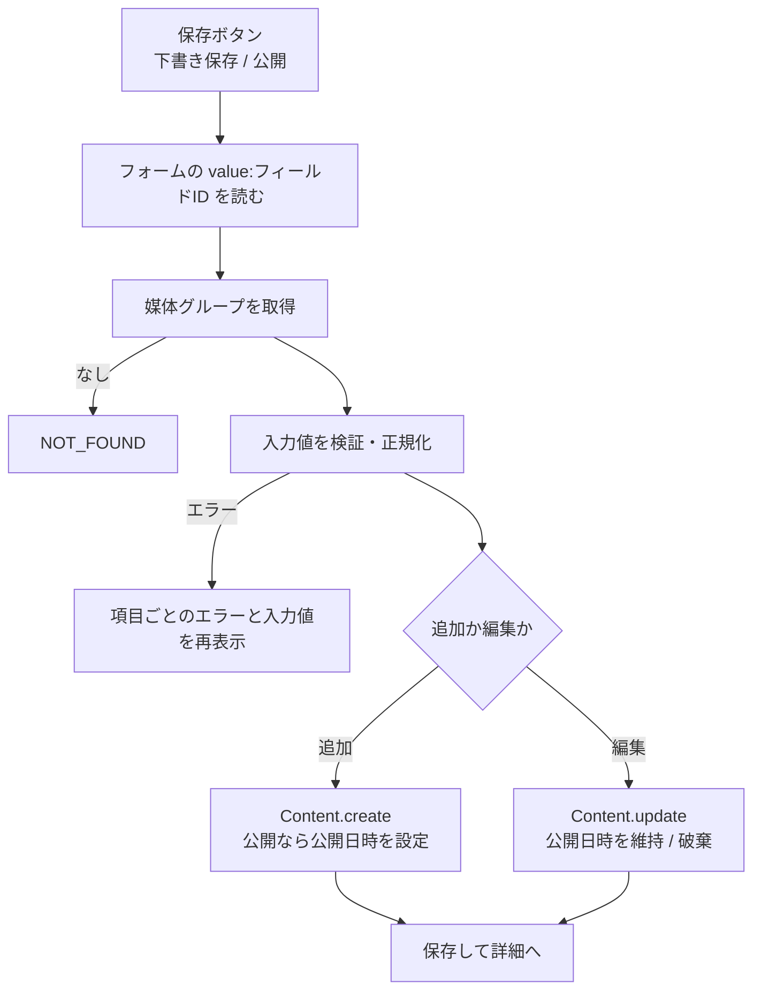

# 機能設計書

## 1. 概要

媒体グループ(媒体グループ管理)で定義したフィールドに沿って、コンテンツ(バナーの文言・画像など)を入力・公開・削除する。コンテンツのデータは、コンポーネントに埋め込まれて表示される(データ埋め込みとレスポンス)。

| 項目 | 内容 |
|---|---|
| 対象機能 | コンテンツの一覧・追加・詳細・編集・削除、公開 / 下書きの切り替え |
| 関連要件 | F-01(メインバナー管理。公開 / 非公開の切り替え) |
| 利用者 | 管理画面を使う全員(削除も、権限の制限はない) |

## 2. 機能仕様

| ID | 機能 | 概要 | 入力 | 出力 | 備考 |
|---|---|---|---|---|---|
| FD-01 | コンテンツの一覧 | 更新日時の新しい順に、20件ずつ表示する。媒体グループで絞り込める | group(クエリ)、page | タイトル、媒体グループ、ステータス、更新日時 | 絞り込みの各リンクに件数を併記する |
| FD-02 | コンテンツの追加 | 媒体グループを選び、入力フォームで入力して保存する | 媒体グループID、入力値、ステータス | コンテンツ | 媒体グループ未選択なら、選択画面を出す |
| FD-03 | コンテンツの詳細 | 入力内容と公開情報を表示する | id | 項目ごとの値、ステータス、公開・作成・更新日時 | 画像は画像、繰り返しは行ごとに表示する |
| FD-04 | コンテンツの編集 | 入力値とステータスを更新する | id、入力値、ステータス | コンテンツ | 保存後、詳細画面へ移動する |
| FD-05 | コンテンツの削除 | コンテンツを削除する | id | なし | 確認ダイアログあり。削除後は一覧へ |
| FD-06 | 公開 / 下書き | 保存時に、公開か下書きかを選ぶ | status | 公開日時の設定 / 破棄 | 下記のルール |
| FD-07 | 入力値の検証 | 媒体グループの定義に沿って、必須・型・文字数・選択肢を検証する | 入力値 | 正規化した値 | 媒体グループ管理の「フィールドの種類」を参照 |
| FD-08 | 一覧用のタイトル | 媒体グループの最初のテキスト(text)フィールドの値を使う | コンテンツ | タイトル | なければ「(無題)」 |

### 公開日時のルール

| 操作 | status | 公開日時(publishedAt) |
|---|---|---|
| 新規作成して公開 | published | 作成時刻 |
| 新規作成して下書き | draft | なし |
| 下書きを公開 | published | その時刻 |
| 公開済みを更新(公開のまま) | published | 最初に公開した日時を維持 |
| 公開済みを下書きに戻す | draft | 破棄する |

### 入力値の正規化

| 項目 | 内容 |
|---|---|
| 前後の空白 | 除く |
| 空値 | 保存しない。必須項目が空ならエラー |
| 定義にないキー | 保存しない |
| 繰り返し項目 | 何も入力されていない行を除く。行ごとに子の定義で検証する。エラーは「N行目「子の名前」: メッセージ」にまとめる |

## 3. 画面設計

### 画面一覧

| 画面 | 目的 | 主な表示項目 | 主な操作 | 遷移先 |
|---|---|---|---|---|
| コンテンツ一覧(`/contents`) | コンテンツを探す | 媒体グループの絞り込み(すべて / 各グループ(件数))、タイトル(リンク)、媒体グループ、ステータス、更新日時、ページ送り | 絞り込み、新規追加、タイトルのクリック | 追加(絞り込み中のグループを引き継ぐ)、詳細 |
| コンテンツ追加(`/contents/new`) | コンテンツを作る | 媒体グループの選択(未選択時)、入力フォーム | 媒体グループの選択、下書き保存、公開、キャンセル | 詳細、一覧 |
| コンテンツ詳細(`/contents/<id>`) | 内容の確認 | 項目ごとの値(未入力は「未入力」)、ステータス、公開日時、作成日時、更新日時 | 編集、一覧へ戻る、削除 | 編集、一覧 |
| コンテンツ編集(`/contents/<id>/edit`) | 内容の変更 | 入力フォーム(現在の値) | 下書き保存、公開 / 更新、キャンセル | 詳細 |

- 入力フォームは、フィールドの種類ごとの入力部品を並べる(単一テキスト、テキストエリア、数値、日付、選択肢、画像、複数画像、繰り返し)。
- 画像・複数画像は、メディアに登録済みの画像から選ぶダイアログを開く。ダイアログの中から、その場でアップロードもできる(メディア管理)。複数画像は、選択順が表示順になり、前後への移動ができる。
- 繰り返し項目は、行の追加・削除ができる。
- 追加画面の公開ボタンは「公開」。編集画面は、公開済みなら「更新」、下書きなら「公開」。
- 媒体グループが1つもないときは、追加画面で「媒体グループを作成」のリンクを出す。
- 検証エラーのときは、送信した値を再表示し、項目ごとにエラーを出す。

## 4. 処理フロー

- 保存後は `revalidatePath("/", "layout")` で、一覧・ダッシュボード・サイドバーを更新する。
- 画像の削除(メディア管理)は、コンテンツでの使用を調べる。使用中の画像は削除できない。

## 5. データ設計

### contents

| エンティティ | 項目 | 型 | 必須 | 説明 |
|---|---|---|---|---|
| contents | id | TEXT(UUID) | ○ | 主キー |
| | media_group_id | TEXT | ○ | 媒体グループ(削除時に連動して削除。インデックスあり) |
| | status | TEXT | ○ | draft / published(CHECK 制約) |
| | field_values | TEXT(JSON) | ○ | フィールドID → 値(文字列) |
| | published_at | TEXT | - | 公開日時。下書きは NULL |
| | created_at | TEXT | ○ | 作成日時 |
| | updated_at | TEXT | ○ | 更新日時 |

- 数値・日付・画像も、文字列で保持する。画像は画像ID。複数画像は画像IDの配列の JSON、繰り返し項目は行の配列の JSON。
- 一覧は `updated_at` の降順(同時刻は新しい `rowid` 順)。

## 6. インターフェース

| 名称 | 種別 | 入力 | 出力 | 備考 |
|---|---|---|---|---|
| createContentAction | Server Action | 媒体グループID、`value:<フィールドID>`、status | 詳細へリダイレクト | |
| updateContentAction | Server Action | id、`value:<フィールドID>`、status | 詳細へリダイレクト | |
| deleteContentAction | Server Action | id | 一覧へリダイレクト | |
| CreateContentUseCase / UpdateContentUseCase / DeleteContentUseCase | ユースケース | | Content / なし | |
| ListContentsPageUseCase | ユースケース | mediaGroupId、page、perPage | コンテンツと媒体グループのページ | |
| GetContentUseCase | ユースケース | id | コンテンツと媒体グループ | |

## 7. エラー処理・例外

| 事象 | 条件 | 画面・応答 | 対応 |
|---|---|---|---|
| 必須項目が空 | 必須フィールドが未入力 | その項目に「必須項目です」 | 入力する |
| 文字数超過 | text が256文字以上、textarea が10001文字以上 | 「255文字以内で入力してください」「10000文字以内で入力してください」 | 短くする |
| 数値でない | number が数値でない | 「数値で入力してください」 | 直す |
| 日付が不正 | date が YYYY-MM-DD でない、実在しない日付 | 「日付の形式が不正です」 | 直す |
| 選択肢外 | select が選択肢にない | 「選択肢から選んでください」 | 選び直す |
| 画像の不正 | images の形式が不正、重複、21枚以上 | 「画像の形式が不正です」「同じ画像が重複しています」「画像は20枚まで選択できます」 | 選び直す |
| 繰り返しの不正 | 51行以上、形式が不正、子の検証エラー | 「50行まで追加できます」「入力内容を読み取れませんでした」「N行目「子」: …」 | 直す |
| ステータスが不正 | draft / published 以外 | 「ステータスが不正です」 | 通常は起きない(ボタンから送る) |
| 媒体グループなし | 追加・編集の間に削除された | 「媒体グループが見つかりません」 | 一覧に戻る |
| コンテンツなし | 存在しない id | 詳細・編集は 404、削除は「コンテンツが見つかりません」 | 一覧に戻る |

## 8. 未決事項

### 公開の仕組み

| 項目 | 現状 | 決める内容 |
|---|---|---|
| 公開の予約 | なし。公開 / 下書きのみ | 公開日時・終了日時を指定する予約公開(バナーの掲載期間)が必要か |
| 承認フロー | なし。誰でも公開できる | 公開の承認者と承認フローが必要か(要件定義書の未決事項) |
| 公開中のコンテンツの編集 | 保存した時点で、公開中の内容が変わる | 下書きを別に持つか。変更履歴を残すか |

### 権限と運用

| 項目 | 現状 | 決める内容 |
|---|---|---|
| 削除の権限 | 権限の制限なし | EC運用担当者に削除させるか(認証と権限を参照) |
| 一覧の検索・並び替え | 媒体グループの絞り込みと、更新日時順のみ | キーワード検索、ステータスの絞り込み、並び替えが必要か |
| 並び順(表示順) | なし。EC基盤に渡すときの順は更新日時の新しい順(一覧パターンのプレビュー) | バナーの表示順を指定する項目が必要か |
