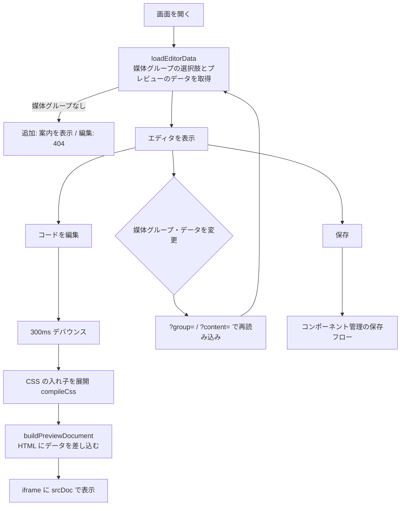

# 機能設計書

## 1. 概要

コンポーネントの HTML / CSS / JS を編集し、プレビューで確認する画面(`ComponentEditor`)。追加画面と編集画面で共通に使う。CodeMirror 6 によるコードエディタに、補完・整形・リファクタリング・パーツの追加といった編集支援を備える。保存の流れは「コンポーネント管理」、プレビューに使うデータは「データ埋め込みとレスポンス」、保存時のチェックは「保存時コードチェック」を参照する。

| 項目 | 内容 |
|---|---|
| 対象機能 | コンポーネントの編集画面、プレビュー(PC / SP)、コードエディタ、整形、リファクタリング、パーツの追加、データ項目の表示 |
| 関連要件 | F-06(コード編集画面)、F-08(コンポーネントのプレビュー)、F-02(UI・動作・データ埋め込み場所の定義) |
| 利用者 | 開発者(コードを書く人)。現状は権限による制限がない |

## 2. 機能仕様

| ID | 機能 | 概要 | 入力 | 出力 | 備考 |
|---|---|---|---|---|---|
| FD-01 | 基本情報の編集 | コンポーネント名、使用するコンテンツ(媒体グループ)、表示パターン(詳細 / 一覧)を選ぶ | 名前、媒体グループ、パターン | 画面の状態 | 媒体グループの変更は `?group=<id>` で再読み込みする |
| FD-02 | コードの編集 | HTML / CSS / JS をタブで切り替えて編集する | コード | コード | CodeMirror 6 |
| FD-03 | プレビュー | 編集中のコードに、コンテンツのデータを埋め込んで表示する | コード、レスポンス | iframe の表示 | 入力は300msデバウンスして反映する |
| FD-04 | 表示幅の切り替え | プレビューを PC(全幅)/ SP(375px)で表示する | PC / SP | iframe の幅 | iframe の高さは縦にドラッグして変えられる |
| FD-05 | プレビューのデータ選択 | 詳細パターンで、プレビューに使うコンテンツを選ぶ | コンテンツID | レスポンス | 既定は最新の1件。`?content=<id>` |
| FD-06 | データ項目の表示 | レスポンスの項目を、Example Value と Schema で切り替えて表示する | 媒体グループ、パターン | 項目の一覧 | `ResponseViewer` |
| FD-07 | コードの補完 | 項目名・クラス名・CSS の入れ子・スニペットなどを補完する | 入力中のコード | 候補 | 下記「補完」 |
| FD-08 | 整形 | 表示中のタブを Prettier で整形する | コード | 整形後のコード | ボタン / Shift+Alt+F |
| FD-09 | リファクタリング | クラス名・BEM ブロック名の一括変更、CSS の入れ子への整理 | 新旧の名前 | 変更後のコード | `refactor.ts`(postcss) |
| FD-10 | パーツの追加 | WordPress のブロック追加に相当。パーツを選んで HTML と CSS を追加する | パーツ | HTML(カーソル位置)、CSS(末尾) | `parts.ts` |
| FD-11 | ショートカット一覧 | タブ右の「?」にカーソルを重ねる(フォーカスする)と表示する | - | 一覧 | 表示中の言語で使えるものだけ |
| FD-12 | 保存 | 下書き保存 / 公開(更新) | フォームの値 | 保存結果 | コンポーネント管理 |
| FD-13 | 診断の表示 | 保存時のエラー・警告を一覧に出し、クリックで該当位置へ移動する。エディタにも印を付ける | 診断 | 一覧、印 | 保存時コードチェック |

### 機能は表示中のタブで使えるものだけを出す

| 機能 | HTML | CSS | JS |
|---|---|---|---|
| パーツを追加 | ○ | - | - |
| 「CSS を入れ子(BEM)に整理」 | - | ○ | - |
| Emmet(Tab 展開、Ctrl+Alt+W で囲む) | ○ | ○ | - |
| 項目の参照方法・保存時チェックの説明 | HTML のもの | CSS のもの | JS のもの |
| 整形、クラス名の一括変更、補完、検索 | ○ | ○ | ○ |

### コードエディタの機能

| 機能 | 内容 |
|---|---|
| 基本 | 行番号、折りたたみ、検索、括弧・タグの自動閉じ、Ctrl+/ でコメント |
| Emmet | Tab で展開(例: mt10 → margin-top: 10px)、展開できなければインデント。Ctrl+Alt+W で囲む |
| ホバー | HTML の `{{項目}}` にカーソルを重ねると、型と説明を表示する |
| 外からの変更 | 整形・リファクタリング・パーツの追加で値が変わると、エディタの内容を差し替える |

### 補完

| 場所 | 候補 |
|---|---|
| CSS の入れ子(`.card {` の中で `&`) | HTML で使っている `&__title` / `&--large` |
| HTML の `{{` | 項目名、`{{#each}}`。繰り返しの中では、子の項目と `this` |
| HTML の `class="…"` | CSS で定義済み、HTML で使用中のクラス |
| CSS の `.` | HTML で使っているクラス |
| JS | `CONTENT.`・`CONTENT["…"]`(レスポンスの項目)、ブラウザ標準 |
| 各言語 | スニペット(BEM、PC / SP の切り替え、イベント登録など) |

### リファクタリング

| 操作 | 内容 |
|---|---|
| クラス名を変更 | HTML の class 属性、CSS のセレクタ(入れ子の `&__xxx` も)、JS の `".クラス名"` と `classList` などの名前だけの文字列を、まとめて変更する。変更前に、箇所数(HTML / CSS / JS)を表示する |
| BEM のブロック名を変更 | ブロック名と、そのブロックの要素(`__`)・修飾子(`--`)をまとめて変更する |
| CSS を入れ子(BEM)に整理 | フラットな BEM の CSS を、ブロックごとの入れ子にまとめる(例: `.card__title` → `.card { &__title }`)。CSS タブのみ |

- CSS が入れ子のときは、いったん展開して置換し、入れ子に戻す。結果は反映後に CSS を整形する。
- 新しい名前は検証する(空、現在と同じ、BEM に沿わない、既に使われている名前は不可。ブロック名は要素・修飾子を含まない形)。変更できる名前がないときは「変更できる名前がありません」、変更箇所がないときは「変更する箇所がありません」と表示する。

### パーツ

| カテゴリ | パーツ |
|---|---|
| レイアウト | セクション、2カラム、3列グリッド |
| テキスト | 見出し、段落、リスト、ボタン |
| メディア | 画像、PC/SP画像、画像とテキスト |
| コンポーネント | カード、ヒーロー、お知らせ枠 |
| データ項目 | レスポンスの項目から自動で作る。カーソル位置で使える項目(繰り返しの中なら1行分、複数画像の中なら `{{this}}`)のみ |

- ダイアログで、カテゴリ・検索で選ぶ。選ぶと、BEM のクラス名つきの HTML をカーソル位置へ、対応する CSS(入れ子)を CSS の末尾へ追加する。
- ブロック名は、使用中の名前と重ならないよう連番を付ける。追加後は「「パーツ名」を追加しました(ブロック名: 〇〇)」と表示する。

## 3. 画面設計

### 画面一覧

| 画面 | 目的 | 主な表示項目 | 主な操作 | 遷移先 |
|---|---|---|---|---|
| コンポーネントエディタ(`/components/new`、`/components/<id>/edit`) | コンポーネントの編集 | 固定ヘッダー(タイトル、操作ボタン)、基本情報、プレビュー、コード編集とデータ項目 | 保存、コード編集、プレビューの切り替え | 一覧 |

### 画面の構成(上から)

| 領域 | 内容 |
|---|---|
| 固定ヘッダー | 画面タイトル、メタ情報、「下書き保存」、公開ボタン(新規は「公開」、公開済みの編集は「更新」)、整形・リファクタリング・パーツ追加などの操作、「一覧へ戻る」。スクロールしても上に固定される |
| 通知・エラー | 保存・複製の通知、入力エラー、診断の一覧(位置つき。クリックで該当位置へ) |
| 基本情報 | コンポーネント名(必須)、使用するコンテンツ(媒体グループ)、表示パターン(詳細 / 一覧) |
| プレビュー | 説明(「<媒体グループ> / <パターン>のデータを埋め込んで表示します」)、プレビューのデータ(詳細パターンのみ)、PC / SP の切り替え、iframe |
| コード編集 | HTML / CSS / JS のタブと、コードエディタ |
| データ項目 | レスポンスの項目。Example Value / Schema の切り替え。コードエディタの横に並べる |

- 保存ボタンは、`form` 属性で、値の送信専用の非表示フォームに紐づく。ボタンは画面上部にまとめ、フォームは隠している。
- プレビューのデータ(詳細パターン)に、コンテンツがなければ「コンテンツがありません」を表示する。

### プレビューの隔離

プレビューは `sandbox="allow-scripts"` の iframe(`srcDoc`)に表示する。`allow-same-origin` は付けない。コンポーネントの JS から、管理画面の Cookie・DOM に触れさせないため(要件 N-08 に対応)。

## 4. 処理フロー

- 媒体グループの選択は、`?group=<id>` で、優先順位は「クエリ → 編集中のコンポーネントの媒体グループ → 先頭の媒体グループ」。見つからない場合や、取得の間に削除された場合は、次の候補にする。
- 保存するのは、入れ子のままの CSS。プレビューには、展開したフラットな CSS を渡す(ブラウザは `&__title`(`&` に文字を続ける書き方)を解釈できないため)。
- コンポーネントの CSS を出力に使うときは、同様に展開する必要がある。
- 整形は、構文エラーのコードでは行えない(エラーを表示する)。Prettier は、使うときに動的に読み込む。

## 5. データ設計

画面の状態(保存はしない)と、保存するデータ(components テーブル。コンポーネント管理を参照)がある。

| エンティティ | 項目 | 型 | 必須 | 説明 |
|---|---|---|---|---|
| 画面の状態 | name | 文字列 | ○ | コンポーネント名 |
| | mode | detail / list | ○ | 表示パターン |
| | code(html、css、js) | 文字列 | ○ | 編集中のコード |
| | tab | html / css / js | ○ | 表示中のタブ |
| | device | pc / sp | ○ | プレビューの幅 |
| EditorPreview | groupId、groupName | 文字列 | ○ | 使用するコンテンツ(媒体グループ) |
| | fields | FieldDefinition の配列 | ○ | レスポンスの項目の元 |
| | samples、sampleId | 配列、文字列 | ○ | プレビューのデータの選択肢と選択中のID |
| | detail、list | TemplateData | ○ | 詳細 / 一覧のレスポンス |

## 6. インターフェース

| 名称 | 種別 | 入力 | 出力 | 備考 |
|---|---|---|---|---|
| `?group=<id>` | クエリ | 媒体グループID | 媒体グループを切り替えた画面 | 追加・編集で使う |
| `?content=<id>` | クエリ | コンテンツID | 詳細パターンのプレビューのデータ | |
| `?saved=1` / `?duplicated=1` | クエリ | - | 通知の表示 | 保存・複製後 |
| GetComponentPreviewUseCase | ユースケース | mediaGroupId、sampleId | ComponentPreview | データ埋め込みとレスポンス |
| createComponentAction / updateComponentAction | Server Action | フォームの値 | 結果の状態 | コンポーネント管理 |

## 7. エラー処理・例外

| 事象 | 条件 | 画面・応答 | 対応 |
|---|---|---|---|
| 保存時のエラー | コードのエラー | 診断の一覧(言語・行:列・メッセージ・ルール名)。クリックで該当位置へ移動し、エディタに印を付ける | コードを直す |
| 保存時の警告 | alt なし、未使用変数など | 保存は止めない。エラーと同時に出たときだけ、一覧に並ぶ | 必要に応じて直す |
| 整形できない | 構文エラーのコード | 「HTML を整形できません。構文エラーを直してからもう一度お試しください」(言語名は表示中のタブ) | 構文を直す |
| クラス名の変更 | 新しい名前が空、現在と同じ、BEM に沿わない、既に使われている | 「新しい名前を入力してください」「現在の名前と同じです」「「名前」はすでに使われています」など。変更できる名前がないときは「変更できる名前がありません」 | 名前を直す |
| 媒体グループなし | 追加画面で、媒体グループが0件 | 「媒体グループがありません」と、作成へのリンク | 媒体グループを作る |
| プレビューのデータなし | コンテンツが0件 | データは空で表示(`{{項目}}` は空文字) | コンテンツを追加する |
| 実行時エラー | プレビューの JS が例外を投げる | iframe の中で完結する(管理画面には影響しない) | JS を直す |

## 8. 未決事項

### 編集体験

| 項目 | 現状 | 決める内容 |
|---|---|---|
| 未保存の変更 | 離脱時の確認はない(コードからは確認できない) | 未保存のまま移動したときの警告が必要か |
| 実行時エラーの表示 | プレビュー内のエラーを、管理画面側に出さない | コンソール・エラーを、プレビューの下に表示するか |
| ネットワーク・ストレージの制限 | sandbox のスクリプト許可のみ。外部への通信は制限していない | 隔離の方式の詳細(要件定義書の未決事項)。外部通信を禁止するか |
| プレビューの表示幅 | PC(全幅)と SP(375px)の2つ | タブレットなどの幅、任意の幅が必要か |

### 機能の拡張

| 項目 | 現状 | 決める内容 |
|---|---|---|
| AI によるコード生成 | 未実装 | エディタのどこから生成を呼ぶか(未実装機能を参照) |
| JS の記述 | `CONTENT` でレスポンスを参照する。ブラウザ標準のみ | 外部ライブラリの利用を許すか |
| 権限 | 全員が編集できる | 開発者のみにするか(認証と権限を参照) |
