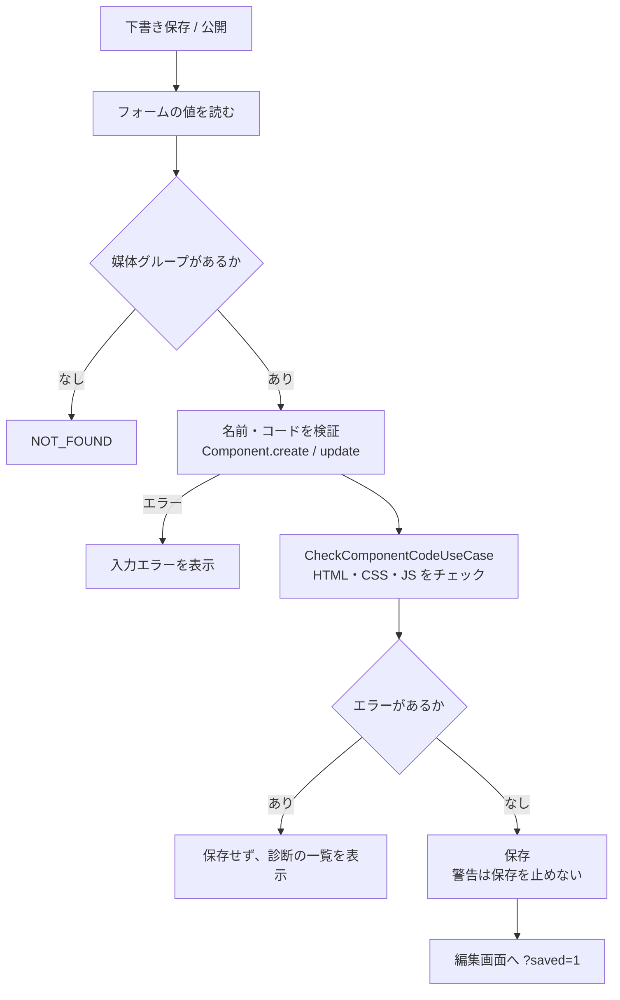

# 機能設計書

## 1. 概要

コンポーネントは、コンテンツのデータ(レスポンス)を埋め込んで表示する HTML / CSS / JS の組である。入力フォームや入力値は持たない。使うコンテンツは、媒体グループ(「バナー」「スタイリング」など)の単位で選ぶ。記事ごとにコンポーネントを作るわけではない。この設計書では、コンポーネントのデータと、一覧・複製・削除・保存の流れを扱う。編集画面は「コンポーネントエディタ」、埋め込みの仕組みは「データ埋め込みとレスポンス」、保存時のチェックは「保存時コードチェック」に書く。

| 項目 | 内容 |
|---|---|
| 対象機能 | コンポーネントの一覧・作成・更新・複製・削除、公開 / 下書き |
| 関連要件 | F-02(コンポーネント管理) |
| 利用者 | 管理画面を使う全員(要件上は、開発者が中心。権限の制限はない) |

## 2. 機能仕様

| ID | 機能 | 概要 | 入力 | 出力 | 備考 |
|---|---|---|---|---|---|
| FD-01 | コンポーネントの一覧 | 更新日時の新しい順に、20件ずつ表示する | page | 名前、媒体グループ、パターン、ステータス、更新日時 | |
| FD-02 | コンポーネントの作成 | 名前・媒体グループ・表示パターン・コードを登録する | 名前、mediaGroupId、mode、html、css、js、status | コンポーネント | 保存後、編集画面へ移動(`?saved=1`) |
| FD-03 | コンポーネントの更新 | 作成と同じ項目を更新する | id と作成の入力 | コンポーネント | 保存後、編集画面に戻る(`?saved=1`) |
| FD-04 | 複製 | コンポーネントのコピーを、下書きで作る | id | コンポーネント | 名前の末尾に「 のコピー」を付ける。編集画面へ移動(`?duplicated=1`) |
| FD-05 | 削除 | コンポーネントを削除する | id | なし | 確認ダイアログあり。削除後は一覧へ |
| FD-06 | 公開 / 下書き | 保存時に選ぶ。公開日時の扱いはコンテンツと同じ | status | 公開日時の設定 / 破棄 | コンテンツ管理の「公開日時のルール」と同じ |
| FD-07 | 保存時のチェック | コードにエラーがあれば保存しない | コード | 診断の一覧 | 保存時コードチェック。下書き保存も対象 |

### 入力の制約

| 項目 | 内容 |
|---|---|
| コンポーネント名 | 必須、100文字以内。前後の空白は除く |
| HTML | 必須(空白のみは不可)、50,000文字以内 |
| CSS / JS | 任意、それぞれ50,000文字以内 |
| 媒体グループ | 存在すること。コンポーネントは必ず1つの媒体グループに紐づく |
| 表示パターン(mode) | detail(詳細)/ list(一覧) |
| ステータス | draft / published |

### 複製のルール

| 項目 | 内容 |
|---|---|
| 名前 | 元の名前 + 「 のコピー」。100文字を超える分は、元の名前の末尾を切り詰める |
| コード・媒体グループ・パターン | 元と同じ |
| ステータス | 必ず下書き(公開日時なし) |
| 作成・更新日時 | 複製した時刻 |

## 3. 画面設計

### 画面一覧

| 画面 | 目的 | 主な表示項目 | 主な操作 | 遷移先 |
|---|---|---|---|---|
| コンポーネント一覧(`/components`) | コンポーネントを探す・管理する | 名前(リンク)、媒体グループ、パターン(詳細 / 一覧)、ステータス、更新日時、ページ送り | 新規追加、複製、削除 | 追加、編集 |
| コンポーネント追加(`/components/new`) | 新規作成 | コンポーネントエディタ(コンポーネントエディタを参照) | 下書き保存、公開 | 編集 |
| コンポーネント編集(`/components/<id>/edit`) | 更新 | 同上。保存後は「保存しました。」、複製後は「複製しました。下書きとして保存されています。」 | 同上 | 一覧 |

- 一覧の削除は「「名前」を削除します。元に戻せません。よろしいですか?」の確認を出す。
- 追加画面は、媒体グループがないとき「媒体グループがありません」を表示し、「媒体グループを作成」のリンクを出す(コンポーネントの追加には、先に媒体グループが必要)。
- 編集画面は、媒体グループがすべて削除されていると、項目が分からないため 404 になる。
- 追加画面の初期コードは、HTML が `<section class="card">`、CSS が `.card` と入れ子の `&__title`、JS は空。

## 4. 処理フロー

### 保存(作成・更新)

### 媒体グループとの関係

- 媒体グループを削除すると、コンポーネントも外部キー(CASCADE)で削除される。
- 媒体グループのフィールドを削除・名称変更すると、コンポーネントの HTML の `{{項目}}` が参照を失う。次の保存時に、「保存時コードチェック」が未定義の項目として報告する(自動では書き換えない)。

## 5. データ設計

### components

| エンティティ | 項目 | 型 | 必須 | 説明 |
|---|---|---|---|---|
| components | id | TEXT(UUID) | ○ | 主キー |
| | name | TEXT | ○ | コンポーネント名(100文字以内) |
| | media_group_id | TEXT | ○ | 使うコンテンツの媒体グループ(削除時に連動して削除。インデックスあり) |
| | mode | TEXT | ○ | detail / list(CHECK 制約。既定は detail) |
| | html | TEXT | ○ | HTML(50,000文字以内) |
| | css | TEXT | ○ | CSS(入れ子のソースのまま保存) |
| | js | TEXT | ○ | JS |
| | status | TEXT | ○ | draft / published(CHECK 制約) |
| | published_at | TEXT | - | 公開日時。下書きは NULL |
| | created_at | TEXT | ○ | 作成日時 |
| | updated_at | TEXT | ○ | 更新日時 |

- 一覧は `updated_at` の降順。
- 現在の構成より古い開発用の `components` テーブル(`html` 列なし)は、接続時に破棄する。`mode` 列がなければ追加する。

## 6. インターフェース

| 名称 | 種別 | 入力 | 出力 | 備考 |
|---|---|---|---|---|
| createComponentAction | Server Action | mediaGroupId、name、mode、html、css、js、status | 編集画面へリダイレクト / エラー・診断の状態 | |
| updateComponentAction | Server Action | id と同じ項目 | 同上 | |
| duplicateComponentAction | Server Action | id | 複製の編集画面へリダイレクト | |
| deleteComponentAction | Server Action | id | 一覧へリダイレクト | |
| CreateComponentUseCase / UpdateComponentUseCase | ユースケース | 同上 | Component | |
| DuplicateComponentUseCase / DeleteComponentUseCase / GetComponentUseCase | ユースケース | id | Component / なし | |
| ListComponentsPageUseCase | ユースケース | page、perPage | コンポーネントと媒体グループのページ | |

## 7. エラー処理・例外

| 事象 | 条件 | 画面・応答 | 対応 |
|---|---|---|---|
| 名前が空 | 空白のみ | 「コンポーネント名を入力してください」 | 入力する |
| 名前が長い | 101文字以上 | 「コンポーネント名は100文字以内で入力してください」 | 短くする |
| HTML が空 | 空白のみ | 「HTMLを入力してください」 | 入力する |
| コードが長い | HTML / CSS / JS が50,000文字を超える | 「〇〇は50000文字以内で入力してください」 | 短くする |
| 表示パターンが不正 | detail / list 以外 | 「表示パターンが不正です」 | 通常は起きない |
| コードにエラー | チェックのエラー | 「コードにエラーがあります。修正してから保存してください」と、位置つきの一覧 | コードを直す |
| 媒体グループなし | 保存時に削除されていた | 「媒体グループが見つかりません」 | 媒体グループを選び直す |
| コンポーネントなし | 存在しない id | 編集は 404、更新・複製・削除は「コンポーネントが見つかりません」 | 一覧に戻る |

## 8. 未決事項

### 公開の意味

| 項目 | 現状 | 決める内容 |
|---|---|---|
| 公開 / 下書きの効果 | ステータスと公開日時を保存するだけ。EC基盤への提供が未実装のため、公開しても何も起きない | EC基盤向けAPIで、公開済みだけを返すか(未実装機能を参照) |
| メインバナーとの紐づけ | コンポーネントとコンテンツは、媒体グループ単位。複数のUIから選んで切り替える仕組みはない | 「複数のUIから選んでメインバナーを切り替える」(F-01)を、どう表現するか(適用するコンポーネントを選ぶ設定が必要) |
| バージョン管理 | なし。保存すると上書き | 変更履歴、元に戻す機能が必要か |

### 運用

| 項目 | 現状 | 決める内容 |
|---|---|---|
| 一覧の検索・絞り込み | 更新日時順のみ | 名前の検索、媒体グループ・ステータスでの絞り込みが必要か |
| テーマとの関係 | 未実装 | テーマにコンポーネントを紐づけるか(未実装機能を参照) |
| 権限 | 全員が編集できる | 開発者のみ編集可、運用担当者は選択のみ、とするか(認証と権限を参照) |
