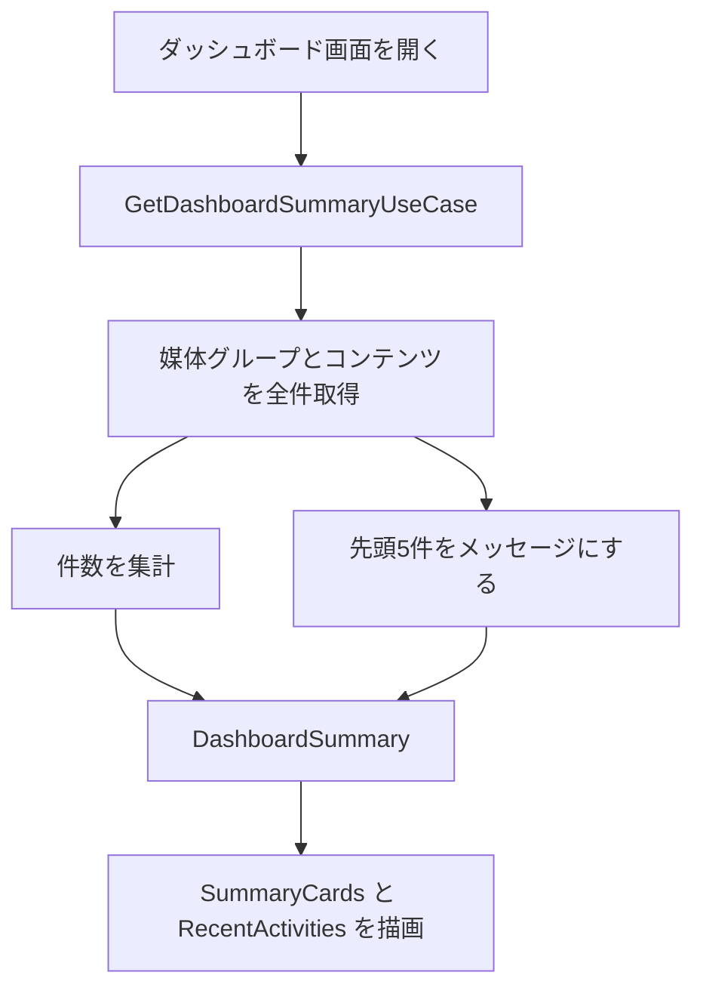

# 機能設計書

## 1. 概要

管理画面を開いたときの最初の画面。コンテンツと媒体グループの件数、最近更新したコンテンツを表示する。表示だけで、更新する操作はない。

| 項目 | 内容 |
|---|---|
| 対象機能 | ダッシュボード(件数のカード、最近の更新) |
| 関連要件 | なし(要件定義書にダッシュボードの要件はない) |
| 利用者 | 管理画面を使う全員 |

## 2. 機能仕様

| ID | 機能 | 概要 | 入力 | 出力 | 備考 |
|---|---|---|---|---|---|
| FD-01 | 件数の集計 | コンテンツ・公開中・下書き・媒体グループの件数を数える | なし | 4つの指標 | `ContentDashboardRepository` |
| FD-02 | 最近の更新 | 更新日時の新しいコンテンツ5件を、文にして並べる | なし | メッセージと日時 | `RECENT_ACTIVITY_LIMIT` = 5 |

### 指標

| ID | 表示名 | 数え方 |
|---|---|---|
| contents | コンテンツ | 全コンテンツの件数 |
| published | 公開中 | ステータスが公開(published)の件数 |
| drafts | 下書き | コンテンツの件数 − 公開中の件数 |
| media-groups | 媒体グループ | 媒体グループの件数 |

### 最近の更新のメッセージ

| ステータス | メッセージ |
|---|---|
| 公開 | 「<タイトル>」を公開しました |
| 下書き | 「<タイトル>」を下書き保存しました |

- タイトルは、媒体グループの最初のテキストフィールドの値。なければ「(無題)」。
- 並び順は、コンテンツの更新日時の新しい順。
- 媒体グループが見つからないコンテンツは、一覧に出さない。
- 更新履歴のテーブルはない。「最近の更新」は、コンテンツの現在の状態から作る(コンポーネント・メディア・媒体グループの更新は含まない)。

## 3. 画面設計

### 画面一覧

| 画面 | 目的 | 主な表示項目 | 主な操作 | 遷移先 |
|---|---|---|---|---|
| ダッシュボード(`/`) | 全体の状況を見る | 件数のカード4つ、最近の更新(最大5件) | なし(表示のみ) | なし |

## 4. 処理フロー

- コンテンツは更新日時の新しい順で取得する。件数の集計は、全件を読んで数える。

## 5. データ設計

| エンティティ | 項目 | 型 | 必須 | 説明 |
|---|---|---|---|---|
| DashboardMetric | id | 文字列 | ○ | 指標の識別子 |
| | label | 文字列 | ○ | 表示名 |
| | value | 数値 | ○ | 件数(負の値は不可) |
| DashboardActivity | id | 文字列 | ○ | コンテンツID |
| | message | 文字列 | ○ | 表示するメッセージ |
| | occurredAt | 日時 | ○ | コンテンツの更新日時 |

## 6. インターフェース

| 名称 | 種別 | 入力 | 出力 | 備考 |
|---|---|---|---|---|
| GetDashboardSummaryUseCase | ユースケース | なし | DashboardSummary(metrics、recentActivities) | `DashboardRepository` を通す |

## 7. エラー処理・例外

| 事象 | 条件 | 画面・応答 | 対応 |
|---|---|---|---|
| データがない | コンテンツ・媒体グループが0件 | 件数は0、最近の更新は空 | なし |
| 指標が負の値 | 実装の誤り | `DashboardSummary.create` が例外を投げる | 開発者が修正する |

## 8. 未決事項

### 表示内容

| 項目 | 現状 | 決める内容 |
|---|---|---|
| 集計の対象 | コンテンツと媒体グループのみ | コンポーネント・メディアの件数を出すか |
| 最近の更新の範囲 | コンテンツのみ。更新履歴は残さない | コンポーネントの更新も含めるか。履歴のテーブルを持つか |
| 件数の集計方法 | 全件を読んで数える | 件数が増えたときに、集計クエリへ変えるか |
