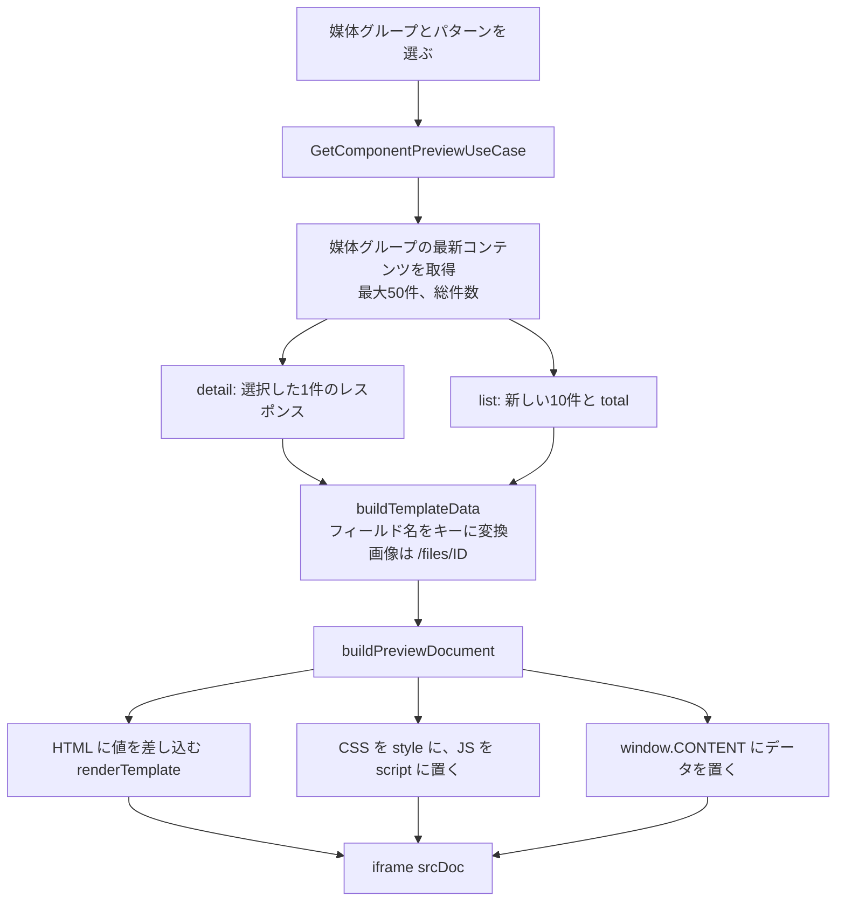

# 機能設計書

## 1. 概要

コンテンツのデータ(レスポンス)を、コンポーネントの HTML に差し込む仕組み。差し込み用の記法(`{{項目}}`)、レスポンスのパターン(詳細 / 一覧)、レスポンスの項目定義(Schema)、プレビュー文書の組み立てを扱う。コンポーネントは、データを埋め込む場所だけを持ち、データそのものは持たない。EC基盤が同じ形のレスポンスをAPIで受け取れば、同じ表示になることを狙う(API は未実装。「未実装機能」を参照)。

| 項目 | 内容 |
|---|---|
| 対象機能 | テンプレートの描画、レスポンスの組み立て、レスポンスの Schema、プレビュー文書の組み立て、プレビュー用データの取得 |
| 関連要件 | F-02(データ埋め込み場所の定義)、F-08(コンポーネントのプレビュー)、F-03(EC基盤向けAPIが返すデータの形) |
| 利用者 | 開発者(テンプレートを書く人)。EC運用担当者(プレビューで確認する人) |

## 2. 機能仕様

| ID | 機能 | 概要 | 入力 | 出力 | 備考 |
|---|---|---|---|---|---|
| FD-01 | 差し込みデータの組み立て | コンテンツの入力値(フィールドID → 値)を、フィールド名をキーにしたデータに変換する | フィールド定義、入力値 | TemplateData | 画像は配信URLにする |
| FD-02 | テンプレートの描画 | HTML の `{{…}}` に値を差し込む | HTML、TemplateData | 描画した HTML | 値は HTML エスケープする |
| FD-03 | レスポンスのパターン | 詳細(1件)/ 一覧(総件数と配列)の形でレスポンスを作る | フィールド、値、パターン | レスポンス | 下記 |
| FD-04 | レスポンスの Schema | レスポンスの項目を、OpenAPI 風の型の表記で表す | フィールド、パターン | SchemaNode の配列 | データ項目の表示、保存時チェックで使う |
| FD-05 | プレビュー用データの取得 | 媒体グループ単位で、詳細・一覧のレスポンスと、選択肢を作る | mediaGroupId、sampleId | ComponentPreview | `GetComponentPreviewUseCase` |
| FD-06 | プレビュー文書の組み立て | HTML・CSS・JS とデータから、iframe に表示する1つの HTML 文書を作る | コード、データ | HTML 文書 | `buildPreviewDocument` |

### 差し込みの記法

| 記法 | 意味 | 備考 |
|---|---|---|
| `{{項目名}}` | コンテンツの項目の値を差し込む | HTML エスケープする(`& < > " '`)。未定義の名前は空文字 |
| `{{#each 名前}}…{{/each}}` | 複数画像・繰り返し項目・一覧の `items` の各要素を繰り返す | 配列でない・存在しない名前は何も出さない |
| `{{this}}` | `{{#each}}` の中で、現在の要素 | 複数画像の中では、画像のURL |
| `{{子の項目名}}` | `{{#each}}` の中で、繰り返し項目の子、一覧の項目 | 外側の項目も参照できる(内側を優先) |

- 配列やオブジェクトを、そのまま `{{名前}}` で差し込んでも、何も出さない(文字列・数値だけを出す)。
- 閉じていない `{{#each}}` は、そこまでの内容を1つのブロックとして閉じる。対応のない `{{/each}}` は無視する。空の `{{ }}` は無視する。
- テンプレート本体(HTML)は、開発者が書いたものとして、エスケープしない。

### フィールドの種類ごとの差し込み値

| フィールドの種類 | 差し込み値 | Schema の型 | 説明 |
|---|---|---|---|
| text | 文字列 | string | |
| textarea | 文字列 | string | 複数行のテキスト |
| number | 文字列 | string($number) | 数値(文字列で渡される) |
| date | 文字列(YYYY-MM-DD) | string($date) | |
| select | 文字列 | string | 説明に選択肢を並べる |
| image | `/files/<画像ID>`(未入力は空文字) | string($uri) | メディアの配信URL |
| images | `/files/<画像ID>` の配列 | array&lt;string($uri)&gt; | `{{#each}}` で繰り返す。`{{this}}` で参照 |
| repeater | 行ごとのオブジェクトの配列 | array&lt;object&gt; | `{{#each}}` で繰り返す。子の名前で参照 |

### レスポンスのパターン

| パターン | レスポンスの形 | プレビューのデータ |
|---|---|---|
| detail(詳細) | 選択したコンテンツ1件の項目が、そのまま入る | 既定は最新の1件。「プレビューのデータ」で、最新50件から選べる(`?content=<id>`) |
| list(一覧) | `{ total, items: [コンテンツの項目…] }`。total は総件数 | その媒体グループの新しい10件(`LIST_PREVIEW_LIMIT`)と、総件数 |

- 一覧の Schema は、`total`(integer、必須、「コンテンツの総件数」)と `items`(array&lt;object&gt;、必須、「コンテンツの配列」。子が媒体グループの項目)である。
- 公開 / 下書きにかかわらず、新しい順で取得する(ステータスで絞らない)。

### JS から参照するデータ

プレビュー文書では、`window.CONTENT` にレスポンス(詳細 / 一覧)を JSON として置く。JS からは、`CONTENT` で参照できる。

## 3. 画面設計

専用の画面はない(対象外)。「コンポーネントエディタ」の、プレビューとデータ項目の領域で使う。

### 画面一覧

| 画面 | 目的 | 主な表示項目 | 主な操作 | 遷移先 |
|---|---|---|---|---|
| データ項目(コンポーネントエディタ内) | レスポンスの形を確認する | Swagger のレスポンス欄のように、Example Value と Schema を切り替えて表示する。項目名、型、必須、説明 | Example Value / Schema の切り替え | なし |

## 4. 処理フロー

### プレビュー文書の安全対策

| 対象 | 対策 |
|---|---|
| 差し込む値 | HTML エスケープ |
| CSS の `</style` | `<\/style` に置き換え、文書が壊れないようにする |
| JS の `</script` | `<\/script` に置き換える |
| `CONTENT` の JSON | `<`、U+2028、U+2029 をエスケープし、`</script>` やコメントで抜けられないようにする |
| iframe | `sandbox="allow-scripts"`(`allow-same-origin` なし) |

文書には、既定のスタイル(`body{margin:0;font-family:system-ui,sans-serif;line-height:1.6}img{max-width:100%}`)と、viewport の meta を含める。

## 5. データ設計

| エンティティ | 項目 | 型 | 必須 | 説明 |
|---|---|---|---|---|
| TemplateData | 項目名 | TemplateValue | - | フィールド名をキーにした差し込みデータ |
| TemplateValue | - | 文字列 / 数値 / 配列 / オブジェクト | - | 文字列・数値(一覧の total)、配列(複数画像・繰り返し行・一覧)、オブジェクト(1行・1件) |
| SchemaNode | name | 文字列 | ○ | 項目名 |
| | kind | scalar / scalars / rows | ○ | 文字列 / 文字列の配列(複数画像)/ オブジェクトの配列(繰り返し・一覧) |
| | type | 文字列 | ○ | OpenAPI 風の型(例: string、string($uri)、array&lt;object&gt;) |
| | fieldType | フィールドの種類 / null | ○ | 元のフィールドの種類。一覧の total・items は null |
| | required | 真偽 | ○ | 必須か |
| | description | 文字列 | ○ | 説明 |
| | children | SchemaNode の配列 | ○ | rows のときの、1行(1件)の項目 |
| ComponentPreview | groupId、groupName | 文字列 | ○ | 媒体グループ |
| | fields | FieldDefinition の配列 | ○ | レスポンスの項目の元 |
| | samples | id と title の配列 | ○ | 詳細パターンのデータの選択肢(新しい順、最大50件) |
| | sampleId | 文字列 | ○ | 詳細パターンで使うコンテンツ(なければ空) |
| | detail、list | TemplateData | ○ | 詳細 / 一覧のレスポンス |

## 6. インターフェース

| 名称 | 種別 | 入力 | 出力 | 備考 |
|---|---|---|---|---|
| buildTemplateData | 関数 | フィールド、入力値 | TemplateData | `domain/component/template.ts` |
| renderTemplate | 関数 | HTML、TemplateData | HTML | |
| buildResponseSchema | 関数 | フィールド、パターン | SchemaNode の配列 | `response-schema.ts` |
| buildDetailResponse / buildListResponse | 関数 | フィールド、値(、総件数) | TemplateData | |
| buildPreviewDocument | 関数 | コード、TemplateData | HTML 文書 | `preview-document.ts` |
| GetComponentPreviewUseCase | ユースケース | mediaGroupId、sampleId | ComponentPreview | 媒体グループがなければ NOT_FOUND |

## 7. エラー処理・例外

| 事象 | 条件 | 画面・応答 | 対応 |
|---|---|---|---|
| 未定義の項目 | `{{名前}}` が、レスポンスにない | 空文字で描画する。保存時にはエラーにする(保存時コードチェック) | 項目名を直す |
| 配列でない項目を繰り返す | `{{#each}}` の対象が文字列 | 何も出さない。保存時にエラー | 直す |
| `{{#each}}` の対応がない | 閉じ忘れ、`{{/each}}` だけ | 描画は継続する(閉じ忘れは閉じる、余分な閉じは無視)。保存時にエラー | 直す |
| プレビューのデータなし | コンテンツが0件 | 空のデータで描画する。選択肢に「コンテンツがありません」 | コンテンツを追加する |
| 媒体グループなし | 媒体グループが削除された | NOT_FOUND。エディタは、次の候補の媒体グループにする | 媒体グループを選び直す |
| 画像の不正な値 | 複数画像・繰り返しの値が不正な JSON | 空の配列として扱う | コンテンツを入力し直す |

## 8. 未決事項

### データの形

| 項目 | 現状 | 決める内容 |
|---|---|---|
| EC基盤向けのレスポンス | プレビューのレスポンスの形のみ。公開済みのコンテンツだけを返す仕組みはない | API が返す JSON の形を、プレビューと同じにするか。公開済みだけに絞るか(未実装機能を参照) |
| 画像のURL | `/files/<画像ID>`(相対パス) | EC基盤から使うときの絶対URL、CDN |
| 数値の型 | 文字列で渡す | 数値型で渡すか |
| 条件分岐 | `{{#each}}` のみ。`if` はない | 項目が空のときの出し分けが必要か |
| 一覧の条件 | 新しい10件(プレビュー)。件数・順序の指定はない | 件数・並び順・絞り込みを指定できるようにするか |
| 日付の書式 | `YYYY-MM-DD` のまま | 書式を指定する記法が必要か |
