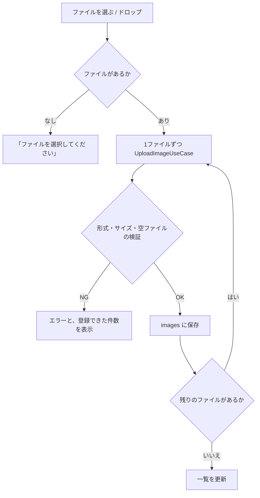
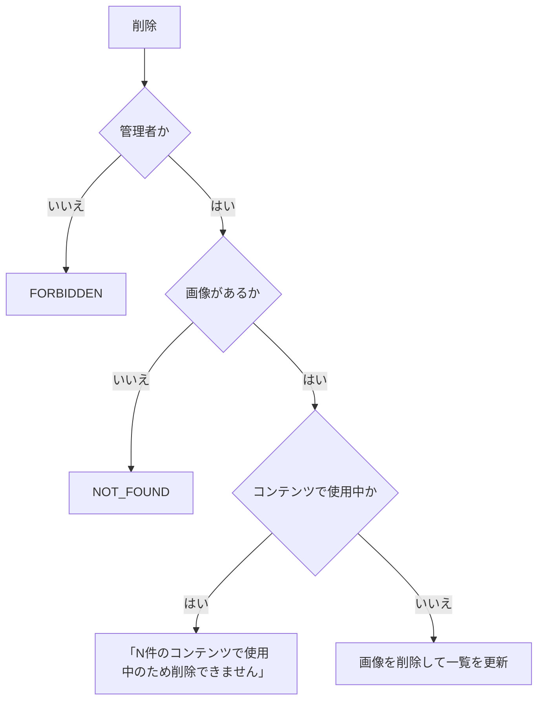
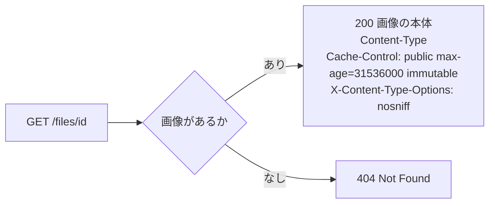

# 機能設計書

## 1. 概要

画像を登録して管理する機能。登録した画像は、コンテンツの画像フィールドから選び、`/files/<id>` の URL で配信する。画像は DB(SQLite)の BLOB として保存する。

| 項目 | 内容 |
|---|---|
| 対象機能 | 画像のアップロード、一覧、削除、配信、コンテンツからの画像選択 |
| 関連要件 | F-01(バナー画像などの媒体コンテンツ) |
| 利用者 | 管理画面を使う全員。削除は管理者のみ |

## 2. 機能仕様

| ID | 機能 | 概要 | 入力 | 出力 | 備考 |
|---|---|---|---|---|---|
| FD-01 | アップロード | 画像を複数まとめて登録する。ドラッグ&ドロップまたはクリックで選ぶ | 画像ファイル(複数) | 画像ID、ファイル名、サイズ | 1ファイルずつ登録する。途中で失敗しても、登録済みの分は残る |
| FD-02 | メディア一覧 | 新しい順に、20件ずつ、カードで表示する | page | ファイル名、サイズ、プレビュー | `findSummariesPage`(画像データは読まない) |
| FD-03 | 画像の削除 | 画像を削除する | id | なし | 管理者のみ。コンテンツで使用中の画像は削除できない |
| FD-04 | 画像の配信 | 画像IDから画像を返す | id | 画像の本体 | `GET /files/<id>`。長期キャッシュ |
| FD-05 | 画像の選択 | コンテンツの画像フィールドで、登録済みの画像から選ぶ。その場でアップロードもできる | 画像ID | 選択した画像ID(複数画像は配列) | コンテンツ管理から使う |

### 画像の制約

| 項目 | 内容 |
|---|---|
| 形式 | PNG / JPEG / GIF / WebP(`image/png`、`image/jpeg`、`image/gif`、`image/webp`) |
| サイズ | 1ファイル 5MB まで(空ファイルは不可) |
| 判定 | ブラウザが送る MIME タイプで判定する(中身の検査はしない) |
| 複数画像フィールド | 1フィールドに20枚まで |

### 使用中の判定

画像の削除時に、全コンテンツの値を調べる。値が画像IDと一致する(単一画像)、または値に `"<画像ID>"` を含む(複数画像・繰り返し項目の JSON)コンテンツがあれば、使用中とみなす。

## 3. 画面設計

### 画面一覧

| 画面 | 目的 | 主な表示項目 | 主な操作 | 遷移先 |
|---|---|---|---|---|
| メディア(`/media`) | 画像の登録・管理 | 新規アップロード欄、メディアライブラリ(件数、画像カード、ページ送り) | ファイルのドロップ・選択、画像の削除 | なし |
| 画像選択ダイアログ(コンテンツの入力フォーム内) | 画像フィールドに画像を割り当てる | 登録済みの画像、選択中の枚数、アップロード欄 | 画像の選択、アップロード、「この画像を使用」「選択を反映」、キャンセル | 入力フォームに戻る |

- アップロード欄には「ファイルをドロップするか、クリックして選択」「PNG / JPEG / GIF / WebP、1ファイル5MBまで(複数選択可)」と表示する。送信中は「アップロード中...」。
- 画像カードは、ファイル名とサイズを表示し、削除ボタンを持つ。削除前に「「ファイル名」を削除しますか?」の確認を出す。
- 画像が0件のときは「画像がまだありません。」。選択ダイアログでは「メディアに画像がありません。アップロードしてください。」。
- 複数画像の選択は、上限(20枚)に達すると「(上限に達しました)」と表示する。ダイアログでアップロードした画像は、そのまま選択状態になる。
- 入力フォームでは、選択した画像のサムネイルと「外す」、複数画像は前後への移動(← →)を表示する。「選択を解除」で全部外す。

## 4. 処理フロー

### アップロード

### 削除

### 配信

## 5. データ設計

### images

| エンティティ | 項目 | 型 | 必須 | 説明 |
|---|---|---|---|---|
| images | id | TEXT(UUID) | ○ | 主キー。配信URLの一部 |
| | file_name | TEXT | ○ | アップロード時のファイル名 |
| | mime_type | TEXT | ○ | MIME タイプ |
| | size | INTEGER | ○ | バイト数 |
| | data | BLOB | ○ | 画像の本体 |
| | created_at | TEXT | ○ | 登録日時 |

- 一覧は `created_at` の降順(同時刻は新しい `rowid` 順)。
- コンテンツは、画像IDを値として持つ。外部キーはない。

## 6. インターフェース

| 名称 | 種別 | 入力 | 出力 | 備考 |
|---|---|---|---|---|
| `GET /files/<id>` | Route Handler | 画像ID | 画像の本体 / 404 | 認証なしで取得できる。EC基盤からも使える画像のURL |
| uploadMediaAction | Server Action | フォームの `files`(複数) | ok(登録した画像の一覧)/ error(メッセージ) | メディア画面と選択ダイアログで共通 |
| deleteMediaAction | Server Action | id | idle / error | Actor を使う |
| UploadImageUseCase | ユースケース | ファイル名、MIME タイプ、データ | 画像ID | |
| DeleteImageUseCase | ユースケース | Actor、id | なし | |
| ListImagesPageUseCase / ListImagesUseCase | ユースケース | page / なし | 画像の概要(データを含まない) | 選択ダイアログは全件を読む |
| GetImageUseCase | ユースケース | id | 画像 | 配信で使う |

## 7. エラー処理・例外

| 事象 | 条件 | 画面・応答 | 対応 |
|---|---|---|---|
| ファイル未選択 | ファイルが0件、または空のファイル | 「ファイルを選択してください」 | ファイルを選ぶ |
| 形式が不正 | PNG / JPEG / GIF / WebP 以外 | 「画像は PNG / JPEG / GIF / WebP のみアップロードできます」(登録できた件数を併記) | 形式を変える |
| 空ファイル | 0バイト | 「画像ファイルが空です」 | 別のファイルを選ぶ |
| サイズ超過 | 5MB を超える | 「画像は5MB以下にしてください」 | 小さくする |
| 削除の権限なし | 管理者以外 | 「メディアの削除は管理者のみ実行できます」 | 管理者が操作する |
| 使用中 | コンテンツで使用中 | 「この画像はN件のコンテンツで使用中のため削除できません」 | コンテンツから外してから削除する |
| 画像なし | 存在しない id | 削除は「画像が見つかりません」、配信は 404 | 一覧を更新する |

## 8. 未決事項

### 保存先・配信

| 項目 | 現状 | 決める内容 |
|---|---|---|
| 保存先 | DB の BLOB | 画像が増えたときに、R2 や Vercel Blob へ移すか(全体概要の未決事項を参照) |
| 配信の認証 | なし。IDを知っていれば誰でも取得できる(UUID) | 非公開(下書き)コンテンツの画像を、保護する必要があるか |
| 画像の検査 | MIME タイプの申告のみ | 中身の検査、画像サイズの縮小・変換(WebP化、PC / SP 用のサイズ)が必要か |

### 管理機能

| 項目 | 現状 | 決める内容 |
|---|---|---|
| 画像の情報 | ファイル名・サイズのみ | 代替テキスト(alt)、幅・高さ、フォルダ分けが必要か。alt は、コンポーネントの警告にも関係する |
| 一覧の検索・並び替え | 新しい順のみ | ファイル名の検索が必要か |
| 使用箇所の表示 | 件数のみ。どのコンテンツかは表示しない | 使用中のコンテンツへのリンクを出すか |
| 削除の権限 | 管理者のみ。認証が未実装のため、全員が管理者 | 認証と権限を参照 |
