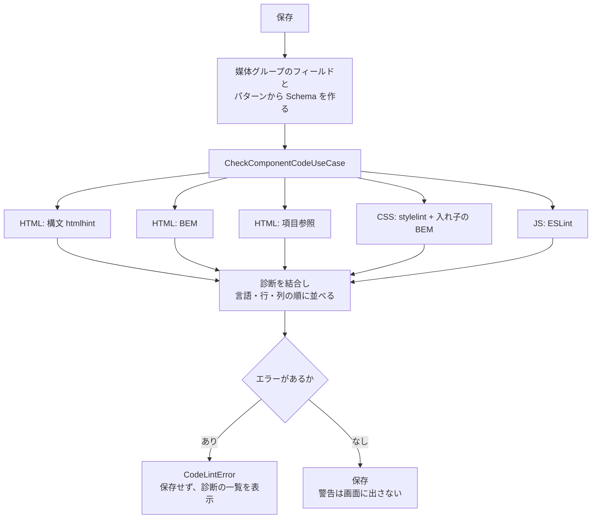

# 機能設計書

## 1. 概要

コンポーネントを保存するときに、HTML / CSS / JS のコードをチェックする機能。エラーがあれば保存せず、位置つきで画面に表示する。警告は保存を止めない。作成・更新の両方で、下書き保存も対象にする。チェックは、構文・BEM(クラス名の記法)・`{{項目}}` の参照の3つ。

| 項目 | 内容 |
|---|---|
| 対象機能 | HTML の構文・BEM・項目参照、CSS の構文・BEM・ID セレクタの禁止、JS の構文と標準的な誤り |
| 関連要件 | F-02(コンポーネント管理)、F-06(コード編集)。コードの品質を保つための機能(要件定義書に直接の記載はない) |
| 利用者 | 開発者 |

## 2. 機能仕様

| ID | 機能 | 概要 | 入力 | 出力 | 備考 |
|---|---|---|---|---|---|
| FD-01 | HTML の構文チェック | タグの対応、属性の記法などを検査する | HTML | 診断 | htmlhint。`{{…}}` は同じ長さの文字に置き換えて検査する |
| FD-02 | HTML の BEM チェック | class 属性が BEM に沿うか、修飾子に基底クラスがあるかを検査する | HTML | 診断 | `domain/component/bem.ts` |
| FD-03 | 項目参照のチェック | `{{項目}}` と `{{#each}}` が、レスポンスの項目と合っているか検査する | HTML、Schema | 診断 | `template-references.ts` |
| FD-04 | CSS のチェック | 構文・未知のプロパティ・BEM・ID セレクタの禁止などを検査する | CSS | 診断 | stylelint と、入れ子の BEM の自前チェック |
| FD-05 | JS のチェック | 構文と、ESLint の推奨ルールで検査する | JS | 診断 | ESLint(ブラウザ標準と `CONTENT` を許可) |
| FD-06 | 診断の統合と並び替え | 3つの言語の診断を、言語 → 行 → 列の昇順に並べる | 診断 | 診断の配列 | `sortDiagnostics` |
| FD-07 | 保存の可否の判定 | エラーが1つでもあれば保存しない(`CodeLintError`) | 診断 | 保存 / 拒否 | 警告のみなら保存する |

### 診断の項目

| 項目 | 内容 |
|---|---|
| language | html / css / js |
| line、column | 1 始まりの位置 |
| message | メッセージ |
| rule | チェック項目の名前(例: `selector-class-pattern`、`bem/class-name`) |
| severity | error(保存を止める)/ warning(止めない) |

### HTML のチェック

| チェック | ルール | 重大度 |
|---|---|---|
| タグの対応 | tag-pair | エラー |
| タグ名・属性名の小文字 | tagname-lowercase、attr-lowercase | エラー |
| 属性値のダブルクォート | attr-value-double-quotes | エラー |
| 属性の重複 | attr-no-duplication | エラー |
| id の一意 | id-unique | エラー |
| src が空でない | src-not-empty | エラー |
| img の alt | alt-require | 警告 |
| クラス名が BEM でない | bem/class-name | エラー |
| 修飾子に基底クラスがない | bem/modifier-needs-base | エラー |
| `{{項目}}` がレスポンスにない | template/unknown-field | エラー |
| 配列でない項目を `{{#each}}` で繰り返す | template/not-iterable | エラー |
| `{{#each}}` と `{{/each}}` の不対応 | template/unbalanced-each | エラー |

- htmlhint の結果は、種別が error ならエラー、それ以外は警告として扱う。
- BEM の検査は、`{{…}}` を含むクラス(値の差し込み)を対象にしない。
- 複数画像の中で `{{項目名}}` を使うと、「複数画像の中では {{this}} を使います」のヒントを付ける。
- 見つからない `{{#each}}` の中では、参照のチェックをしない(二重に報告しない)。

### BEM の記法

クラス名は、`block__element--modifier` の形で、小文字・数字・ハイフン区切り(ケバブケース)にする。

| 部分 | 規則 |
|---|---|
| block | 小文字で始まり、小文字・数字を、ハイフンでつなぐ(例: `product-card`) |
| `__element` | 小文字・数字・ハイフン(任意) |
| `--modifier` | 小文字・数字・ハイフン(任意) |
| 修飾子 | `card--large` を使うときは、基底クラス `card` も同じ class 属性に書く |

### CSS のチェック

| チェック | ルール |
|---|---|
| 空のブロック | block-no-empty |
| 不正な色 | color-no-invalid-hex |
| 重複したプロパティ | declaration-block-no-duplicate-properties(連続する重複で値が異なるものは許す) |
| 重複したフォント名 | font-family-no-duplicate-names |
| 未知のメディア特性・プロパティ・疑似クラス・疑似要素・単位・at ルール | media-feature-name-no-unknown など |
| 重複したセレクタ | no-duplicate-selectors |
| 不正な `//` コメント | no-invalid-double-slash-comments |
| ID セレクタの禁止 | selector-max-id(0) |
| クラス名が BEM でない | selector-class-pattern |

- stylelint の標準設定や、プロジェクトの設定ファイルは読み込まない(設定は `node-code-linter.ts` に持つ)。
- CSS は入れ子(Sass 風の `&__title`)で書く。stylelint の `selector-class-pattern` は、`&` に続けて書いたクラス名を検査しないため、親のセレクタを当てはめた名前(`.card__title`)を BEM として自前で検査する(`lintNestedBem`)。
- 空の CSS は検査しない。

### JS のチェック

| 項目 | 内容 |
|---|---|
| ルール | ESLint の推奨ルール。`no-unused-vars`・`eqeqeq`・`no-var` は警告 |
| 環境 | ecmaVersion は最新、sourceType は script。グローバルは、ブラウザ標準と、読み取り専用の `CONTENT` |
| 構文エラー | rule は `parse-error`、エラー |

## 3. 画面設計

専用の画面はない。「コンポーネントエディタ」の画面で結果を表示する。

### 画面一覧

| 画面 | 目的 | 主な表示項目 | 主な操作 | 遷移先 |
|---|---|---|---|---|
| 診断の一覧(コンポーネントエディタ内) | 保存できなかった理由を示す | 言語(HTML / CSS / JS)、行:列、メッセージ、ルール名。エディタ上の印 | 項目のクリックで該当位置へ移動 | なし |

## 4. 処理フロー

- リンターは Node 上で動かす。`CodeLinter` ポートの実装(`NodeCodeLinter`)は infrastructure に置き、`next.config.ts` の `serverExternalPackages` に指定する。
- 保存前に、名前・コードの形式の検証(`Component.create` / `update`)を先に行う。次にコードのチェックを行う。

## 5. データ設計

保存するデータはない。診断(CodeDiagnostic)は、チェックのたびに作り、画面の状態として返す。項目は「2. 機能仕様」の「診断の項目」を参照。

## 6. インターフェース

| 名称 | 種別 | 入力 | 出力 | 備考 |
|---|---|---|---|---|
| CheckComponentCodeUseCase | ユースケース | html、css、js、schema | CodeDiagnostic の配列 | |
| CodeLinter | ポート | 言語、コード | CodeDiagnostic の配列 | `NodeCodeLinter` が実装 |
| checkHtmlBem、checkTemplateReferences | 関数 | HTML(、Schema) | CodeDiagnostic の配列 | ドメイン層 |
| 保存の Server Action | Server Action | コンポーネントのフォーム | `status: "lint"` の状態(message、diagnostics) | コンポーネント管理 |

## 7. エラー処理・例外

| 事象 | 条件 | 画面・応答 | 対応 |
|---|---|---|---|
| コードにエラー | エラーの診断が1つ以上 | 「コードにエラーがあります。修正してから保存してください」と診断の一覧。保存しない | コードを直す |
| 警告のみ | 警告の診断だけ | 保存する。警告は画面に表示しない(エラーと同時に出たときだけ、一覧に並ぶ) | 保存前に確認する手段はない(未決事項を参照) |
| CSS の構文エラー(入れ子の BEM) | postcss が構文エラー | 入れ子の BEM の検査は何も返さない。構文エラーは stylelint が報告する | CSS を直す |
| 想定外のエラー | リンターの内部エラー | Next.js のエラー画面 | 開発者が対応する |

## 8. 未決事項

### チェックの内容

| 項目 | 現状 | 決める内容 |
|---|---|---|
| BEM の強制 | HTML・CSS ともエラーで、保存を止める | 緩めるか(警告にするか)。既存のコードを取り込むときの扱い |
| 警告の確認 | 警告は保存を止めない。エラーと同時に出たときだけ表示され、警告だけのときは表示されない | 警告だけのときも、保存後に表示するか |
| JS の安全性 | ESLint の推奨ルールのみ。外部通信・DOM の危険な操作は検査しない | セキュリティのチェックが必要か(プレビューの隔離と合わせて検討) |
| アクセシビリティ | `alt` の警告のみ | 見出し・コントラストなどのチェックが必要か |
| 公開時のチェック | 保存時と同じ | 公開時だけ、より厳しくするか |
