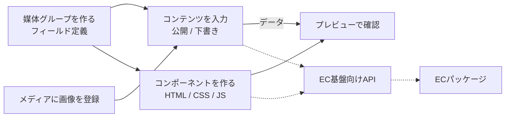

# 機能設計書

## 1. 概要

EC CMS(リポジトリ名 f-ec-cms)全体の構成と、機能設計書の一覧。機能ごとの詳細は、同じフォルダの、ほかの設計書に分けて書く。この文書は `main` ブランチの実装(コード)を読んで書いたもので、実装と食い違う点は、実装を正とする。要件定義書(EC CMS / 開発要件整理)の機能のうち、実装済みのものと未実装のものを「2. 機能仕様」に示す。

| 項目 | 内容 |
|---|---|
| 対象機能 | EC CMS 管理画面全体(媒体グループ・コンテンツ・メディア・コンポーネントを管理し、コンポーネントをプレビューする) |
| 関連要件 | F-01〜F-08 全体(対応は「2. 機能仕様」を参照) |
| 利用者 | 管理画面を開いた人。現状は認証がなく、全員が管理者として扱われる(「認証と権限」を参照) |

### 設計書の一覧

| 設計書 | 対象 | 状況 |
|---|---|---|
| 全体概要 | この文書。構成、共通ルール、要件との対応 | - |
| 画面共通 | 管理画面のレイアウト、サイドバー、ルーティング、一覧のページ送り | 実装済み |
| ダッシュボード | 件数と最近の更新の表示 | 実装済み |
| 媒体グループ管理 | コンテンツの入力フォーム(フィールド定義)の作成・編集・削除 | 実装済み |
| コンテンツ管理 | 媒体グループの定義に沿ったコンテンツの入力・公開・削除 | 実装済み |
| メディア管理 | 画像のアップロード・一覧・削除・配信 | 実装済み |
| コンポーネント管理 | コンポーネントの一覧・作成・複製・削除 | 実装済み |
| コンポーネントエディタ | HTML / CSS / JS の編集画面、プレビュー、編集支援 | 実装済み |
| データ埋め込みとレスポンス | `{{項目}}` の描画、レスポンスのパターン(詳細 / 一覧)、プレビュー文書 | 実装済み |
| 保存時コードチェック | HTML / CSS / JS の構文・BEM・項目参照のチェック | 実装済み |
| 認証と権限 | 操作者(Actor)と管理者のみの操作 | 一部実装(認証は未実装) |
| 未実装機能 | EC基盤向けAPI、テーマ管理、AIコード生成、設定画面 | 未実装 |

## 2. 機能仕様

### 機能の一覧

| ID | 機能 | 概要 | 入力 | 出力 | 備考 |
|---|---|---|---|---|---|
| FD-01 | 画面共通 | サイドバー・ヘッダーつきの管理画面、一覧のページ送り | URL | 画面 | 画面共通 |
| FD-02 | ダッシュボード | コンテンツ数・公開数・下書き数・媒体グループ数と、最近の更新5件を表示する | なし | 画面 | ダッシュボード |
| FD-03 | 媒体グループ管理 | コンテンツの入力フォーム(フィールド構成)を定義する | 名称、フィールド定義 | 媒体グループ | 媒体グループ管理 |
| FD-04 | コンテンツ管理 | 媒体グループに沿ってコンテンツを入力し、公開 / 下書きを切り替える | 入力値、ステータス | コンテンツ | コンテンツ管理 |
| FD-05 | メディア管理 | 画像をアップロードして管理し、`/files/<id>` で配信する | 画像ファイル | 画像、配信URL | メディア管理 |
| FD-06 | コンポーネント管理 | コンポーネントの一覧・複製・削除、作成・編集画面への入口 | コンポーネント | 一覧 | コンポーネント管理 |
| FD-07 | コンポーネントエディタ | HTML / CSS / JS の編集、プレビュー、整形、リファクタリング、パーツ追加 | コード | コンポーネント | コンポーネントエディタ |
| FD-08 | データ埋め込みとレスポンス | コンテンツのデータをコンポーネントに差し込む | HTML、レスポンス | 描画した HTML | データ埋め込みとレスポンス |
| FD-09 | 保存時コードチェック | コードのエラーがあれば保存しない | HTML / CSS / JS | 診断の一覧 | 保存時コードチェック |
| FD-10 | 認証と権限 | 操作者の権限(管理者 / 編集者)で、一部の操作を制限する | Actor | 許可 / 拒否 | 認証と権限 |
| FD-11 | 未実装機能 | 要件にあるが、まだ実装されていない機能の整理 | - | - | 未実装機能 |

### 要件定義書との対応

| 要件ID | 要件 | 実装状況 | 設計書 |
|---|---|---|---|
| F-01 | メインバナー管理 | 部分的に実装。専用の画面はない。媒体グループ(例: バナー)とコンテンツの公開 / 下書きで代替する。複数のUIを選んで切り替える機能はない | 媒体グループ管理、コンテンツ管理 |
| F-02 | コンポーネント管理 | 実装済み。UI・動作(HTML / CSS / JS)とデータの埋め込み場所(`{{項目}}`)を定義できる | コンポーネント管理、コンポーネントエディタ、データ埋め込みとレスポンス |
| F-03 | EC基盤向けAPI提供 | 未実装。管理画面用の Server Action と画像配信 `/files/<id>` のみ | 未実装機能 |
| F-04 | 権限管理 | 未実装。操作者を管理者に固定している。権限の検証ロジックだけある | 認証と権限 |
| F-05 | テーマ管理 | 未実装 | 未実装機能 |
| F-06 | コード編集画面 | 実装済み(コンポーネントエディタ)。要件上は低優先度だが、実装は進んでいる | コンポーネントエディタ |
| F-07 | AIによるコンポーネントコード生成 | 未実装 | 未実装機能 |
| F-08 | コンポーネントのプレビュー | 実装済み。PC / SP の幅切り替えと、データの選択に対応する | コンポーネントエディタ、データ埋め込みとレスポンス |

## 3. 画面設計

画面ごとの詳細は、各設計書に書く。画面とURLの一覧を示す。

### 画面一覧

| 画面 | URL | 設計書 |
|---|---|---|
| ダッシュボード | `/` | ダッシュボード |
| コンテンツ一覧 | `/contents`(`?group=<媒体グループID>&page=<n>`) | コンテンツ管理 |
| コンテンツ追加 | `/contents/new`(`?group=<媒体グループID>`) | コンテンツ管理 |
| コンテンツ詳細 | `/contents/<id>` | コンテンツ管理 |
| コンテンツ編集 | `/contents/<id>/edit` | コンテンツ管理 |
| 媒体グループ一覧 | `/media-groups` | 媒体グループ管理 |
| 媒体グループ追加 | `/media-groups/new` | 媒体グループ管理 |
| 媒体グループ詳細 | `/media-groups/<id>` | 媒体グループ管理 |
| 媒体グループ編集 | `/media-groups/<id>/edit` | 媒体グループ管理 |
| メディア | `/media` | メディア管理 |
| コンポーネント一覧 | `/components` | コンポーネント管理 |
| コンポーネント追加 | `/components/new`(`?group=`、`?content=`) | コンポーネントエディタ |
| コンポーネント編集 | `/components/<id>/edit` | コンポーネントエディタ |
| 設定 | `/settings`(プレースホルダ) | 未実装機能 |

## 4. 処理フロー

EC基盤への提供までの全体の流れ。点線は未実装の部分。

## 5. データ設計

DB は SQLite(`better-sqlite3`)。ファイルは `data/cms.db`(環境変数 `DATABASE_PATH` で変更できる)。スキーマは接続時に `CREATE TABLE IF NOT EXISTS` で適用する。マイグレーション機構はなく、既存DBへの列追加だけを `database.ts` で行う。各テーブルの項目は、それぞれの設計書に書く。

| テーブル | 内容 | 設計書 |
|---|---|---|
| media_groups | 媒体グループ | 媒体グループ管理 |
| field_definitions | 媒体グループのフィールド定義 | 媒体グループ管理 |
| contents | コンテンツ | コンテンツ管理 |
| images | 画像(BLOB) | メディア管理 |
| components | コンポーネント | コンポーネント管理 |

### 関連(外部キー)

| 子 | 親 | 削除時 |
|---|---|---|
| field_definitions.media_group_id | media_groups.id | 親と一緒に削除(CASCADE) |
| contents.media_group_id | media_groups.id | 親と一緒に削除(CASCADE) |
| components.media_group_id | media_groups.id | 親と一緒に削除(CASCADE) |

画像(images)は、コンテンツから参照されるが外部キーはない。コンテンツの値に画像IDを文字列で持つ。

## 6. インターフェース

外部向けの API はない(「未実装機能」を参照)。画面からの更新は、Next.js の Server Action で行う。外部から使えるのは、画像の配信だけである。

| 名称 | 種別 | 入力 | 出力 | 備考 |
|---|---|---|---|---|
| `GET /files/<id>` | Route Handler | 画像ID | 画像の本体 | メディア管理 |
| Server Action | 画面の更新 | フォームの値 | 画面の再描画・リダイレクト | 各設計書 |

## 7. エラー処理・例外

エラーの扱いは、全機能で共通である。

| 事象 | 条件 | 画面・応答 | 対応 |
|---|---|---|---|
| 入力エラー(VALIDATION) | 必須・形式・文字数などの違反 | フォーム上部にメッセージ、項目ごとにエラー | 入力を直して再送信する。送信した値は再表示される(コンテンツ) |
| 対象なし(NOT_FOUND) | 存在しない媒体グループ・コンテンツ・コンポーネント・画像のID | 詳細・編集画面は 404、画像配信は 404 | 一覧から選び直す |
| 権限なし(FORBIDDEN) | 管理者以外が、管理者のみの操作をした | フォーム上部にメッセージ | 管理者が操作する |
| コードエラー(CODE_LINT) | コンポーネントのコードにエラーがある | 位置つきの一覧を表示し、保存しない | コードを直す(保存時コードチェック) |
| 想定外のエラー | 上記以外 | Next.js のエラー画面 | 開発者が対応する |

- ドメインエラーは `code` で判定する(`instanceof` を使わない)。Next.js はルートごとにバンドルを分け、クラスが複製されるため。

## 8. 未決事項

### 要件との差

| 項目 | 現状 | 決める内容 |
|---|---|---|
| 未実装の要件(F-03, F-04, F-05, F-07) | 未実装 | 実装する順番と時期。初回リリースの範囲(要件定義書では、メインバナーまで) |
| メインバナー管理(F-01) | 専用画面なし。媒体グループとコンテンツで代替 | 専用画面を作るか、媒体グループで運用するか。複数のUIから選ぶ方法(コンポーネントとの紐づけ) |

### 技術・インフラ

| 項目 | 現状 | 決める内容 |
|---|---|---|
| DB | SQLite(`better-sqlite3`)。要件定義書の提案は PostgreSQL(Neon / Supabase) | 本番のDBを何にするか。Vercel など、ファイルを永続化できない環境では SQLite は使えない |
| 画像の保存先 | DB の BLOB | R2 や Vercel Blob に移すか。画像が増えたときのDBの大きさ |
| マイグレーション | 機構なし。接続時に列を追加する処理のみ | マイグレーション機構の導入と、旧テーブルを破棄する処理の扱い |
