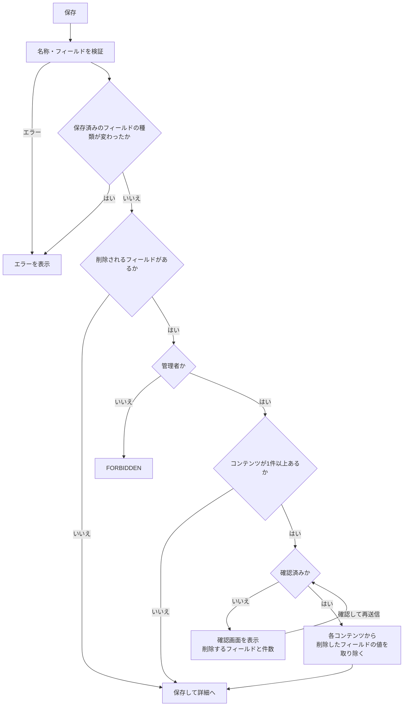
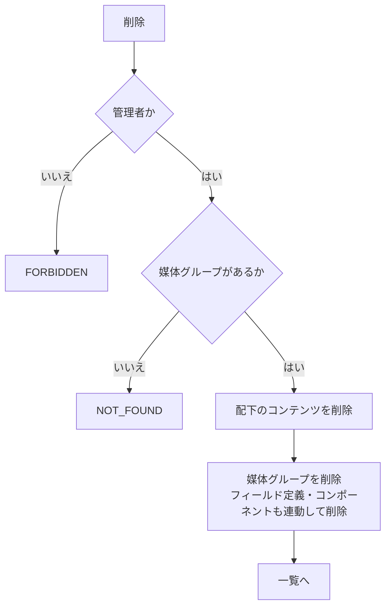

# 機能設計書

## 1. 概要

媒体グループは、コンテンツの入力フォーム(フィールドの構成)を定義するグループである。「バナー」「スタイリング」のように、コンテンツの種類ごとに作る。コンテンツ(コンテンツ管理)は、媒体グループの定義に沿って入力する。コンポーネント(コンポーネント管理)は、媒体グループを選び、そのコンテンツのデータを埋め込む。

| 項目 | 内容 |
|---|---|
| 対象機能 | 媒体グループの一覧・詳細・作成・編集・削除、フィールド定義 |
| 関連要件 | F-01(メインバナーなどの媒体コンテンツの土台)、F-02(コンポーネントが埋め込む項目の元) |
| 利用者 | 管理画面を使う全員。フィールドの削除と媒体グループの削除は管理者のみ |

## 2. 機能仕様

| ID | 機能 | 概要 | 入力 | 出力 | 備考 |
|---|---|---|---|---|---|
| FD-01 | 媒体グループの一覧 | 作成の古い順に、20件ずつ表示する | page | 名称、フィールド数、コンテンツ数、作成日 | コンテンツ数から、そのグループのコンテンツ一覧へ移動できる |
| FD-02 | 媒体グループの詳細 | フィールド定義を表で表示する(繰り返し項目の子も) | id | 媒体グループ、コンテンツ数 | 存在しない id は 404 |
| FD-03 | 媒体グループの作成 | 名称とフィールドを登録する | 名称、フィールドの一覧 | 媒体グループ | 保存後、詳細画面へ移動する |
| FD-04 | 媒体グループの編集 | 名称・フィールドを更新する。並び替え・追加・削除ができる | id、名称、フィールドの一覧、確認済みフラグ | 媒体グループ | 保存後、詳細画面へ移動する |
| FD-05 | フィールド削除の確認 | コンテンツがある媒体グループでフィールドを削除するとき、確認を求める | 削除されるフィールド、コンテンツ数 | 確認画面 | 確認後に、各コンテンツの値も削除する |
| FD-06 | 媒体グループの削除 | 媒体グループと、配下のコンテンツをすべて削除する | id | なし | 管理者のみ。コンポーネントも外部キーで削除される |

### フィールドの種類

| 種類(type) | 表示名 | 入力値の形式 | 検証 |
|---|---|---|---|
| text | 単一テキスト | 文字列 | 255文字以内 |
| textarea | テキストエリア | 文字列 | 10000文字以内 |
| number | 数値 | 文字列 | 数値として読めること |
| date | 日付 | 文字列(YYYY-MM-DD) | 実在する日付 |
| image | 単一画像 | 画像ID | なし(メディアから選ぶ) |
| images | 複数画像 | 画像IDの配列の JSON 文字列 | 20枚まで、重複なし |
| select | 選択肢 | 文字列 | 選択肢のどれか |
| repeater | 繰り返し項目 | 行(子フィールドID→値)の配列の JSON 文字列 | 50行まで。空の行は保存しない。子の値は子の定義で検証 |

### 制約

| 項目 | 内容 |
|---|---|
| 媒体グループ名 | 必須、50文字以内。前後の空白は除く |
| フィールド数 | 1個以上、50個まで |
| フィールド名 | 必須、50文字以内。同じ媒体グループの中で重複しない |
| 選択肢(select) | 1つ以上。空欄なし、重複なし |
| 繰り返し項目の子 | 1個以上、20個まで。子の中に繰り返し項目は置けない(入れ子は1段)。子の名前は重複しない |
| 種類の変更 | 保存済みのフィールド(繰り返し項目の子を含む)は、種類を変更できない |
| 必須 | フィールドごとに必須 / 任意を選ぶ |

## 3. 画面設計

### 画面一覧

| 画面 | 目的 | 主な表示項目 | 主な操作 | 遷移先 |
|---|---|---|---|---|
| 媒体グループ一覧(`/media-groups`) | 媒体グループを探す | 名称(リンク)、フィールド数、コンテンツ数(リンク)、作成日、ページ送り | 新規追加、名称・コンテンツ数のクリック | 追加、詳細、`/contents?group=<id>` |
| 媒体グループ追加(`/media-groups/new`) | 媒体グループを作る | 名称、フィールドの一覧(名称・種類・必須・選択肢・子項目) | フィールドの追加・並び替え(↑ ↓)・削除、作成 | 詳細 |
| 媒体グループ詳細(`/media-groups/<id>`) | 定義の確認 | 名称、入力フォーム設定の表(番号、名称、種類、必須、選択肢。子は「1-1.」の形式)、作成・更新日時 | 編集、コンテンツを追加、コンテンツ一覧、削除(管理者のみ) | 編集、`/contents/new?group=<id>`、`/contents?group=<id>`、一覧 |
| 媒体グループ編集(`/media-groups/<id>/edit`) | 定義の変更 | 追加画面と同じ | 保存、フィールドの削除の確認 | 詳細 |

- フィールドの種類は、保存済みのものは選択を無効にする。
- 種類を「繰り返し項目」にすると、空の入力項目が1つ自動で追加される。入力項目を0個にして保存すると、「入力項目を1つ以上追加してください」のエラーになる。
- 保存済みのフィールドの「削除」ボタンは、管理者でなければ無効になり、「フィールドの削除は管理者のみ可能です」と表示する。追加したばかり(未保存)のフィールドは、管理者でなくても削除できる。
- 選択肢は、1行に1つずつ入力する。

## 4. 処理フロー

### 更新(フィールド削除の確認を含む)

### 削除

- 削除前の確認ダイアログは「媒体グループ「名前」と、配下のN件のコンテンツをすべて削除します。元に戻せません。」を表示する。
- 繰り返し項目の子を外したときも、削除されるフィールドとして扱う(名称は「親 > 子」)。
- フィールドIDは、画面側で新規フィールドに採番する(画面から渡されたIDを使う。なければサーバーで採番する)。保存前でも、入力値をIDに紐づけられる。

## 5. データ設計

### media_groups

| エンティティ | 項目 | 型 | 必須 | 説明 |
|---|---|---|---|---|
| media_groups | id | TEXT(UUID) | ○ | 主キー |
| | name | TEXT | ○ | 名称(50文字以内) |
| | created_at | TEXT(ISO 8601) | ○ | 作成日時 |
| | updated_at | TEXT(ISO 8601) | ○ | 更新日時 |

### field_definitions

| エンティティ | 項目 | 型 | 必須 | 説明 |
|---|---|---|---|---|
| field_definitions | id | TEXT(UUID) | ○ | 主キー |
| | media_group_id | TEXT | ○ | 媒体グループ(削除時に連動して削除) |
| | name | TEXT | ○ | フィールド名 |
| | type | TEXT | ○ | 種類(text / textarea / number / date / image / images / select / repeater) |
| | required | INTEGER | ○ | 必須(0 / 1) |
| | options | TEXT(JSON) | ○ | select の選択肢。既定は空配列 |
| | children | TEXT(JSON) | ○ | repeater の子フィールド。既定は空配列 |
| | position | INTEGER | ○ | 並び順(インデックス `media_group_id, position`) |

## 6. インターフェース

| 名称 | 種別 | 入力 | 出力 | 備考 |
|---|---|---|---|---|
| createMediaGroupAction | Server Action | name、fields(JSON) | 詳細へリダイレクト | `revalidatePath("/", "layout")` |
| updateMediaGroupAction | Server Action | id、name、fields(JSON)、confirmFieldRemoval | 詳細へリダイレクト、または確認の状態 | 管理者の判定に Actor を使う |
| deleteMediaGroupAction | Server Action | id | 一覧へリダイレクト | Actor を使う |
| CreateMediaGroupUseCase | ユースケース | 名称、フィールド | MediaGroup | |
| UpdateMediaGroupUseCase | ユースケース | Actor、id、名称、フィールド、確認済みフラグ | updated / confirmation-required | |
| DeleteMediaGroupUseCase | ユースケース | Actor、id | なし | |
| ListMediaGroupsPageUseCase | ユースケース | page、perPage | 媒体グループとコンテンツ数のページ | |

- フィールドの一覧は、フォームの hidden 入力に JSON で入れて送る(`parseFieldsPayload`)。

## 7. エラー処理・例外

| 事象 | 条件 | 画面・応答 | 対応 |
|---|---|---|---|
| 名称が空 | 空白のみ | 「媒体グループ名を入力してください」 | 入力する |
| 名称が長い | 51文字以上 | 「媒体グループ名は50文字以内で入力してください」 | 短くする |
| フィールドなし | 0個 | 「フィールドを1つ以上追加してください」 | 追加する |
| フィールドが多い | 51個以上 | 「フィールドは50個まで追加できます」 | 減らす |
| 名称・IDの重複 | 同じ名称・IDのフィールド | 「フィールド名が重複しています」 | 名称を変える |
| フィールド名が不正 | 空、51文字以上 | 「フィールド名を入力してください」など | 直す |
| 種類が不正 | 定義にない種類 | 「フィールド「名前」の種類が不正です」 | 選び直す |
| 選択肢が不正 | 0個、空欄、重複 | 「選択肢を1つ以上入力してください」「選択肢が重複しています」 | 直す |
| 繰り返し項目が不正 | 子が0個、21個以上、子に繰り返し項目、子の名前が重複 | 各メッセージ | 直す |
| 種類の変更 | 保存済みのフィールドの種類を変えた | 「既存のフィールド「名前」の種類は変更できません」 | 新しいフィールドを追加する |
| 削除の権限なし | 管理者以外がフィールドを削除 | 「フィールドの削除は管理者のみ実行できます」 | 管理者が操作する |
| 削除の確認 | コンテンツがあるグループでフィールドを削除 | 確認画面(削除するフィールド名、影響するコンテンツ数) | 確認して再送信 |
| 媒体グループなし | 存在しない id | 詳細・編集は 404、更新・削除は「媒体グループが見つかりません」 | 一覧から選び直す |
| 削除の権限なし(グループ) | 管理者以外が削除 | 「媒体グループの削除は管理者のみ実行できます」 | 管理者が操作する |

## 8. 未決事項

### 仕様

| 項目 | 現状 | 決める内容 |
|---|---|---|
| コンポーネントがあるグループの削除 | 確認の文言は、コンテンツの件数のみ。コンポーネントも連動して削除される | 確認に、削除されるコンポーネントの件数も出すか。コンポーネントがあるグループは削除できなくするか |
| フィールドの削除と公開済みコンテンツ | 削除すると、公開済みのコンテンツからも値が消える | EC基盤に影響する変更を、公開中のものに対して許すか |
| フィールドの種類の変更 | 変更不可 | 種類を変えたい場合の手順(新規追加と値の移行など) |
| 並び替え | 作成の古い順。変更できない | 並び順を変えられるようにするか |
| 権限 | フィールド・グループの削除は管理者のみ。認証が未実装のため、全員が管理者 | 認証と権限の設計書を参照 |
