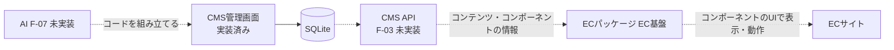

# 機能設計書

## 1. 概要

要件定義書(EC CMS / 開発要件整理)にあり、`main` ブランチではまだ実装されていない機能の整理。現状のコードで、実装の足がかりになるものと、決める必要があることを示す。この文書は、要件を実装へ落とすときの出発点であり、仕様の確定したものではない。実装の済んだ機能は、それぞれの設計書に書く。

| 項目 | 内容 |
|---|---|
| 対象機能 | EC基盤向けAPI(F-03)、テーマ管理(F-05)、AIによるコンポーネントコード生成(F-07)、メインバナーの切り替え(F-01 の一部)、設定画面 |
| 関連要件 | F-01、F-03、F-05、F-07 |
| 利用者 | EC基盤(API の利用者)、EC運用担当者、開発者 |

## 2. 機能仕様

| ID | 機能 | 概要 | 入力 | 出力 | 備考 |
|---|---|---|---|---|---|
| FD-01 | EC基盤向けAPI(F-03) | EC基盤が、コンテンツとコンポーネントの情報を取得できる API | リクエスト | JSON | 未実装。現在の足がかりは下記 |
| FD-02 | テーマ管理(F-05) | テーマの登録と適用 | テーマ | テーマ | 未実装。足がかりなし |
| FD-03 | AIによるコンポーネントコード生成(F-07) | 管理画面の設定をもとに、AI でコンポーネントのコードを組み立てる | 設定、レスポンスのサンプル | HTML / CSS / JS | 未実装 |
| FD-04 | メインバナーの切り替え(F-01 の一部) | 複数のUI(コンポーネント)から選び、公開 / 非公開を切り替える | コンポーネントの選択 | 表示するUI | 未実装。コンテンツの公開 / 下書きは実装済み |
| FD-05 | 設定画面 | 設定の項目を置く場所 | - | 「設定は準備中です」 | プレースホルダ(`/settings`) |

### 実装の足がかり

| 機能 | 現在の実装 | 活用できる点 |
|---|---|---|
| EC基盤向けAPI | `GET /files/<id>`(画像配信)のみが外部から使える | レスポンスの形は、プレビューのレスポンス(`buildDetailResponse` / `buildListResponse`)が、そのまま使える。画像は `/files/<id>` の URL になっている |
| EC基盤向けAPI | コンポーネントの HTML / CSS / JS を保存済み | コンポーネントを返す形式の検討(下記の未決事項) |
| メインバナー | 媒体グループ(バナー)とコンテンツの公開 / 下書き、コンポーネントの表示パターン(詳細 / 一覧) | 一覧パターンのレスポンス(`total`、`items`)を、バナーの一覧として使える |
| AIコード生成 | コンポーネントのエディタ、レスポンスの Schema(`buildResponseSchema`)、保存時コードチェック | 生成コードを、Schema に沿った `{{項目}}` と BEM でチェックできる |
| テーマ | なし | - |

## 3. 画面設計

### 画面一覧

| 画面 | 目的 | 主な表示項目 | 主な操作 | 遷移先 |
|---|---|---|---|---|
| 設定(`/settings`) | (将来)設定を置く | 「設定は準備中です」 | なし | なし |
| テーマ管理 | (未実装)テーマの登録・適用 | - | - | - |
| メインバナーの管理 | (未実装)UIの選択と公開 / 非公開 | - | - | - |

## 4. 処理フロー

目指す全体の流れ(要件定義書のシステム概要に基づく)。点線は未実装。

## 5. データ設計

追加が必要になりそうなデータ(案)。仕様が決まっていないため、項目は示さない。

| エンティティ | 目的 | 状況 |
|---|---|---|
| ユーザー・ロール | 認証と権限(F-04) | 認証と権限を参照 |
| テーマ | テーマの登録と適用(F-05) | 未定 |
| コンポーネントの適用 | メインバナーに、どのコンポーネントを使うか(F-01) | 未定 |
| API のキー(クレデンシャル) | EC基盤からのアクセスの認可 | 未定 |

## 6. インターフェース

| 名称 | 種別 | 入力 | 出力 | 備考 |
|---|---|---|---|---|
| CMS API | HTTP API(未実装) | 未定 | JSON | 要件定義書では、Next.js の Route Handlers(zod で検証、OpenAPI で契約を明文化)を提案中。N-01: すべての API が 200 で応答する |
| AI(LLM)のAPI | 外部連携(未実装) | 未定 | コード | 要件定義書では Claude API などを検討中 |
| モック | 外部連携(未実装) | - | - | 連携サービスは、モックでレスポンスを定義する予定 |

## 7. エラー処理・例外

未実装のため、エラー処理は未定。実装時に決める。

| 事象 | 条件 | 画面・応答 | 対応 |
|---|---|---|---|
| 設定画面を開く | `/settings` | 「設定は準備中です」 | 未実装 |

## 8. 未決事項

### EC基盤向けAPI(F-03)

| 項目 | 現状 | 決める内容 |
|---|---|---|
| 提供する範囲 | 未実装 | 返すもの(コンテンツ、コンポーネントのコード、メタ情報)と、エンドポイントの構成 |
| 公開の扱い | プレビューは、公開・下書きを区別しない | 公開済みのコンテンツ・コンポーネントだけを返す |
| 認証 | 未実装 | API キーなど、EC基盤の認可方式 |
| 契約と検証 | 未実装 | 入出力の検証と、OpenAPI で契約を残すか |
| 性能 | 数値目標なし(N-01) | 応答時間、キャッシュ(公開データの更新との整合) |

### テーマ(F-05)

| 項目 | 現状 | 決める内容 |
|---|---|---|
| テーマの定義 | 未定 | テーマとは何か(色・フォントなどの値か、コンポーネントの組か) |
| 適用の方法 | 未定 | テーマの切り替えと、コンポーネントとの関係。EC運用担当者が行う操作 |

### AIコード生成(F-07)

| 項目 | 現状 | 決める内容 |
|---|---|---|
| 入力と出力 | 未定 | 設定する項目(見た目の指示、APIレスポンスのサンプル、データ埋め込み場所など)と、生成する単位 |
| 承認とバージョン | 未定 | 生成後すぐ適用するか、確認・承認してから適用するか。履歴の保存 |
| 利用するAIとコスト | 未定 | モデル、1回あたりの利用料、利用回数の上限、AIの API キーの持ち主 |

### メインバナー(F-01)

| 項目 | 現状 | 決める内容 |
|---|---|---|
| 複数のUIの切り替え | 未実装 | どこで、どのコンポーネントを使うかを、選ぶ設定(コンポーネント管理の未決事項) |
| 公開 / 非公開 | コンテンツ・コンポーネントそれぞれに、公開 / 下書きがある | メインバナーとしての公開と、既存のステータスとの関係 |
