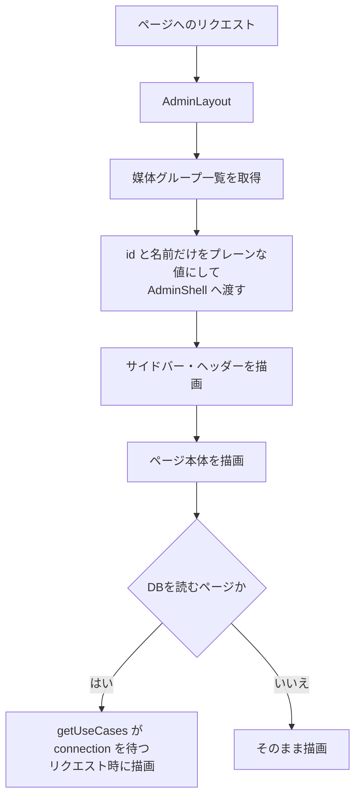

# 機能設計書

## 1. 概要

管理画面の共通部分。ヘッダー、サイドバー(ナビゲーション)、ページ見出し、一覧のページ送り、日時の表示形式、ルーティングの構成を定める。管理画面のページは、すべて `app/(admin)/` に置き、同じレイアウトを使う。

| 項目 | 内容 |
|---|---|
| 対象機能 | 管理画面のレイアウト、サイドバー、ページ送り、日時の表示、DB を読むページの扱い |
| 関連要件 | F-04(ログイン画面は未実装) |
| 利用者 | 管理画面を使う全員 |

## 2. 機能仕様

| ID | 機能 | 概要 | 入力 | 出力 | 備考 |
|---|---|---|---|---|---|
| FD-01 | 共通レイアウト | ヘッダー、サイドバー、本文の枠を、全ページに付ける | ページ | 画面 | `app/(admin)/layout.tsx`、`AdminShell` |
| FD-02 | サイドバー | 6つのメニューを表示し、現在のページを強調する。「コンテンツ」の下に媒体グループを開閉して並べる | 現在のURL、媒体グループの一覧 | メニュー | `navigation.ts` が定義 |
| FD-03 | ページ見出し | ページの題名と説明を表示する | title、description | 見出し | `PageHeader` |
| FD-04 | ページ送り | 一覧を20件ずつ表示し、前後のページへ移動する | page(クエリ) | 一覧の1ページ分 | 範囲外のページは、最初または最後に丸める |
| FD-05 | 日時の表示 | 日時・日付を日本語、日本時間(Asia/Tokyo)で表示する | Date | 文字列 | `formatDateTime` / `formatDate` |
| FD-06 | リクエスト時の描画 | DB を読むページを、ビルド時に描画しない | - | - | `getUseCases()` が `connection()` を待つ |
| FD-07 | 確認つきボタン | 削除などの前に確認ダイアログを出す | メッセージ | 送信 / 中止 | `ConfirmSubmitButton` |

### サイドバーのメニュー

| メニュー | URL | アイコン | 備考 |
|---|---|---|---|
| ダッシュボード | `/` | dashboard | `/` は完全一致のときだけ強調 |
| コンテンツ | `/contents` | contents | 下に媒体グループを並べる。配下のページを開いているときは必ず展開する |
| 媒体グループ | `/media-groups` | media-groups | |
| コンポーネント | `/components` | components | |
| メディア | `/media` | media | |
| 設定 | `/settings` | settings | 準備中 |

## 3. 画面設計

### 画面一覧

| 画面 | 目的 | 主な表示項目 | 主な操作 | 遷移先 |
|---|---|---|---|---|
| ヘッダー | 管理画面の上部。トップへ戻る | サービス名(リンク)、「管理者」の表示 | サービス名のクリック | `/` |
| サイドバー | 機能間の移動 | メニュー、媒体グループ(コンテンツの下) | メニューのクリック、▸ / ▾ で媒体グループを開閉 | 各画面。媒体グループは `/contents?group=<id>` |
| ページ送り | 一覧のページ移動 | 全件数、ページ番号、前後の矢印 | ページ番号・矢印のクリック | 同じ一覧の別ページ |
| 設定(準備中) | 将来の設定画面の場所 | 「設定は準備中です」 | なし | なし |

- ヘッダーの「管理者」は固定の文字で、ログイン中のユーザーを表すものではない(「認証と権限」を参照)。
- ページ送りは、現在のページの前後と、先頭・末尾だけを並べ、間は「…」で省略する。総ページが1ページのときは表示しない(一覧画面の側で判定)。
- 媒体グループの絞り込みなど、ページ送りの前後でクエリを保つ必要がある一覧は、`hrefOf` で遷移先を組み立てる。

## 4. 処理フロー

- Server Component から Client Component へ渡す props は、プレーンなオブジェクトだけにする(ドメインのクラスは渡さない)。
- コンテンツ・媒体グループを更新する Server Action は、`revalidatePath("/", "layout")` で、サイドバーの媒体グループも更新する。

## 5. データ設計

画面共通に固有のデータはない。サイドバーは、媒体グループの `id` と `name` だけを使う。

| エンティティ | 項目 | 型 | 必須 | 説明 |
|---|---|---|---|---|
| ページ送りの結果(Page) | items | 配列 | ○ | そのページの要素 |
| | total | 数値 | ○ | 全件数 |
| | page | 数値 | ○ | 実際に返したページ(範囲外・不正な値は丸める) |
| | totalPages | 数値 | ○ | 総ページ数(最小1) |

## 6. インターフェース

| 名称 | 種別 | 入力 | 出力 | 備考 |
|---|---|---|---|---|
| `?page=<n>` | クエリ | ページ番号 | 一覧の該当ページ | 数値でない・1未満は1。総ページを超えると最後 |
| `getUseCases()` | 関数 | なし | DI コンテナ | ページでは `getContainer()` を直接呼ばない |
| `orNotFound(promise)` | 関数 | ユースケースの呼び出し | 結果、または 404 | `NOT_FOUND` を `notFound()` に変換する |

## 7. エラー処理・例外

| 事象 | 条件 | 画面・応答 | 対応 |
|---|---|---|---|
| 404 | 詳細・編集画面で、IDが存在しない | Next.js の 404 画面 | 一覧から開き直す |
| ページが範囲外 | `?page` が総ページより大きい | 最後のページを表示 | なし |
| 一覧が空 | 件数が0 | 「〜がありません」の文言(一覧ごと) | 「新規追加」から作成する |
| 設定画面にアクセス | `/settings` | 「設定は準備中です」 | 未実装(「未実装機能」を参照) |

## 8. 未決事項

### 画面

| 項目 | 現状 | 決める内容 |
|---|---|---|
| ログイン中のユーザー表示 | ヘッダーに「管理者」と固定表示 | 認証導入後に、ユーザー名・ロール・ログアウトを表示するか |
| モバイル対応 | 未確認(コードからは判断できない) | 管理画面をスマートフォンで使うか |
| 設定画面の内容 | 準備中 | 設定する項目(未実装機能を参照) |
