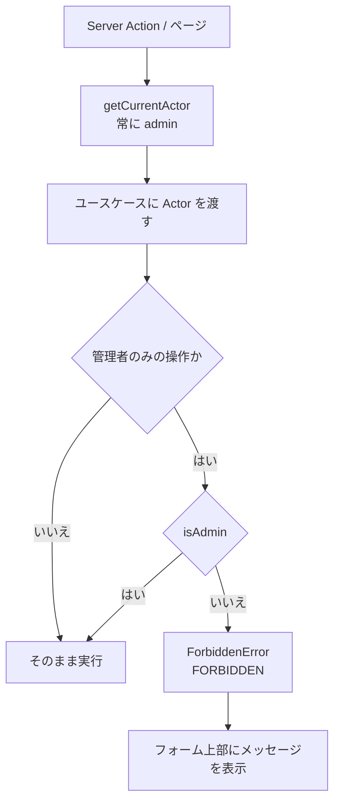
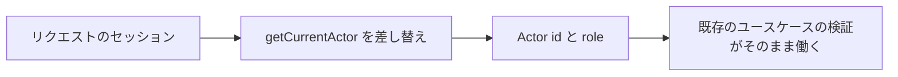

# 機能設計書

## 1. 概要

操作者(Actor)と権限の扱い。要件定義書(F-04)では、管理者 / 開発者 / EC運用担当者の3つの権限と、ログイン画面を求めている。現状は、認証が未実装で、操作者は常に管理者として扱われる。権限の検証の仕組み(管理者のみ可能な操作の判定)だけが先に実装されている。認証を導入するときは、操作者を返す1か所(`getCurrentActor`)を差し替える。

| 項目 | 内容 |
|---|---|
| 対象機能 | 操作者(Actor)の取得、ロールによる操作の制限(管理者のみの操作) |
| 関連要件 | F-04(権限管理、ログイン画面)、N-03(認証)、N-04(権限制御) |
| 利用者 | 管理画面を使う全員 |

## 2. 機能仕様

| ID | 機能 | 概要 | 入力 | 出力 | 備考 |
|---|---|---|---|---|---|
| FD-01 | 操作者の取得 | 現在の操作者(id とロール)を返す | なし | Actor | 常に `{ id: "admin", role: "admin" }`(認証は未実装) |
| FD-02 | 管理者のみの操作の検証 | ユースケースが、Actor のロールを検証し、管理者でなければ拒否する | Actor | 許可 / FORBIDDEN | `isAdmin(actor)` |
| FD-03 | 画面側の制御 | 管理者でなければ、使えない操作のボタンを非表示・無効にする | Actor | 表示の切り替え | 画面の制御は補助。検証はユースケースで必ず行う |

### ロールと権限

| ロール | コード上の値 | 現状 |
|---|---|---|
| 管理者 | admin | 全操作が可能。現状は、全員がこのロール |
| 編集者 | editor | 型としてだけ存在する。使われていない |
| 開発者 / EC運用担当者 | なし | 未実装(要件定義書の3ロール。「未決事項」を参照) |

### 管理者のみの操作

| 操作 | 場所 | 拒否のメッセージ |
|---|---|---|
| 媒体グループのフィールドの削除(繰り返し項目の子を含む) | UpdateMediaGroupUseCase | 「フィールドの削除は管理者のみ実行できます」 |
| 媒体グループの削除 | DeleteMediaGroupUseCase | 「媒体グループの削除は管理者のみ実行できます」 |
| メディア(画像)の削除 | DeleteImageUseCase | 「メディアの削除は管理者のみ実行できます」 |

- 上記以外の操作(コンテンツの削除、コンポーネントの編集・削除など)は、ロールで制限しない。
- 画面側は、フィールドの削除ボタンを管理者でなければ無効にし(「フィールドの削除は管理者のみ可能です」)、媒体グループ詳細の削除ボタンを非表示にする。
- 認可は、Server Action はユースケース内で必ず検証する。画面の非表示だけに頼らない(Server Action は直接送信できるため)。

## 3. 画面設計

### 画面一覧

| 画面 | 目的 | 主な表示項目 | 主な操作 | 遷移先 |
|---|---|---|---|---|
| ログイン画面 | ログインする | (未実装) | (未実装) | (未実装) |
| ヘッダーの利用者表示 | 利用者の表示 | 「管理者」(固定の文字) | なし | なし |

- ログイン・ログアウト・ユーザー管理の画面は、まだない。

## 4. 処理フロー

### 認証を導入するときの差し替え

## 5. データ設計

| エンティティ | 項目 | 型 | 必須 | 説明 |
|---|---|---|---|---|
| Actor | id | 文字列 | ○ | 操作者のID(現状は固定の `admin`) |
| | role | admin / editor | ○ | ロール |

- ユーザー・パスワード・セッションのテーブルは、まだない(未実装)。

## 6. インターフェース

| 名称 | 種別 | 入力 | 出力 | 備考 |
|---|---|---|---|---|
| getCurrentActor | 関数 | なし | Actor | `infrastructure/auth/current-actor.ts`。認証の差し替え場所 |
| isAdmin | 関数 | Actor | 真偽 | `domain/shared/actor.ts` |
| ForbiddenError | ドメインエラー | メッセージ | code = FORBIDDEN | `isForbiddenError` で判定する |

## 7. エラー処理・例外

| 事象 | 条件 | 画面・応答 | 対応 |
|---|---|---|---|
| 権限なし | 管理者以外が、管理者のみの操作をした | フォーム上部にメッセージ(例: 「メディアの削除は管理者のみ実行できます」) | 管理者が操作する |
| 未ログイン | (未実装) | - | 認証の導入後に、ログイン画面へ誘導する |

- 現状は、全員が管理者のため、権限なしのエラーは実際には起きない(テストでは、editor の Actor で確認している)。

## 8. 未決事項

### 認証

| 項目 | 現状 | 決める内容 |
|---|---|---|
| 認証方式 | 未実装。要件定義書では Auth.js のメール+パスワードを提案中 | 方式、パスワードの扱い、セッションの有効期間、外部認証の有無(要件定義書の未決事項) |
| ログイン画面・ユーザー管理 | なし | ユーザーの作成・変更・削除を、だれが、どの画面で行うか。初期ユーザーの作り方 |
| 画像の配信 | 認証なしで取得できる | ログインしていなくても、画像のURLを開けるようにしてよいか(EC基盤から取得するため) |

### ロールと権限

| 項目 | 現状 | 決める内容 |
|---|---|---|
| ロールの構成 | コード上は admin / editor の2種類。要件は 管理者・開発者・EC運用担当者 の3種類 | ロールの名前と数。`Role` の型を要件に合わせて変更するか |
| 権限の範囲 | 3つの削除のみ管理者に制限 | 要件(開発者: コード編集など / EC運用担当者: 公開・非公開、コンポーネント選択、テーマ適用のみ)に沿って、操作ごとの可否表を決める |
| 画面の出し分け | 管理者かどうかで、削除ボタンを出し分けるのみ | ロールごとに、メニュー・画面を出し分けるか(コンポーネントエディタは開発者のみ、など) |
| 操作の記録 | なし | 監査のために、操作者と日時を記録するか |
