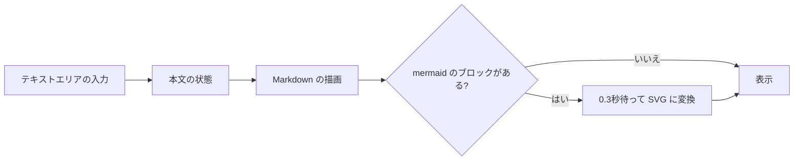
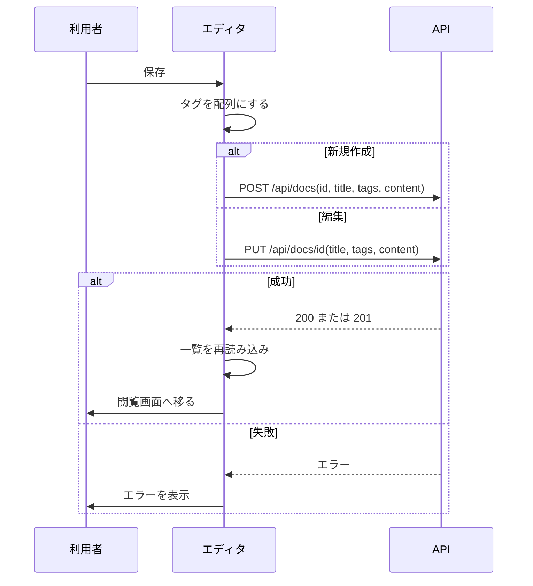

# 機能設計書

## 1. 概要

ドキュメントを、Markdown で書き、横にプレビューを見ながら編集する。閲覧画面でも、同じ描画で表示し、見出しから目次を作る。描画は、すべてブラウザ側で行う。

| 項目 | 内容 |
|---|---|
| 対象機能 | エディタ(新規作成・編集)、Markdown の描画(閲覧・プレビュー)、Mermaid、目次、コードハイライト |
| 関連要件 | なし(全体概要の「未決事項」を参照) |
| 利用者 | 編集は開発メンバー以上。閲覧(描画)は全員 |

## 2. 機能仕様

| ID | 機能 | 概要 | 入力 | 出力 | 備考 |
|---|---|---|---|---|---|
| FD-01 | Markdown の編集 | テキストエリアで Markdown を書く | 本文 | 入力中の本文 | 等幅フォント。スペルチェックなし |
| FD-02 | プレビュー | 入力中の本文を、そのまま描画する | 本文 | 描画結果 | 編集と同時に更新する |
| FD-03 | Markdown の描画 | GFM(表、チェックリスト、取り消し線 など)を描画する | 本文 | HTML | react-markdown + remark-gfm |
| FD-04 | コードハイライト | コードブロックを、言語ごとに色付けする | コードブロック | 色付きのコード | rehype-highlight。Mermaid のブロックは対象外 |
| FD-05 | Mermaid 図 | ` ```mermaid ` のコードブロックを図にする | Mermaid の記述 | SVG | 必要になったときだけ読み込む。入力が止まって 0.3 秒後に描画 |
| FD-06 | 見出しのアンカー | 見出しに id を付ける | 見出し | id つきの見出し | rehype-slug |
| FD-07 | 目次 | h1〜h3 の見出しから、目次を作る | 描画結果 | 目次(右側) | 閲覧画面のみ。画面幅が広いとき(xl 以上)だけ表示 |
| FD-08 | 画像の貼り付け・ドロップ | 画像を貼り付け・ドロップして、本文に挿入する | 画像ファイル | `` | 画像アップロードを参照 |
| FD-09 | 保存 | 新規作成または更新する | タイトル、タグ、本文(新規は、保存先フォルダも) | 保存後に閲覧画面へ | ドキュメント管理を参照 |

### 描画のルール

- 本文に書かれた生の HTML は、HTML として解釈しない(react-markdown の既定。スクリプトは実行されない)
- Mermaid は、`securityLevel: strict` で描画する
- Mermaid の記述に誤りがあるときは、図の代わりに「Mermaid error: <メッセージ>」を赤字で表示する
- スタイルは、Tailwind の typography(prose)を使い、リンクはブランドカラーで表示する

## 3. 画面設計

### 画面一覧

| 画面 | 目的 | 主な表示項目 | 主な操作 | 遷移先 |
|---|---|---|---|---|
| 編集(`/edit/<id>`)、新規作成のエディタ(`/new?template=<id>`) | 書く | 上段: 保存先フォルダ(新規のみ)、タイトル、タグ(編集のみ)、エラー、保存ボタン。下段: Markdown の入力、プレビュー | 入力、画像の貼り付け・ドロップ、保存 | 保存後に `/docs/<id>` |
| 閲覧(`/docs/<id>`) | 読む | 本文、目次 | 目次のクリックで、見出しへ移動 | 同じページ内 |

- 下段は、画面幅が広いとき(lg 以上)は左右に2つ、狭いときは縦に並べる
- 入力欄のラベル: 「Markdown(画像は貼り付け / ドロップで追加)」
- 保存ボタンは、タイトルが空のとき、保存中のときは無効。保存中は「保存中…」と表示する
- エラーは、保存ボタンの横に赤字で表示する
- タグは、カンマ区切りで入力する(前後の空白は除き、空は捨てる)
- 新規作成のとき、保存先フォルダの選択肢は「ルート」と既存のフォルダ

## 4. 処理フロー

### プレビューの更新



### 保存



## 5. データ設計

エディタ内の状態(保存前の入力)。保存するデータは、ドキュメント管理を参照。

| エンティティ | 項目 | 型 | 必須 | 説明 |
|---|---|---|---|---|
| エディタの状態 | folder | 文字列 | 新規のみ | 保存先フォルダ(空はルート) |
| エディタの状態 | title | 文字列 | ○ | タイトル。新規作成では、ここからファイル名を決める |
| エディタの状態 | tags | 文字列 | | カンマ区切り(保存時に配列にする) |
| エディタの状態 | content | 文字列 | | Markdown の本文 |

## 6. インターフェース

| 名称 | 種別 | 入力 | 出力 | 備考 |
|---|---|---|---|---|
| POST /api/docs | API | ドキュメント管理を参照 | ドキュメント管理を参照 | 新規作成の保存 |
| PUT /api/docs/&lt;id&gt; | API | ドキュメント管理を参照 | ドキュメント管理を参照 | 編集の保存 |
| POST /api/upload | API | 画像アップロードを参照 | 画像アップロードを参照 | 画像の貼り付け・ドロップ |
| 使用ライブラリ | ブラウザ内 | | | react-markdown、remark-gfm、rehype-highlight、rehype-slug、mermaid |

## 7. エラー処理・例外

| 事象 | 条件 | 画面・応答 | 対応 |
|---|---|---|---|
| 保存の失敗 | 重複・不正な入力・権限なし・通信エラー | 保存ボタンの横にメッセージ(API のメッセージ。なければ「save failed」) | 内容を直して、もう一度保存する |
| 画像のアップロード失敗 | 形式・サイズが不正、権限なし | 同じ場所にメッセージ(API のメッセージ。なければ「upload failed」) | 画像を変える |
| Mermaid の記述の誤り | 構文エラー | 図の代わりに「Mermaid error: ...」 | 記述を直す |
| 保存の途中で画面を離れる | ブラウザを閉じる・戻る | 入力は失われる(下書きの保存なし) | 保存してから離れる |
| 他の人の保存と衝突 | 同じドキュメントを、同時に編集 | 後から保存した内容が残る | 保存前に、再読み込みする |

## 8. 未決事項

### 機能

| 項目 | 現状 | 決める内容 |
|---|---|---|
| 編集中の下書き | 保存せずに離れると失われる。離れる前の警告もない | 自動保存、離脱時の警告が必要か |
| エディタの機能 | テキストエリアのみ(構文の色付け・ショートカットなし) | CodeMirror などへの置き換え(README の想定) |
| 書式のツールバー | なし | 必要か |
| プレビューの同期スクロール | なし | 必要か |
| 目次の表示 | 閲覧画面の広い画面のみ。プレビューには出ない | プレビューにも出すか |
| 生の HTML の扱い | HTML として解釈しない | 一部の HTML を許可するか(許可する場合は、サニタイズが必要) |
| 狭い画面(モバイル) | サイドバーが隠れる(画面共通を参照)。エディタは縦に並ぶ | モバイル対応の範囲 |
