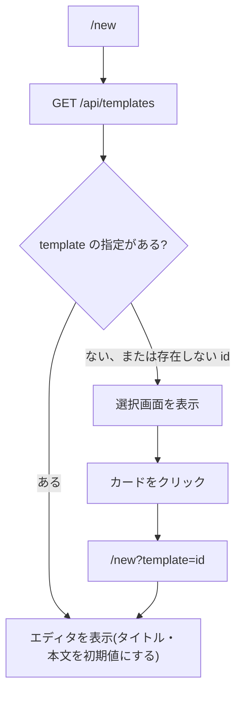

# 機能設計書

## 1. 概要

新規作成のとき、雛形(テンプレート)を選んで、本文の初期値にする。テンプレートは、リポジトリの `templates/*.md` に置いたファイルで、API のビルド時に Worker へ同梱する。

| 項目 | 内容 |
|---|---|
| 対象機能 | テンプレートの一覧、選択、本文の初期値への反映 |
| 関連要件 | なし(全体概要の「未決事項」を参照) |
| 利用者 | 開発メンバー以上(新規作成ができるロール)。一覧の API は、閲覧ができる全員 |

## 2. 機能仕様

| ID | 機能 | 概要 | 入力 | 出力 | 備考 |
|---|---|---|---|---|---|
| FD-01 | 一覧 | テンプレートの id、タイトル、本文を返す | なし | `{ id, title, content }` の配列 | view。ファイル名の昇順 |
| FD-02 | 選択 | 新規作成の最初の画面で、テンプレートを選ぶ | テンプレートの id | エディタの初期値 | `/new?template=<id>` |
| FD-03 | 同梱 | `templates/*.md` を、ビルド時に TypeScript のモジュールへ変換する | `templates/*.md` | 生成されたモジュール | `apps/api/scripts/gen-templates.mjs`。生成物は Git 管理外 |

### テンプレート

| id | タイトル | 内容 |
|---|---|---|
| blank | 空のドキュメント | 見出し「タイトル」のみ |
| design | 設計書 | 概要、アーキテクチャ(Mermaid)、データ設計、画面 / API設計、処理フロー(Mermaid)、エラー処理・例外、テスト方針 |
| requirements | 要件定義書 | 背景・目的、スコープ、利用者・ステークホルダー、機能要件(表)、非機能要件、制約・前提条件、未決事項 |

- テンプレートのタイトルは、ファイル先頭の frontmatter の `title`。なければ、ファイル名(id)
- 本文は、frontmatter を除いた部分

### 反映のルール

- テンプレートを選ぶと、エディタの本文に、テンプレートの本文が入る
- タイトルは、テンプレートのタイトルが入る。ただし「空のドキュメント」(id が blank)は、タイトルを空にする
- タグは、空
- 存在しない id を指定したときは、テンプレートの選択画面を表示する

## 3. 画面設計

### 画面一覧

| 画面 | 目的 | 主な表示項目 | 主な操作 | 遷移先 |
|---|---|---|---|---|
| テンプレートの選択(`/new`) | 雛形を選ぶ | 見出し「テンプレートを選択」、説明、テンプレートのカード(アイコン、タイトル) | カードをクリック | `/new?template=<id>`(エディタ) |

- 一覧を読み込むまで、何も表示しない
- 権限がない(一般メンバー)ときは、`/` へ移る

## 4. 処理フロー

### 同梱の流れ

1. `npm run dev` / `test` / `typecheck` / `deploy` の前に、`gen:templates` を実行する
2. `templates/*.md` を読み、frontmatter の title と本文を取り出す
3. `apps/api/src/infrastructure/templates/templates.generated.ts` に書き出す(フォルダがなければ作る)

## 5. データ設計

| エンティティ | 項目 | 型 | 必須 | 説明 |
|---|---|---|---|---|
| テンプレート | id | 文字列 | ○ | ファイル名(拡張子なし) |
| テンプレート | title | 文字列 | ○ | frontmatter の title。なければ id |
| テンプレート | content | 文字列 | ○ | 本文(frontmatter を除く) |

- D1 には保存しない(コードに同梱する)

## 6. インターフェース

| 名称 | 種別 | 入力 | 出力 | 備考 |
|---|---|---|---|---|
| GET /api/templates | API | なし | `{ id, title, content }` の配列 | view |

## 7. エラー処理・例外

| 事象 | 条件 | 画面・応答 | 対応 |
|---|---|---|---|
| 存在しないテンプレート | `template` の id が、一覧にない | 選択画面を表示する | 選び直す |
| 一覧の取得に失敗 | 通信エラー | 選択画面が空になる(エラー表示はない) | 再読み込み |
| 生成物がない | クリーンな環境で、生成を忘れた | 生成スクリプトが、フォルダを作って書き出す(型チェック・テスト・デプロイの前に自動で実行) | なし |

## 8. 未決事項

### 機能

| 項目 | 現状 | 決める内容 |
|---|---|---|
| テンプレートの追加・編集 | リポジトリの `templates/` にファイルを追加し、再デプロイする。画面からはできない | 画面から管理するか |
| 機能設計書のテンプレート | `.claude/skills/create-design/templates/` にあり、アプリの一覧には出ない | アプリの一覧にも出すか |
| テンプレートからのタグ | 初期のタグを持てない | 持たせるか |
