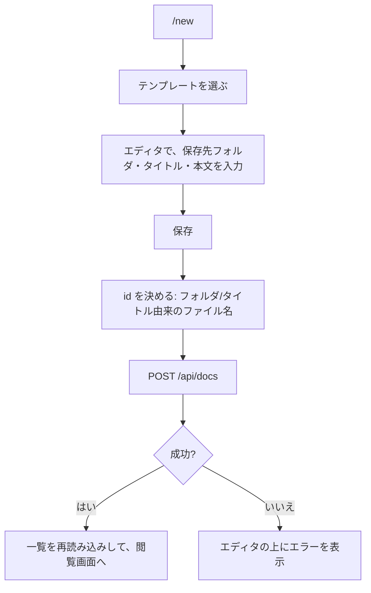

# 機能設計書

## 1. 概要

ドキュメント(Markdown)の一覧、閲覧、作成、編集、移動(名称変更)、削除と、タグでの絞り込み、サイドバーでの検索。ドキュメントは、フォルダ込みのパスを id として識別する。

| 項目 | 内容 |
|---|---|
| 対象機能 | ドキュメントの CRUD、移動・名称変更、タグ、検索 |
| 関連要件 | なし(全体概要の「未決事項」を参照) |
| 利用者 | 閲覧は全員、作成・編集・移動は開発メンバー以上、削除はオーナー |

## 2. 機能仕様

| ID | 機能 | 概要 | 入力 | 出力 | 備考 |
|---|---|---|---|---|---|
| FD-01 | 一覧 | 全ドキュメントの要約(本文なし)を返す | なし | id、タイトル、タグ、更新日時の配列 | view。id の昇順 |
| FD-02 | 取得 | 1件を、本文つきで返す | id | id、タイトル、タグ、更新日時、本文 | view。なければ 404 |
| FD-03 | 作成 | 新しいドキュメントを作る | id、タイトル、タグ、本文 | `{ id }`(201) | edit。同じ id は 409 |
| FD-04 | 更新 | タイトル・タグ・本文を更新する | id、タイトル、タグ、本文 | `{ ok: true }` | edit。更新日時が現在になる。なければ 404 |
| FD-05 | 移動・名称変更 | id(フォルダ・ファイル名)とタイトルを変える | id、新しい id(to)、タイトル | `{ ok: true }` | edit。更新日時は、移動だけなら変わらない。別のフォルダへ移すと、並び順は未設定に戻る(名称だけの変更では保つ) |
| FD-06 | 削除 | ドキュメントを削除する | id | `{ ok: true }` | delete(オーナーのみ)。なければ 404 |
| FD-07 | タグ絞り込み | `/?tag=<タグ>` で、そのタグのドキュメントだけを一覧する | タグ | 絞り込んだ一覧 | ブラウザ側で絞り込む |
| FD-08 | サイドバー検索 | タイトル・id・タグの部分一致(大文字小文字を区別しない)で絞り込む | 検索語 | 検索結果 | ブラウザ側で絞り込む(本文は対象外) |
| FD-09 | 親フォルダの維持 | ドキュメントを作った・移したフォルダは、中身が空になっても残る | なし | なし | 親フォルダを、明示的なフォルダとして保存する(フォルダ管理) |
| FD-10 | 並び順 | 同じフォルダの中での並び順(order)を持つ。1 以上が設定済み、0 が未設定 | なし | 一覧・取得の `order` | 設定は、フォルダ管理の「並び順の設定」(PUT /api/order)。新規作成は未設定(最後に並ぶ) |

### 入力の規則

| 項目 | 規則 |
|---|---|
| id | `\` は `/` に、前後の `/` は除き、末尾の `.md` も除く。空の要素・`.`・`..`・制御文字は不可。300文字まで。最上位が `assets` のものは不可 |
| タイトル | 前後の空白を除く。空なら、id のファイル名部分を使う。200文字まで |
| タグ | 前後の空白を除き、重複と空を除く。30個まで、1個50文字まで |
| 本文 | 400,000文字まで(D1 の1行の上限に収めるため) |

## 3. 画面設計

### 画面一覧

| 画面 | 目的 | 主な表示項目 | 主な操作 | 遷移先 |
|---|---|---|---|---|
| ドキュメント一覧(`/`) | 一覧から探す | 見出し(「すべてのドキュメント」または `#タグ`)、件数、各ドキュメントのカード(フォルダ、タイトル、タグ、更新日) | カードをクリック | `/docs/<id>` |
| ドキュメント閲覧(`/docs/<id>`) | 読む | フォルダ、タイトル、タグ、更新日時、本文、目次 | 編集、移動、削除、タグのクリック | `/edit/<id>`、移動ダイアログ、削除の確認、`/?tag=` |
| 新規作成(`/new`) | 新しく書く | テンプレートの選択、エディタ | テンプレートを選ぶ、保存 | 保存後は `/docs/<id>` |
| 編集(`/edit/<id>`) | 編集する | エディタ(タイトル、タグ、本文) | 保存 | 保存後は `/docs/<id>` |
| 移動ダイアログ | 名称変更・移動 | タイトル、移動先フォルダ、ファイル名(.md なし)、保存先の表示 | 保存、キャンセル(Esc、外側のクリックでも閉じる) | 保存後は、新しい id の閲覧画面 |
| 削除の確認ダイアログ | 削除を確認 | 対象のタイトル | 削除する、キャンセル | 削除後は `/` |

- 一覧は、更新日時の新しい順
- ドキュメントがないときは、「ドキュメントがありません。」と「最初のドキュメントを作成」のリンクを出す(リンクは、一般メンバーにも表示される。押すと、権限がないため `/` に戻る)
- 閲覧画面の「編集」「移動」は edit、「削除」は delete を持つユーザーにだけ表示する
- 移動ダイアログの保存ボタンは、タイトル・フォルダ・ファイル名のどれも変えていないとき、またはタイトルかファイル名が空のときは無効
- ファイル名の欄では、`/` `\` と、末尾の `.md` を取り除く
- 閲覧画面の「見つからない」は、「ドキュメントが見つかりません」と一覧へのリンクを出す。404 以外のエラーは、そのメッセージを出す

## 4. 処理フロー

### 新規作成

- ファイル名は、タイトルから決める。`/ \ : * ? " < > | # %` を半角スペースに置き換え、連続する空白を1つにし、前後の空白と末尾の `.md` を除く
- 新規作成のエディタには、タグの入力欄がない。タグは、保存後に、編集画面で付ける

### 移動・名称変更

1. 移動ダイアログで、タイトル・フォルダ・ファイル名を入力する
2. `PATCH /api/docs/<id>` に、新しい id(to)とタイトルを送る
3. 新しい id が、別のドキュメントと重複していれば 409
4. 親フォルダを、明示的なフォルダとして保存する
5. 成功したら、一覧を再読み込みし、新しい id の閲覧画面へ移る

### 削除

1. 閲覧画面で「削除」を押し、確認ダイアログで「削除する」を押す
2. `DELETE /api/docs/<id>`
3. 成功したら、一覧を再読み込みし、`/` へ移る。失敗したときは、何も表示せず、ダイアログを閉じる

### 一覧の共有

ログイン後の全画面は、ドキュメントとフォルダの一覧を共有する(DocsProvider)。作成・更新・移動・削除・フォルダの変更の後に、再読み込みする。再読み込みに失敗したときは、直前の一覧を残す。

## 5. データ設計

| エンティティ | 項目 | 型 | 必須 | 説明 |
|---|---|---|---|---|
| documents | id | TEXT(主キー) | ○ | フォルダ込みのパス(拡張子なし)。例: `要件定義書/ECパッケージ` |
| documents | title | TEXT | ○ | タイトル |
| documents | tags | TEXT | ○ | タグの JSON 配列。例: `["a","b"]` |
| documents | content | TEXT | ○ | Markdown の本文 |
| documents | updated_at | TEXT | ○ | ISO 8601(UTC) |
| documents | sort_order | INTEGER | ○ | 並び順。1 以上が設定済み、0 が未設定(既定)。API では `order` |

## 6. インターフェース

| 名称 | 種別 | 入力 | 出力 | 備考 |
|---|---|---|---|---|
| GET /api/docs | API | なし | `{ id, title, tags, updated, order }` の配列 | view |
| POST /api/docs | API | `{ id, title, tags, content }` | 201 `{ id }` | edit。400: id・タイトル・タグ・本文が不正。409: 同名のドキュメントが既に存在します |
| GET /api/docs/&lt;id&gt; | API | なし | `{ id, title, tags, updated, order, content }` | view。404: ドキュメントが見つかりません。id は、セグメントごとに URL エンコードする |
| PUT /api/docs/&lt;id&gt; | API | `{ title, tags, content }` | `{ ok: true }` | edit。404 |
| PATCH /api/docs/&lt;id&gt; | API | `{ to?, title? }` | `{ ok: true }` | edit。404。409: 移動先に同名のドキュメントが既に存在します |
| DELETE /api/docs/&lt;id&gt; | API | なし | `{ ok: true }` | delete。404 |

## 7. エラー処理・例外

| 事象 | 条件 | 画面・応答 | 対応 |
|---|---|---|---|
| 同名のドキュメント | 作成・移動先の id が、すでにある | 409。エディタ・ダイアログにメッセージ | 別のタイトル・ファイル名にする |
| 不正な id | `..`、空の要素、`assets` で始まる、制御文字、300文字超、`%` を含む不正なエンコード | 400「パスが正しくありません」など | 入力を直す |
| タイトル・タグ・本文の制限超過 | 200文字・30個・50文字・400,000文字を超える | 400 | 内容を減らす |
| ドキュメントがない | 他の人が削除した、URL が違う | 閲覧・編集画面に「ドキュメントが見つかりません」。API は 404 | 一覧へ戻る |
| 権限がない | 一般メンバーが編集、開発メンバーが削除 | API は 403。画面は、ボタンを出さない。`/new` `/edit` は `/` へ移る | オーナーに依頼する |
| 削除に失敗 | 通信エラー、権限なし、すでに削除済み | 何も表示せず、ダイアログを閉じる | 一覧を確認する |
| 同時編集 | 同じドキュメントを、別の人が先に保存した | 後から保存した内容で上書きする(競合は検知しない) | 保存前に、画面を再読み込みする |

## 8. 未決事項

### 機能

| 項目 | 現状 | 決める内容 |
|---|---|---|
| 同時編集の競合検知 | なし(最後に保存した内容が残る) | 更新日時などで、競合を検知するか |
| 変更履歴 | なし。上書き・削除は元に戻せない | 履歴・ごみ箱が必要か |
| 本文の検索 | サイドバーは、タイトル・id・タグのみ | 本文まで検索するか(D1 の FTS など) |
| タグの管理 | タグは、ドキュメントごとの文字列。一覧・名称変更・統合の機能はない | タグの管理画面が必要か |
| 新規作成時のタグ | 新規作成のエディタに、タグの入力欄がない | 作成時にも入力できるようにするか |
| 削除の失敗表示 | 失敗しても、何も表示せずに閉じる | エラーを表示するか |
| 一覧の表示数 | 全件を、1回で読み込み・表示する | 件数が増えたときの、ページ分割や遅延読み込み |
| 空の一覧の導線 | 一般メンバーにも、「最初のドキュメントを作成」が出る | 権限のあるユーザーだけに出すか |
