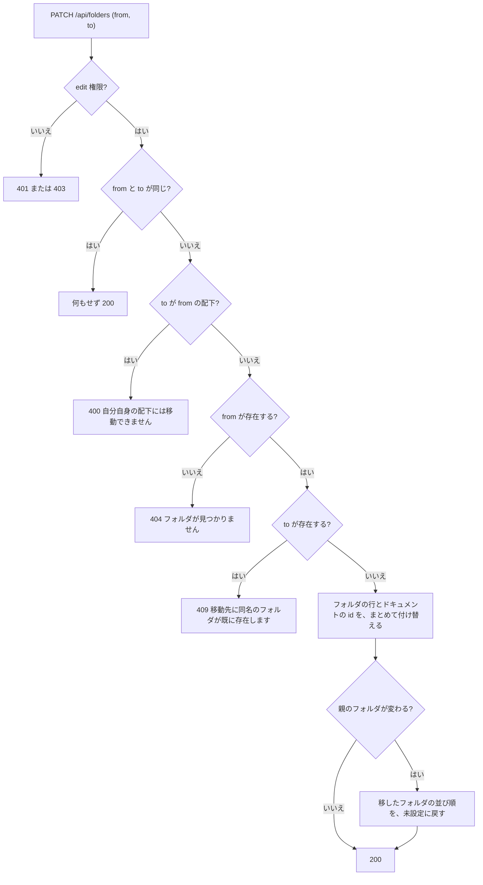
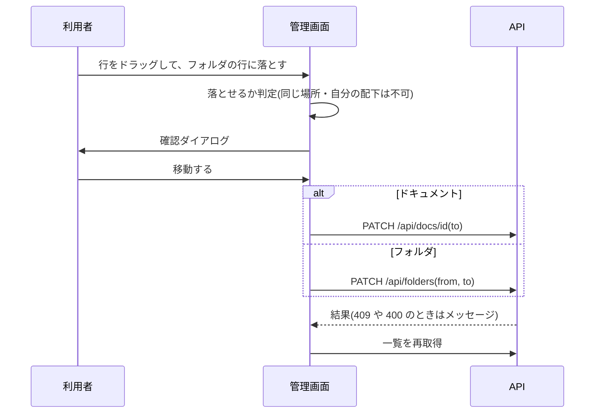
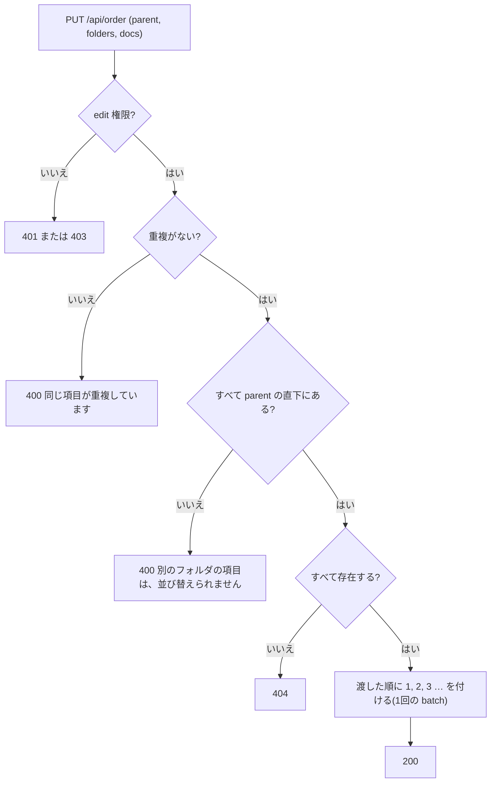

# 機能設計書

## 1. 概要

ドキュメントをフォルダで整理する。フォルダの作成、移動(名称変更を含む)、削除、並び順の設定を、管理ページの「ドキュメント管理」タブで行う。フォルダやドキュメントは、ドラッグ&ドロップ、または移動先を選ぶダイアログで、どの階層へも自由に移せる。フォルダを移すと、配下のサブフォルダとドキュメントも、まとめて移る。

| 項目 | 内容 |
|---|---|
| 対象機能 | フォルダの一覧・作成・移動(名称変更)・削除・並び順の設定、サイドバーと管理画面のツリー |
| 関連要件 | なし(全体概要の「未決事項」を参照) |
| 利用者 | 閲覧は全員、作成・移動・並び順の設定は開発メンバー以上、削除はオーナー |

## 2. 機能仕様

| ID | 機能 | 概要 | 入力 | 出力 | 備考 |
|---|---|---|---|---|---|
| FD-01 | 一覧 | 全フォルダと、配下のドキュメント数、並び順を返す | なし | パス、ドキュメント数、並び順の配列 | view。パスの昇順(表示順は、画面側で並び順に従って決める) |
| FD-02 | 作成 | フォルダを作る。上位のフォルダもまとめて作る | パス | `{ ok: true }`(201) | edit。すでにあれば 409 |
| FD-03 | 移動・名称変更 | フォルダのパスを変える。配下のサブフォルダとドキュメントの id も付け替える | 元のパス、新しいパス | `{ ok: true }` | edit。1回の処理(batch)で、まとめて成功か失敗。別のフォルダへ移すと、並び順は未設定に戻る |
| FD-04 | 削除 | 空のフォルダだけ削除する | パス | `{ ok: true }` | delete(オーナーのみ) |
| FD-05 | ツリー表示 | サイドバーと管理画面に、フォルダとドキュメントをツリーで表示する | フォルダ、ドキュメント | ツリー | 空のフォルダも表示する。並び順に従う |
| FD-06 | 並び順の設定 | 同じフォルダの直下にある、フォルダ同士・ドキュメント同士の並び順を決める | 親のパス、並べたい順のパス(id)の一覧 | `{ ok: true }` | edit。渡した順に 1, 2, 3 … を付ける。渡さなかったものは変えない |
| FD-07 | ドラッグ&ドロップでの移動 | 管理画面の行を、別のフォルダ(またはルート)へドラッグして移す | ドラッグした行、ドロップ先 | 移動後のツリー | 確認ダイアログを挟む。移動は、FD-03(フォルダ)またはドキュメントの移動(ドキュメント管理)を使う |

### フォルダの決まり方

- フォルダの一覧は、次の2つをまとめて作る
  - 明示的に作ったフォルダ(`folders` テーブル)。上位のフォルダも含める
  - ドキュメントの id から求めた親フォルダ(上位を含む)
- ドキュメントを作った・移したときは、その親フォルダを明示的なフォルダとして保存する。そのため、ドキュメントを消しても、フォルダは残る
- 「配下のドキュメント数」は、サブフォルダの中のドキュメントも含める

### 並び順

- 並び順は、同じフォルダの直下にある、フォルダ同士、ドキュメント同士で比べる。同じフォルダの直下では、常にフォルダが先、ドキュメントが後
- 並び順の値は、1 以上が「設定済み」、0 が「未設定」
- 設定済みのものは、値の昇順で先に並ぶ。未設定のものは、その後ろに、名前順で並ぶ(フォルダは名前、ドキュメントは id の最後の部分)
- 新しく作ったものは、未設定なので、最後に並ぶ
- 別のフォルダへ移したもの(フォルダ・ドキュメント)は、並び順が未設定に戻り、移動先の最後に並ぶ。同じフォルダの中での名称変更では、並び順を保つ
- フォルダごと移したとき、配下のドキュメント・サブフォルダの並び順は保つ
- 管理画面の「▲」「▼」は、同じ種類(フォルダ同士、ドキュメント同士)の隣と入れ替える。そのとき、同じフォルダの直下にある、その種類のすべてに、表示している順で 1, 2, 3 … を付け直す
- まだ保存されていないフォルダ(ドキュメントの親として導かれているだけのもの)も、並び順を付けるときに、明示的なフォルダとして保存する

### 入力の規則

| 項目 | 規則 |
|---|---|
| パス | `\` は `/` に、前後の `/` は除く。空の要素・`.`・`..`・制御文字は不可。300文字まで |
| 予約名 | 最上位が `assets` のパスは不可(「assets は予約済みのフォルダ名です」) |

## 3. 画面設計

### 画面一覧

| 画面 | 目的 | 主な表示項目 | 主な操作 | 遷移先 |
|---|---|---|---|---|
| 管理 > ドキュメント管理(`/admin/docs`) | フォルダとドキュメントを管理する | フォルダ作成の入力欄、使い方の説明、「ルート」の行、フォルダとドキュメントのツリー(フォルダ名、配下の件数、ドキュメントのタイトル) | フォルダの作成・移動・削除、ドキュメントの移動、並び順の変更、ドラッグ&ドロップ | ドキュメントのタイトルをクリックすると `/docs/<id>` |
| フォルダ移動ダイアログ | フォルダの移動・名称変更 | 対象のパス、移動先フォルダ(ルートと、自分とその配下を除く全フォルダ)、フォルダ名、新しいパス | 「保存」「キャンセル」(Esc、外側のクリックでも閉じる) | 保存後は、一覧を更新 |
| 移動の確認ダイアログ(ドラッグ&ドロップ後) | 移動を確認する | 「元 → 移動先」、メッセージ | 「移動する」「キャンセル」 | 確定すると移動して、一覧を更新 |
| サイドバーのフォルダツリー | ドキュメントを探す | 「フォルダ」の見出し、フォルダ(開閉できる)、ドキュメント | フォルダを開閉、ドキュメントをクリック | `/docs/<id>` |

#### ドキュメント管理の操作

- 作成: 入力欄にパス(例: `requirements/login`)を入れて「フォルダを作成」(Enter でも作成)。パスが空のときは押せない
- ドラッグ&ドロップ: 行(フォルダまたはドキュメント)を、フォルダの行、または先頭の「ルート」の行へドラッグして、落とす。確認ダイアログで「移動する」を押すと移る
  - 落とせる場所は、ドラッグ中の項目の親と違うフォルダだけ。同じ場所、自分自身、自分の配下へは落とせない(ダイアログは出ない)
  - ドラッグ中、落とせるフォルダの行は強調する。「ルート」の行には、落とせるときだけ説明を出す
  - 操作中(通信中)は、ドラッグできない
- 移動(ダイアログ): フォルダの行の「移動」で、移動先フォルダとフォルダ名を選ぶ。ドキュメントの行の「移動」は、ドキュメント管理の移動ダイアログ
- 並び順: 各行の「▲」「▼」で、同じフォルダの中で1つ上・下へ動かす。先頭の「▲」、末尾の「▼」は無効
- 削除: 「削除」は、delete 権限を持つユーザーにだけ表示する。配下にドキュメントがあるフォルダでは無効(理由を title で表示)。押すと確認ダイアログ(「空のフォルダのみ削除できます。この操作は取り消せません。」)
- 何もないときは「フォルダもドキュメントもありません。」を表示する
- 失敗したときは、フォルダ作成欄の下に、赤いメッセージ(API のメッセージ)を表示し、一覧を読み直す

#### サイドバーのツリー

- 最上位のフォルダ、または表示中のドキュメントを含むフォルダは、開いた状態にする
- 並び順は、フォルダが先、ドキュメントが後。それぞれ、並び順の設定に従う(未設定のものは、設定済みの後ろに名前順)

## 4. 処理フロー

### 移動・名称変更

- 付け替えは、プレフィックスの置き換え。文字数は、SQLite の `length()` で数える

### ドラッグ&ドロップでの移動

- 移動先の id・パスは、「移動先のパス/ドラッグした項目の名前」。同じ名前のものが移動先にあれば、409 になり、メッセージを表示する

### 並び順の設定

### 削除

1. delete 権限を確認する
2. フォルダが存在することを確認する(なければ 404)
3. 配下にサブフォルダ、またはドキュメントがあれば 409「フォルダが空ではありません」
4. 明示的なフォルダとして保存されていれば、削除する

## 5. データ設計

| エンティティ | 項目 | 型 | 必須 | 説明 |
|---|---|---|---|---|
| folders | path | TEXT(主キー) | ○ | 明示的に作った(または、ドキュメントを置いた)フォルダのパス |
| folders | sort_order | INTEGER | ○ | 並び順。1 以上が設定済み、0 が未設定(既定) |
| documents | id | TEXT(主キー) | ○ | フォルダの付け替えで、先頭のパスが置き換わる |
| documents | sort_order | INTEGER | ○ | 並び順。1 以上が設定済み、0 が未設定(既定) |

- 並び順の列は、マイグレーション `0002_sort_order.sql` で追加する(既存の行は、すべて未設定の 0)

## 6. インターフェース

| 名称 | 種別 | 入力 | 出力 | 備考 |
|---|---|---|---|---|
| GET /api/folders | API | なし | `{ path, docCount, order }` の配列 | view |
| POST /api/folders | API | `{ path }` | 201 `{ ok: true }` | edit。400: パスが不正。409: 同名のフォルダが既に存在します |
| PATCH /api/folders | API | `{ from, to }` | `{ ok: true }` | edit。400、404、409 |
| DELETE /api/folders | API | `{ path }`(本文あり) | `{ ok: true }` | delete。404、409: フォルダが空ではありません |
| PUT /api/order | API | `{ parent, folders?, docs? }` | `{ ok: true }` | edit。`parent` は親フォルダのパス(最上位は空文字)。`folders` はフォルダのパス、`docs` はドキュメントの id を、並べたい順に渡す。400、404 |

## 7. エラー処理・例外

| 事象 | 条件 | 画面・応答 | 対応 |
|---|---|---|---|
| 同名のフォルダ | 作成・移動の先に、すでにある | 409。管理画面の上にメッセージ | 別の名前にする |
| 同名のドキュメント(ドキュメントの移動) | 移動先に、同じ id がある | 409。管理画面の上にメッセージ | ドキュメントの名前を変えてから移す |
| 不正なパス | `..`、空の要素、`assets` で始まる など | 400 | パスを直す |
| 自分自身の配下への移動 | 移動先が、元のフォルダの中 | 400「自分自身の配下には移動できません」。ドラッグ&ドロップでは、そもそも落とせない | 別の場所にする |
| フォルダがない | 他の人が先に変更・削除した | 404「フォルダが見つかりません」。一覧を読み直す | 一覧を確認する |
| 空でないフォルダの削除 | 配下にドキュメントまたはサブフォルダがある | 409「フォルダが空ではありません」(配下にドキュメントがある場合は、画面のボタンが無効) | 中身を先に移動・削除する |
| 権限がない | 一般メンバーが作成・移動・並び替え、開発メンバーが削除 | 403(画面は、ボタン・ページを出さない) | オーナーに依頼する |
| 並び替えの対象が不正 | 別のフォルダの項目、存在しない項目、重複 | 400 または 404 | 一覧を読み直して、やり直す |

## 8. 未決事項

### 機能

| 項目 | 現状 | 決める内容 |
|---|---|---|
| 空でないフォルダの削除 | 不可。中身を先に消す必要がある | 中身ごと削除する機能が必要か |
| ドキュメントの一括移動 | 1件ずつ移す(フォルダごとの移動はできる) | 複数選択して移動する機能が必要か |
| ドラッグでの並び替え | 並び順は「▲」「▼」だけ。ドラッグは、フォルダへの移動にだけ使う | 行の間へのドラッグで、並び替えもできるようにするか |
| キーボードだけでの移動 | ドラッグ&ドロップはマウス操作。同じ移動は、「移動」ボタンのダイアログでもできる | ドラッグ操作のキーボード対応が必要か |
| サブフォルダが残るフォルダの削除ボタン | 配下にサブフォルダがあっても、ドキュメントが 0 件なら、ボタンは有効(押すと 409) | ボタンを無効にするか |
| フォルダの深さ・個数 | 制限なし(パスは300文字まで) | 上限が必要か |
| 並び順の同時更新 | 後から送った並び順で上書きする(競合は検知しない) | 競合を検知するか |
| docs/ の並び順 | リポジトリの `docs/` には、並び順の情報がない。取り込みは、既存の並び順を変えない | 並び順もリポジトリで管理するか |
