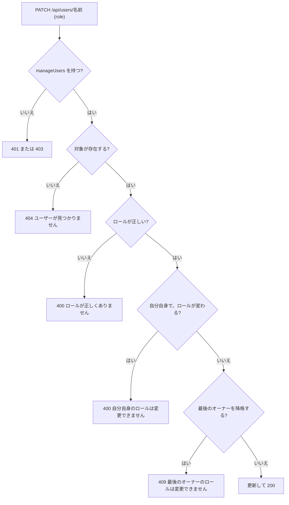

# 機能設計書

## 1. 概要

ユーザーの作成、ロールの設定、パスワードの変更、削除を、オーナーが管理ページで行う。ロールごとの権限は、API(use case)で判定する。

| 項目 | 内容 |
|---|---|
| 対象機能 | ユーザー管理(管理ページの「ユーザー管理」タブ)、権限の判定 |
| 関連要件 | なし(全体概要の「未決事項」を参照) |
| 利用者 | オーナー(ユーザー管理)。権限の判定は全ユーザーに対して働く |

## 2. 機能仕様

| ID | 機能 | 概要 | 入力 | 出力 | 備考 |
|---|---|---|---|---|---|
| FD-01 | ユーザー一覧 | 全ユーザーを、作成日時の昇順で返す | なし | ユーザー名、ロール、作成日時 | manageUsers。パスワードのハッシュは返さない |
| FD-02 | ユーザー作成 | ユーザーを追加する | ユーザー名、パスワード、ロール | 作成したユーザー(201) | 同名は 409 |
| FD-03 | ロール変更 | ユーザーのロールを変える | ユーザー名、ロール | `{ ok: true }` | 自分自身は不可。最後のオーナーは降格できない |
| FD-04 | パスワード変更 | ユーザーのパスワードを変える | ユーザー名、新しいパスワード | `{ ok: true }` | 自分以外・自分自身のどちらも可 |
| FD-05 | ユーザー削除 | ユーザーを削除する | ユーザー名 | `{ ok: true }` | 自分自身は不可。最後のオーナーは削除できない |
| FD-06 | 権限の判定 | 操作ごとに、必要な権限をロールが持つか確認する | ユーザー、権限 | 許可、または 401・403 | 全 use case の先頭で実行する |

### 権限

| 権限 | 内容 | 必要な操作 |
|---|---|---|
| view | 閲覧 | 一覧・取得(ドキュメント、フォルダ、テンプレート、画像) |
| edit | 編集 | 作成、更新、移動、名称変更(ドキュメント、フォルダ)、画像のアップロード |
| delete | 削除 | ドキュメントの削除、フォルダの削除 |
| manageUsers | ユーザー管理 | ユーザーの一覧・作成・更新・削除 |

| ロール | 表示名 | view | edit | delete | manageUsers |
|---|---|---|---|---|---|
| owner | オーナー | ○ | ○ | ○ | ○ |
| developer | 開発メンバー | ○ | ○ | ✕ | ✕ |
| viewer | 一般メンバー | ○ | ✕ | ✕ | ✕ |

### 業務ルール

- 最後のオーナーは、削除も、降格(ロール変更)もできない
- 自分自身は、削除も、ロールの変更もできない(パスワードの変更はできる)
- ロールの変更・ユーザーの削除は、対象のユーザーの次のリクエストから反映される(ロールを毎回読み直すため)
- ユーザー名は変更できない

## 3. 画面設計

### 画面一覧

| 画面 | 目的 | 主な表示項目 | 主な操作 | 遷移先 |
|---|---|---|---|---|
| 管理 > ユーザー管理(`/admin/users`) | ユーザーを管理する | 作成フォーム(ユーザー名、パスワード、ロール)、ユーザー一覧(ユーザー名、「(自分)」、ロール、各ボタン) | 作成、ロールの変更、パスワード変更、削除 | 権限がなければ `/` へ |
| パスワード変更ダイアログ | パスワードを変更する | 対象のユーザー名、新しいパスワード、確認 | 「変更する」「キャンセル」(Esc でも閉じる) | 成功したら、一覧の上に「<ユーザー名> のパスワードを変更しました」 |
| 削除の確認ダイアログ | 削除を確認する | 対象のユーザー名 | 「削除する」「キャンセル」 | 削除後は一覧を更新 |

- ロールの初期値は「一般メンバー」
- 自分自身の行は、ロールの選択と「削除」を無効にする(ロールの選択には、理由を title で表示)
- パスワードと確認が違うときは、API を呼ばず「パスワードが一致しません」を表示する
- 失敗したときは、一覧の上に赤いメッセージを表示する(API のメッセージ。なければ「失敗しました」)
- 管理ページのタブ「ユーザー管理」は、manageUsers を持つユーザーにだけ表示する

## 4. 処理フロー

### ロール変更

### 削除

1. manageUsers を確認する
2. 対象が存在することを確認する(なければ 404)
3. 自分自身なら 400「自分自身は削除できません」
4. 最後のオーナーなら 409「最後のオーナーは削除できません」
5. 削除する

## 5. データ設計

| エンティティ | 項目 | 型 | 必須 | 説明 |
|---|---|---|---|---|
| users | username | TEXT(主キー) | ○ | 英数字と `_` `.` `-` の3〜32文字 |
| users | role | TEXT | ○ | owner / developer / viewer(DB の制約あり) |
| users | password_hash | TEXT | ○ | 認証とセッションを参照 |
| users | created_at | TEXT | ○ | ISO 8601 |

## 6. インターフェース

| 名称 | 種別 | 入力 | 出力 | 備考 |
|---|---|---|---|---|
| GET /api/users | API | なし | `{ username, role, createdAt }` の配列 | manageUsers |
| POST /api/users | API | `{ username, password, role }` | 201 `{ username, role, createdAt }` | 400: 形式・ロールが不正。409: そのユーザー名はすでに使われています |
| PATCH /api/users/:username | API | `{ role?, password? }` | `{ ok: true }` | 400: 自分自身のロール変更、ロール不正、パスワード不正。404。409: 最後のオーナーのロールは変更できません |
| DELETE /api/users/:username | API | なし | `{ ok: true }` | 400: 自分自身は削除できません。404。409: 最後のオーナーは削除できません |

- `:username` は URL エンコードする
- PATCH の `role` と `password` は、どちらか一方、または両方を渡せる

## 7. エラー処理・例外

| 事象 | 条件 | 画面・応答 | 対応 |
|---|---|---|---|
| 未ログイン | Cookie が無効 | 401 | ログインする |
| 権限がない | manageUsers がない | 403(画面では、ユーザー管理のタブとページ自体を出さず、直接開くと `/` へ移る) | オーナーに依頼する |
| ユーザー名の重複 | 同名のユーザーがいる | 409「そのユーザー名はすでに使われています」 | 別の名前にする |
| 最後のオーナーの降格・削除 | オーナーが1人だけ | 409 | 先に別のオーナーを作る |
| 自分自身の削除・ロール変更 | 操作対象が自分 | 400(画面では、ボタンが無効) | 別のオーナーに依頼する |
| 入力不正 | 形式、長さ、ロール | 400 | 入力を直す |
| 対象がいない | 同時に別の人が削除した | 404「ユーザーが見つかりません」 | 一覧を更新する |

## 8. 未決事項

### 機能

| 項目 | 現状 | 決める内容 |
|---|---|---|
| ユーザー名の変更 | できない | 必要か |
| 自分のパスワード変更 | 管理ページのユーザー管理(オーナーのみ)から変更する。オーナー以外が自分のパスワードを変える画面はない | 全ユーザーが自分で変更できる画面を作るか |
| 権限の細分化 | ロールは3種類で固定 | フォルダごとの権限などが必要か |
| 一般メンバー・開発メンバーのパスワード忘れ | オーナーが再設定する | 運用で足りるか |
