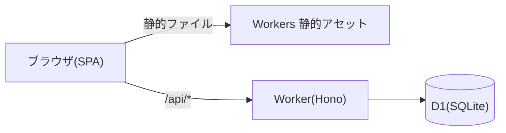
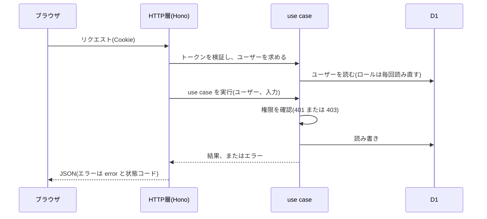

# 機能設計書

## 1. 概要

f-docbase 全体の構成と、機能設計書の一覧。機能ごとの詳細は、同じフォルダの、ほかの設計書に分けて書く。この文書は実装(コード)を読んで書いたもので、実装と食い違う点は、実装を正とする。

| 項目 | 内容 |
|---|---|
| 対象機能 | f-docbase 全体(要件定義書・設計書などを、画面上で作成・編集・管理し、Web上で閲覧するアプリ) |
| 関連要件 | なし(f-docbase の要件定義書は未作成。README の「要件」に対応。8. 未決事項を参照) |
| 利用者 | ログインしたユーザー。ロールは、オーナー / 開発メンバー / 一般メンバーの3種類 |

### 設計書の一覧

| 設計書 | 対象 |
|---|---|
| 全体概要 | この文書。構成、権限、共通ルール |
| 認証とセッション | 初期設定、ログイン、ログアウト、セッション |
| ユーザー管理と権限 | ユーザーの作成・ロール変更・パスワード変更・削除、権限の判定 |
| ドキュメント管理 | ドキュメントの一覧・閲覧・作成・編集・移動・削除、タグ、検索 |
| フォルダ管理 | フォルダの作成・移動(名称変更)・削除、ドラッグ&ドロップでの移動、並び順の設定 |
| エディタとMarkdown表示 | Markdown の編集、プレビュー、Mermaid、目次 |
| 画像アップロード | 画像の追加と配信 |
| テンプレート | 新規作成時の雛形 |
| 画面共通 | ヘッダー、サイドバー、管理ページ、ルーティング |
| 運用 | デプロイ、取り込み、パスワード再設定、開発用アカウント |

## 2. 機能仕様

| ID | 機能 | 概要 | 入力 | 出力 | 備考 |
|---|---|---|---|---|---|
| FD-01 | 認証 | 初期設定・ログイン・ログアウト。署名付き Cookie でログイン状態を保つ | ユーザー名、パスワード | ユーザー情報、Cookie | 認証とセッション |
| FD-02 | ユーザー管理 | ユーザーの作成、ロール変更、パスワード変更、削除 | ユーザー名、パスワード、ロール | ユーザー一覧 | オーナーのみ。ユーザー管理と権限 |
| FD-03 | 権限制御 | ロールごとに、閲覧・編集・削除・ユーザー管理の可否を決める | ロール、操作 | 許可 / 拒否(401・403) | API(use case)で判定。ユーザー管理と権限 |
| FD-04 | ドキュメント管理 | ドキュメントの CRUD、移動、一覧、タグ絞り込み、検索 | id、タイトル、タグ、本文 | ドキュメント | ドキュメント管理 |
| FD-05 | フォルダ管理 | フォルダの作成・移動(名称変更)・削除、ドラッグ&ドロップでの移動、並び順の設定 | フォルダのパス、並び順 | フォルダ一覧 | フォルダ管理 |
| FD-06 | エディタ・Markdown表示 | Markdown の編集とプレビュー、Mermaid、目次、コードハイライト | Markdown | HTML 表示 | ブラウザ側で描画。エディタとMarkdown表示 |
| FD-07 | 画像 | 画像のアップロード(貼り付け・ドロップ)と配信 | 画像ファイル | 画像の URL | 1枚 1MB まで。画像アップロード |
| FD-08 | テンプレート | 新規作成時に、雛形を選ぶ | テンプレート | 本文の初期値 | テンプレート |
| FD-09 | 画面共通 | ヘッダー、サイドバー、管理ページ、ルーティング | URL | 画面 | 画面共通 |
| FD-10 | 運用 | 自動デプロイ、取り込み、パスワード再設定、開発用アカウント | npm run のコマンド | D1 の更新 | 運用 |

### 権限

| ロール | 閲覧 | 編集 | 削除 | ユーザー管理 |
|---|---|---|---|---|
| オーナー | ○ | ○ | ○ | ○ |
| 開発メンバー | ○ | ○ | ✕ | ✕ |
| 一般メンバー | ○ | ✕ | ✕ | ✕ |

- 編集: ドキュメント・フォルダの作成、更新、移動、名称変更、画像のアップロード
- 削除: ドキュメント・フォルダの削除
- 権限の判定は API の use case で行う。画面側の表示制御は、使えない操作を見せないためのもの

## 3. 画面設計

画面は、Vite + React の SPA(ブラウザ側で描画)。画面の一覧は、画面共通にまとめる。

| 画面 | URL | 詳細 |
|---|---|---|
| ログイン / 初期設定 | `/login` | 認証とセッション |
| ドキュメント一覧 | `/` | ドキュメント管理 |
| ドキュメント閲覧 | `/docs/<id>` | ドキュメント管理 |
| 新規作成 | `/new` | ドキュメント管理、テンプレート |
| 編集 | `/edit/<id>` | ドキュメント管理、エディタとMarkdown表示 |
| 管理(ドキュメント管理) | `/admin/docs` | フォルダ管理 |
| 管理(ユーザー管理) | `/admin/users` | ユーザー管理と権限 |

## 4. 処理フロー

### システム構成

- 画面は静的ファイルとして配信し、CPU 時間を使わない。`/api/*` だけを Worker が処理する
- Next.js のサーバー描画は、何もしない API でも CPU 時間が 100ms 以上かかり、無料プランの上限(10ms)を超えるため採用しなかった

### API のリクエスト処理

## 5. データ設計

保存先は Cloudflare D1。テーブルは `apps/api/migrations/0001_init.sql` で作る。

| エンティティ | 項目 | 型 | 必須 | 説明 |
|---|---|---|---|---|
| users | username | TEXT(主キー) | ○ | ユーザー名 |
| users | role | TEXT | ○ | owner / developer / viewer のいずれか |
| users | password_hash | TEXT | ○ | PBKDF2 のハッシュ |
| users | created_at | TEXT | ○ | ISO 8601 |
| documents | id | TEXT(主キー) | ○ | フォルダ込みのパス(拡張子なし) |
| documents | title | TEXT | ○ | タイトル |
| documents | tags | TEXT | ○ | タグの JSON 配列 |
| documents | content | TEXT | ○ | Markdown の本文 |
| documents | updated_at | TEXT | ○ | ISO 8601 |
| documents | sort_order | INTEGER | ○ | 並び順(1 以上が設定済み、0 が未設定)。同じフォルダの中で比べる |
| folders | path | TEXT(主キー) | ○ | 明示的に作ったフォルダ(空フォルダ用) |
| folders | sort_order | INTEGER | ○ | 並び順(1 以上が設定済み、0 が未設定) |
| assets | name | TEXT(主キー) | ○ | 画像のファイル名 |
| assets | content_type | TEXT | ○ | MIME タイプ |
| assets | data | TEXT | ○ | base64 の文字列 |
| assets | created_at | TEXT | ○ | ISO 8601 |
| settings | key | TEXT(主キー) | ○ | 設定名(session_secret) |
| settings | value | TEXT | ○ | 設定値(セッションの署名キー) |

## 6. インターフェース

API の一覧は、各設計書の「6. インターフェース」に書く。共通のルールは次のとおり。

| 名称 | 種別 | 入力 | 出力 | 備考 |
|---|---|---|---|---|
| 共通: 認証 | Cookie | `docbase_session` | ユーザー | 公開されているのは、`/api/auth/status`、`/api/auth/login`、`/api/auth/setup`、`/api/auth/logout` のみ(ほかは未ログインで 401) |
| 共通: 本文 | JSON | UTF-8 の JSON | JSON | 画像のアップロードだけ multipart |
| 共通: エラー | JSON | なし | `{ "error": "メッセージ" }` | 状態コードは 7. を参照 |

## 7. エラー処理・例外

エラーは、use case で業務上のエラー(種別つき)として投げ、HTTP 層で状態コードに変換する。

| 事象 | 条件 | 画面・応答 | 対応 |
|---|---|---|---|
| 入力が不正 | 形式・長さ・パスなどが業務ルールに反する | 400 とメッセージ | 入力を直す |
| 未ログイン | Cookie がない、署名が不正、期限切れ、ユーザーが削除済み | 401 `ログインが必要です`(画面ではログイン画面へ) | ログインする |
| 権限がない | ロールに権限がない | 403 `この操作を行う権限がありません` | オーナーに依頼する |
| 見つからない | 対象が存在しない | 404 とメッセージ | 一覧に戻る |
| 競合 | すでに存在する、最後のオーナーの削除、フォルダが空でない など | 409 とメッセージ | 状態を確認する |
| サーバーエラー | 想定外の例外 | 500 `サーバーでエラーが発生しました` | ログを確認する(詳細は応答に出さない) |
| 存在しない API | `/api/*` で該当なし | 404 `not found` | なし |

## 8. 未決事項

### 要件・設計書

| 項目 | 現状 | 決める内容 |
|---|---|---|
| f-docbase の要件定義書 | 未作成。この設計書の「関連要件」は空 | 要件定義書を作り、機能 ID(F-xx)を設計書と結び付ける |
| 非機能要件 | 性能・可用性・バックアップの目標値は未設定 | 目標値を決める |

### 機能全体

| 項目 | 現状 | 決める内容 |
|---|---|---|
| ログイン試行の回数制限 | なし | 回数制限やロックを入れるか |
| 変更履歴・差分表示 | なし(MVP では不要としている) | 入れる場合の保存方法 |
| 全文検索 | なし。サイドバーは、タイトル・id・タグの部分一致のみ | 本文まで検索するか |
| 監査ログ | なし | 誰がいつ何を変えたかを残すか |
| 同時編集の競合検知 | なし(後から保存した内容が勝つ) | 競合を検知するか |
