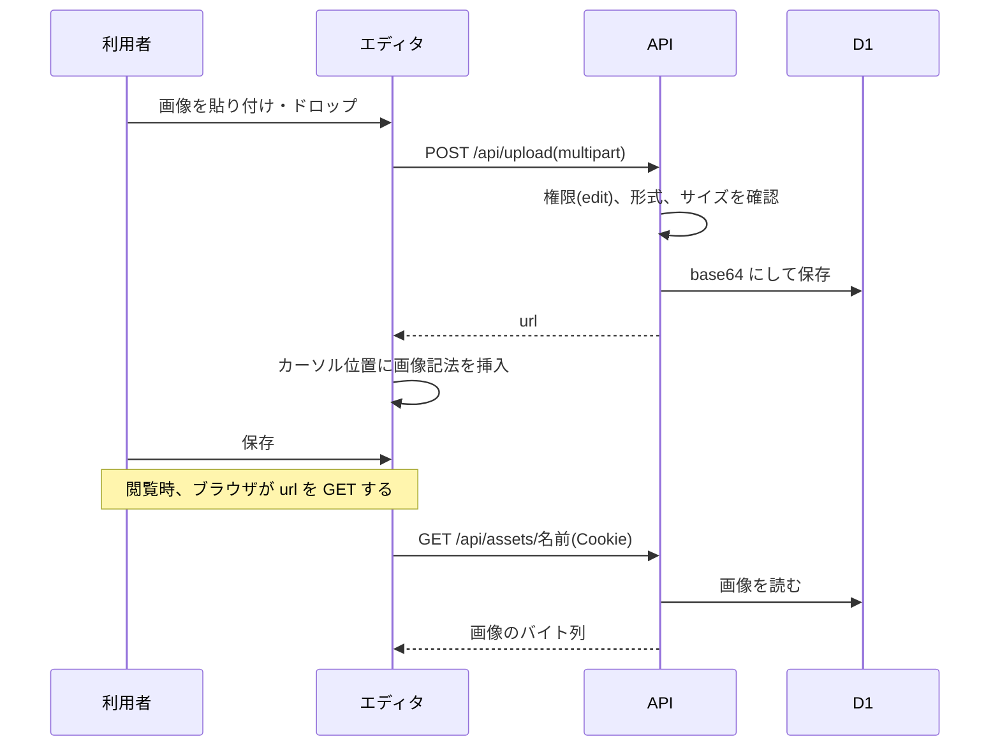

# 機能設計書

## 1. 概要

ドキュメントに画像を入れる。エディタに画像を貼り付ける(またはドロップする)と、アップロードして、本文に Markdown の画像記法を挿入する。画像は D1 に保存し、API から配信する。

| 項目 | 内容 |
|---|---|
| 対象機能 | 画像のアップロード、画像の配信 |
| 関連要件 | なし(全体概要の「未決事項」を参照) |
| 利用者 | アップロードは開発メンバー以上。画像の表示は、ログインしている全員 |

## 2. 機能仕様

| ID | 機能 | 概要 | 入力 | 出力 | 備考 |
|---|---|---|---|---|---|
| FD-01 | アップロード | 画像を保存し、URL を返す | 画像ファイル(multipart の `file`) | `{ url: "/api/assets/<名前>" }` | edit |
| FD-02 | 配信 | 保存した画像を返す | 名前 | 画像のバイト列 | view。なければ 404 |
| FD-03 | 本文への挿入 | アップロード後、カーソル位置に `` を挿入する | 画像ファイル | 更新後の本文 | エディタの機能 |

### 入力の規則

| 項目 | 規則 |
|---|---|
| 形式 | 拡張子が png、jpg、jpeg、gif、webp、svg のいずれか(大文字小文字を区別しない)。拡張子がないときは png とみなす。判定は、拡張子だけで行う(中身は調べない) |
| サイズ | 1バイト以上、1MB(1,048,576バイト)以下 |
| エディタ側 | 貼り付け・ドロップされたファイルのうち、MIME タイプが `image/` で始まるものの先頭1件だけを扱う |

### 保存と配信

| 項目 | 内容 |
|---|---|
| ファイル名 | `<アップロード時刻(ミリ秒)>-<乱数6桁>.<拡張子>`。例: `1791282300778-8a8299.png` |
| 保存形式 | base64 の文字列として、D1 の `assets` に保存する。D1 の BLOB は、読み出しに CPU 時間がかかるため |
| 配信ヘッダー | `Content-Type`(保存した種類)、`Content-Security-Policy: script-src 'none'`(SVG 内のスクリプトを実行させない)、`X-Content-Type-Options: nosniff`、`Cache-Control: private, max-age=31536000, immutable` |
| 認証 | 配信も、ログインが必要(view)。画像の URL を知っていても、未ログインでは取得できない |

## 3. 画面設計

専用の画面はない。エディタ(エディタとMarkdown表示)の機能として動く。

### 画面一覧

| 画面 | 目的 | 主な表示項目 | 主な操作 | 遷移先 |
|---|---|---|---|---|
| エディタの本文入力欄 | 画像を追加する | ラベル「Markdown(画像は貼り付け / ドロップで追加)」 | 画像の貼り付け、ドロップ | なし(本文に挿入) |

- 貼り付け・ドロップした画像は、アップロードに成功したときだけ、本文に挿入する(貼り付け・ドロップの既定の動作は止める)
- アップロード中の表示はない
- 失敗したときは、保存ボタンの横に、赤字でメッセージを表示する

## 4. 処理フロー

## 5. データ設計

| エンティティ | 項目 | 型 | 必須 | 説明 |
|---|---|---|---|---|
| assets | name | TEXT(主キー) | ○ | ファイル名 |
| assets | content_type | TEXT | ○ | `image/png` など |
| assets | data | TEXT | ○ | base64 の文字列 |
| assets | created_at | TEXT | ○ | ISO 8601 |

- 本文との結び付きは、本文中の URL(`/api/assets/<名前>`)だけ。ドキュメントを消しても、画像は残る

## 6. インターフェース

| 名称 | 種別 | 入力 | 出力 | 備考 |
|---|---|---|---|---|
| POST /api/upload | API | multipart/form-data の `file` | `{ url }` | edit。400: file がない、形式・サイズが不正 |
| GET /api/assets/:name | API | 名前 | 画像 | view。404: 画像が見つかりません |

## 7. エラー処理・例外

| 事象 | 条件 | 画面・応答 | 対応 |
|---|---|---|---|
| file がない | multipart に `file` がない | 400 `file required` | ファイルを選び直す |
| 対応外の形式 | png / jpg / jpeg / gif / webp / svg 以外の拡張子 | 400「対応していない画像形式です(png / jpg / gif / webp / svg)」 | 形式を変える |
| 空のファイル | 0バイト | 400「ファイルが空です」 | ファイルを確認する |
| 大きすぎる | 1MB を超える | 400「画像は1MBまでです」 | 画像を縮小・圧縮する |
| 権限がない | 一般メンバーがアップロード | 403(画面でも、一般メンバーは、そもそもエディタを開けない) | 開発メンバー以上に依頼する |
| 画像がない | 名前が違う、削除された | 404(画像が表示されない) | 貼り直す |
| 未ログイン | Cookie が無効 | 401(画像が表示されない) | ログインする |

## 8. 未決事項

### 機能

| 項目 | 現状 | 決める内容 |
|---|---|---|
| 画像の削除 | できない。使われなくなった画像も、D1 に残る | 未使用の画像を整理する機能が必要か |
| サイズの上限 | 1MB(D1 の1行の上限 2MB に、base64 の増加分を見込んだ値) | 大きな画像の扱い(縮小、R2 の利用)。R2 は、有効化にカード登録が必要かが未確認で、「コスト 0・カード登録なし」の条件に反するおそれがある |
| 容量 | D1 の無料枠は 5GB。画像は base64 のため、約 1.33 倍で保存される | 容量の監視、上限 |
| 中身の検証 | 拡張子だけで判定する。拡張子と中身が違うファイルも保存できる | 中身(先頭バイト)も確認するか |
| 配信の認証 | ログインが必要 | 外部に画像を共有する場合の方法 |
| 複数画像の同時追加 | 先頭の1件だけを扱う | 複数枚の貼り付け・ドロップに対応するか |
