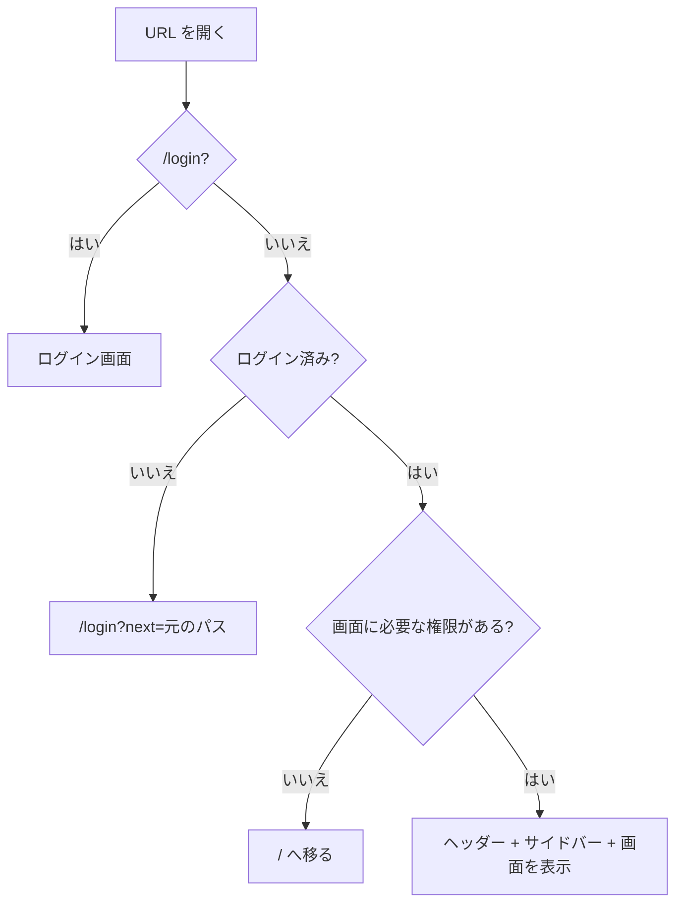

# 機能設計書

## 1. 概要

全画面に共通する、レイアウト(ヘッダー、サイドバー、本文)、ルーティング、管理ページ、共通ダイアログ。画面は、Vite + React の SPA で、URL の切り替えはブラウザ側で行う。

| 項目 | 内容 |
|---|---|
| 対象機能 | ルーティングとアクセス制御、ヘッダー、サイドバー(検索・フォルダツリー・タグ)、管理ページの枠、確認ダイアログ、見つからない画面 |
| 関連要件 | なし(全体概要の「未決事項」を参照) |
| 利用者 | ログインした全員(ログイン画面は未ログインも) |

## 2. 機能仕様

| ID | 機能 | 概要 | 入力 | 出力 | 備考 |
|---|---|---|---|---|---|
| FD-01 | ルーティング | URL に応じて画面を切り替える | URL | 画面 | React Router |
| FD-02 | アクセス制御(ログイン) | 未ログインなら、ログイン画面へ送る | 認証状態 | 画面、またはリダイレクト | `/login?next=<元のパス>` |
| FD-03 | アクセス制御(権限) | 権限がない画面は、`/` へ送る | 権限 | 画面、またはリダイレクト | edit、manageUsers |
| FD-04 | ヘッダー | ロゴ、ユーザー名とロール、新規作成、ログアウトを表示する | ユーザー | ヘッダー | 画面の上に固定 |
| FD-05 | サイドバー | 検索、すべてのドキュメント、フォルダツリー、タグ一覧を表示する | ドキュメント、フォルダ | サイドバー | 04、05 |
| FD-06 | 管理ページの枠 | 管理ページのタブ(ドキュメント管理、ユーザー管理)を表示する | 権限 | タブ | ユーザー管理は、オーナーのみ |
| FD-07 | 一覧データの共有 | ドキュメントとフォルダの一覧を、全画面で共有する | なし | 一覧 | 変更後に再読み込み |
| FD-08 | 確認ダイアログ | 削除などの確認を取る | 対象、メッセージ | 確定、またはキャンセル | Esc、外側のクリックでキャンセル |
| FD-09 | 見つからない画面 | 存在しない URL・ドキュメントで表示する | メッセージ | 案内 | 一覧へのリンクつき |

### ルーティング

| URL | 画面 | 必要な状態 |
|---|---|---|
| `/login` | ログイン / 初期設定 | なし(ログイン済みなら `next` または `/` へ) |
| `/` | ドキュメント一覧(`?tag=` で絞り込み) | ログイン |
| `/docs/<id>` | ドキュメント閲覧 | ログイン |
| `/new` | 新規作成(`?template=` でエディタ) | edit |
| `/edit/<id>` | 編集 | edit |
| `/admin` | `/admin/docs` へ移る | edit |
| `/admin/docs` | 管理 > ドキュメント管理 | edit |
| `/admin/users` | 管理 > ユーザー管理 | manageUsers |
| 上記以外 | 「ページが見つかりません」 | ログイン |

- `<id>` は、`/` 区切りで、セグメントごとに URL エンコードする
- 配信側(Workers の静的アセット)は、未知の URL に対して `index.html` を返す(SPA)。`/api/*` だけは、Worker が処理する

## 3. 画面設計

### 画面一覧

| 画面 | 目的 | 主な表示項目 | 主な操作 | 遷移先 |
|---|---|---|---|---|
| ヘッダー | 全画面の上部 | ロゴ「f-docbase」、ユーザー名、ロールのバッジ(オーナー / 開発メンバー / 一般メンバー)、「＋ 新規作成」(edit のみ)、「ログアウト」 | ロゴ → 一覧、新規作成、ログアウト | `/`、`/new`、`/login` |
| サイドバー | ドキュメントを探す | 検索欄、「すべてのドキュメント(件数)」、フォルダツリー、タグ(件数つき)、下部の「⚙ 管理」(edit のみ) | 検索、フォルダの開閉、ドキュメント・タグ・管理のクリック | `/docs/<id>`、`/?tag=`、`/admin` |
| 管理ページ | 管理機能の入口 | 見出し「管理」、タブ(ドキュメント管理、ユーザー管理) | タブの切り替え | `/admin/docs`、`/admin/users` |
| 確認ダイアログ | 破壊的な操作の確認 | 警告アイコン、タイトル、対象の名前、メッセージ(既定は「この操作は取り消せません。」) | 「削除する」、「キャンセル」 | 呼び出し元に戻る |
| 見つからない画面 | 行き先がない | メッセージ、「ドキュメント一覧へ戻る」 | リンク | `/` |

#### サイドバー

- 検索: タイトル・id・タグの部分一致(大文字小文字を区別しない)。検索語があるときは、ツリーとタグの代わりに「検索結果 (件数)」を表示する。ないときは「見つかりませんでした」
- ツリー: フォルダが先、ドキュメントが後。それぞれ、管理画面で設定した並び順に従う(未設定のものは、設定済みの後ろに名前順)。最上位のフォルダと、表示中のドキュメントを含むフォルダは開いている。表示中のドキュメントは強調する
- タグ: タグ名の昇順。件数つき。選択中のタグは強調する(再度クリックしても解除はされない。解除は「すべてのドキュメント」)
- 管理: 管理ページにいるときは強調する

#### レイアウト

- ヘッダーは、画面の上に固定する
- サイドバー(幅 18rem)は、画面幅が md(768px)以上のときだけ表示する。それより狭いと、サイドバーは出ず、検索・フォルダツリー・管理へのリンクが使えない
- 読み込み中(認証状態の取得中、ドキュメントの取得中)は、何も表示しない
- ログイン画面は、ヘッダーもサイドバーもなし

## 4. 処理フロー

### 一覧データの更新

1. ログイン後、ドキュメントとフォルダの一覧を取得する(DocsProvider)
2. 作成・更新・移動・削除、フォルダの変更のあとに、再取得する
3. 再取得に失敗したときは、直前の一覧を残す

## 5. データ設計

画面が持つ状態。

| エンティティ | 項目 | 型 | 必須 | 説明 |
|---|---|---|---|---|
| 認証の状態 | user | `{ username, role }` または null | | ログイン中のユーザー |
| 認証の状態 | setupRequired | boolean | ○ | 初期設定が必要か |
| 認証の状態 | loading | boolean | ○ | 初回の取得が終わるまで true |
| 一覧の状態 | docs | `{ id, title, tags, updated }` の配列 | ○ | ドキュメントの要約 |
| 一覧の状態 | folders | `{ path, docCount }` の配列 | ○ | フォルダ |

## 6. インターフェース

| 名称 | 種別 | 入力 | 出力 | 備考 |
|---|---|---|---|---|
| GET /api/auth/status | API | なし | 認証の状態 | 起動時に1回。ログイン・ログアウトのあとにも取得する |
| GET /api/docs | API | なし | ドキュメントの要約 | 一覧の取得 |
| GET /api/folders | API | なし | フォルダ | 一覧の取得 |

画面のファイル構成(`apps/web/src`):`api/`(API クライアント)、`auth/`(認証・一覧の共有)、`layout/`(ヘッダー・ガード)、`pages/`(画面)、`components/`(部品)、`hooks/`。

## 7. エラー処理・例外

| 事象 | 条件 | 画面・応答 | 対応 |
|---|---|---|---|
| 未ログイン | 認証状態が、ユーザーなし | `/login?next=...` へ移る | ログインする |
| 権限がない | edit / manageUsers がない画面を開く | `/` へ移る | 権限のあるユーザーでログインする |
| 存在しない URL | 定義にない URL | 「ページが見つかりません」と一覧へのリンク | 一覧へ戻る |
| ドキュメントがない | 閲覧・編集で、id が存在しない | 「ドキュメントが見つかりません」 | 一覧へ戻る |
| 一覧の取得に失敗 | 通信エラー | 直前の一覧を残す(初回は空) | 再読み込み |
| API のエラー | 各操作の失敗 | 操作した場所の近くに、API のメッセージ(なければ「リクエストに失敗しました (状態コード)」) | メッセージに従う |

## 8. 未決事項

### 画面

| 項目 | 現状 | 決める内容 |
|---|---|---|
| 狭い画面(モバイル) | md 未満では、サイドバー(検索・ツリー・管理)が出ない | ドロワー(開閉するメニュー)にするか |
| 読み込み中の表示 | 何も表示しない | スピナーなどを出すか |
| セッション切れの扱い | 401 を受けても、自動でログイン画面へ移らない | 共通で処理するか |
| 通信エラーの表示 | 一覧の取得失敗は、無言で無視する | 再試行・通知を出すか |
| タグ絞り込みの解除 | 「すべてのドキュメント」を押す | サイドバーのタグを再度押して解除するか |
| アクセシビリティ | 確認ダイアログとパスワード変更ダイアログには、役割と aria 属性を付けている(移動ダイアログには付けていない)。そのほかは未検証 | キーボード操作・スクリーンリーダーの確認 |
| 表示言語 | 日本語のみ | 多言語対応が必要か |
