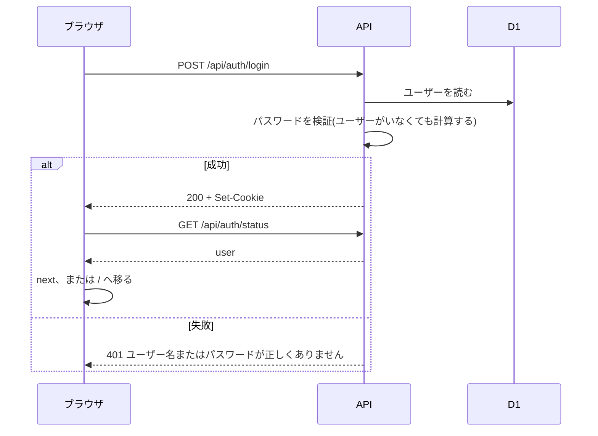
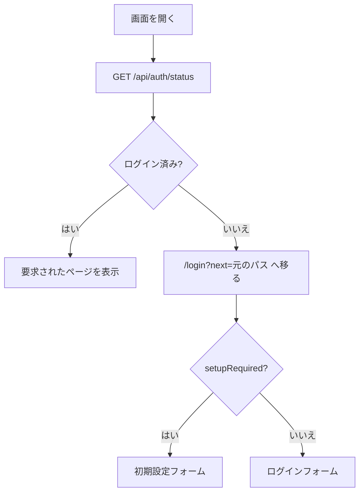

# 機能設計書

## 1. 概要

ログインしないと、画面も API も使えない。ユーザーが1人もいないときだけ、初期設定(最初のオーナーの作成)ができる。ログイン状態は、署名付きの Cookie で保つ。

| 項目 | 内容 |
|---|---|
| 対象機能 | 初期設定、ログイン、ログアウト、セッション(ログイン状態の維持と検証) |
| 関連要件 | なし(全体概要の「未決事項」を参照) |
| 利用者 | 全員(未ログインのユーザーを含む) |

## 2. 機能仕様

| ID | 機能 | 概要 | 入力 | 出力 | 備考 |
|---|---|---|---|---|---|
| FD-01 | 状態の取得 | 初期設定が必要か、ログイン中か、を返す。画面の起動時に1回呼ぶ | なし(Cookie) | `setupRequired`、`user`(未ログインは null) | 未ログインでも使える |
| FD-02 | 初期設定 | 最初のユーザー(オーナー)を作り、そのままログインさせる | ユーザー名、パスワード | ユーザー情報(201)、Cookie | ユーザーが1人もいないときだけ。2回目以降は 409 |
| FD-03 | ログイン | ユーザー名とパスワードを検証し、Cookie を発行する | ユーザー名、パスワード | ユーザー情報、Cookie | 失敗は 401(理由は区別しない) |
| FD-04 | ログアウト | Cookie を消す | なし | `{ ok: true }` | サーバー側にセッションの記録はない |
| FD-05 | セッションの検証 | 全リクエストで、Cookie の署名と期限を検証し、ユーザーを D1 から読み直す | Cookie | ユーザー、または null | ロールの変更・ユーザーの削除が、次のリクエストから反映される |
| FD-06 | パスワードの保護 | パスワードをハッシュ化して保存する | パスワード | ハッシュ文字列 | PBKDF2-SHA256、4万回 |
| FD-07 | 署名キーの管理 | セッションの署名キーを D1 に保存し、無ければ自動生成する | なし | 署名キー | 環境変数・シークレットの設定は不要 |

### 入力の規則

| 項目 | 規則 |
|---|---|
| ユーザー名 | 英数字と `_` `.` `-` の3〜32文字 |
| パスワード | 8〜128文字 |

### セッション

| 項目 | 内容 |
|---|---|
| Cookie 名 | `docbase_session` |
| 属性 | HttpOnly、SameSite=Lax、Path=/、Max-Age 7日。HTTPS のときは Secure |
| 中身 | `<payload>.<署名>`。payload は `{ u: ユーザー名, exp: 有効期限(ミリ秒) }` を base64url にしたもの。署名は HMAC-SHA256 |
| 有効期間 | 7日(発行時に固定。延長しない) |
| 署名キー | D1 の `settings` の `session_secret`。32バイトの乱数(16進)を、初回に自動生成する。同時に作られた場合は、先に保存された方を使う |

### パスワードのハッシュ

| 項目 | 内容 |
|---|---|
| 方式 | PBKDF2-SHA256 |
| 反復回数 | 40,000回(無料プランの CPU 時間に合わせて、推奨値より少ない) |
| 保存形式 | `pbkdf2$sha256$<反復回数>$<ソルト(16進)>$<鍵(16進)>`。反復回数を含むので、あとから変えても古いハッシュを検証できる |
| ソルト | 16バイトの乱数 |
| 比較 | 定数時間で比較する |

## 3. 画面設計

### 画面一覧

| 画面 | 目的 | 主な表示項目 | 主な操作 | 遷移先 |
|---|---|---|---|---|
| ログイン(`/login`) | ログインする | ユーザー名、パスワード、エラー | 「ログイン」 | 成功したら `next` のパス、なければ `/` |
| 初期設定(`/login`、ユーザーがいないとき) | 最初のオーナーを作る | ユーザー名(規則の補足つき)、パスワード、パスワード(確認)、エラー | 「オーナーを作成してログイン」 | 成功したら `/` |

- ログイン画面には、ヘッダーとサイドバーを出さない
- `next` は、`/` で始まり、`//` で始まらないパスだけを使う(外部サイトへのリダイレクトを避ける)
- ログイン済みで `/login` を開くと、`next` または `/` へ移る
- 「初期設定」の説明文: 初期設定です。最初のユーザー(オーナー)を作成してください。他のユーザーは、ログイン後に管理ページのユーザー管理タブで追加できます。
- ログアウトは、ヘッダーの「ログアウト」ボタン。押すと Cookie を消し、`/login` へ移る
- 初期設定のパスワード(確認)が一致しないときは、API を呼ばず、画面で「パスワードが一致しません」を出す

## 4. 処理フロー

### ログイン

- ユーザー名の形式が不正、またはユーザーが存在しない場合も、同じ計算量でハッシュ計算を行い、応答時間からユーザーの有無を推測されないようにする

### 画面の起動とアクセス制御

### リクエストごとの検証

1. Cookie の `docbase_session` を読む
2. 署名(HMAC-SHA256)と有効期限を検証する
3. ユーザー名から、D1 のユーザー(ロール込み)を読む
4. 見つからなければ、未ログインとして扱う(401)

## 5. データ設計

| エンティティ | 項目 | 型 | 必須 | 説明 |
|---|---|---|---|---|
| users | username | TEXT(主キー) | ○ | ユーザー名 |
| users | role | TEXT | ○ | owner / developer / viewer |
| users | password_hash | TEXT | ○ | PBKDF2 のハッシュ |
| users | created_at | TEXT | ○ | ISO 8601 |
| settings | key | TEXT(主キー) | ○ | `session_secret` |
| settings | value | TEXT | ○ | 署名キー(16進の64文字) |

## 6. インターフェース

| 名称 | 種別 | 入力 | 出力 | 備考 |
|---|---|---|---|---|
| GET /api/auth/status | API | なし | `{ setupRequired: boolean, user: { username, role } または null }` | 未ログインでも 200 |
| POST /api/auth/login | API | `{ username, password }` | 200 `{ username, role }` と Set-Cookie | 401: ユーザー名またはパスワードが正しくありません |
| POST /api/auth/setup | API | `{ username, password }` | 201 `{ username, role }` と Set-Cookie | 400: 入力が不正。409: 初期設定はすでに完了しています |
| POST /api/auth/logout | API | なし | `{ ok: true }`。Cookie を消す | |

## 7. エラー処理・例外

| 事象 | 条件 | 画面・応答 | 対応 |
|---|---|---|---|
| ログイン失敗 | ユーザー名またはパスワードが違う | 401。フォームの下に「ユーザー名またはパスワードが正しくありません」 | 入力し直す |
| 入力の形式エラー(初期設定) | ユーザー名が3〜32文字の英数字と `_.-` でない、パスワードが8文字未満 | 400。フォームの下にメッセージ | 入力を直す |
| パスワードの不一致(初期設定) | パスワードと確認が違う | 画面でエラー(API は呼ばない) | 入力を直す |
| 初期設定の重複 | すでにユーザーがいる | 409「初期設定はすでに完了しています」 | ログインする |
| セッション切れ | 7日が過ぎた、署名が不正、ユーザーが削除された | API は 401。画面は、次に認証状態を取得したとき(再読み込み時)にログイン画面へ移る | ログインし直す |
| 状態の取得に失敗 | `/api/auth/status` が失敗(通信エラーなど) | 未ログインとして扱い、ログイン画面へ移る | 再読み込み |

## 8. 未決事項

### セキュリティ

| 項目 | 現状 | 決める内容 |
|---|---|---|
| ログイン試行の回数制限 | なし | 回数制限、ロック、遅延を入れるか |
| パスワードの反復回数 | 4万回。10万回では、本番(無料プラン)で CPU 時間が約 24ms かかった。4万回でも 11〜16ms で、無料プランの上限(10ms)を超えている。超えてもエラーにはなっていないが、上限が実際にどう効くかは未確認 | 反復回数、または有料プランへの移行 |
| 初期設定フォームの公開 | ユーザーがいない間、最初にアクセスした人がオーナーになる | 公開前に自分で初期設定する運用のままにするか、トークンなどで守るか |
| セッションの取り消し | サーバー側にセッションの記録がなく、特定のセッションだけを無効にできない(ユーザーの削除なら無効になる) | 必要か |
| 署名キーの更新 | 自動生成のまま。更新する手順なし | ローテーションの手順 |

### 画面

| 項目 | 現状 | 決める内容 |
|---|---|---|
| セッション切れの画面 | 操作中に 401 になっても、自動ではログイン画面へ移らない | 401 を受けたら、ログイン画面へ移すか |
