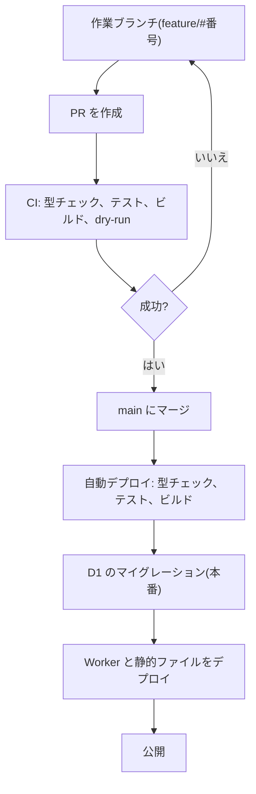
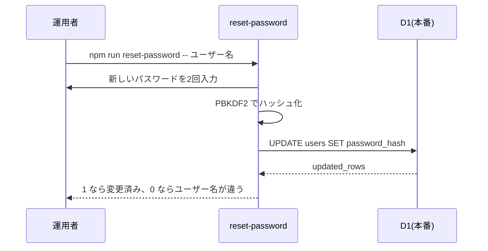

# 機能設計書

## 1. 概要

アプリの公開と運用に関する機能。GitHub Actions による自動デプロイ、D1 のマイグレーション、ドキュメントの同期・書き出し・取り込み、パスワードの再設定、ローカル開発用のアカウント。ドキュメントの正は本番の D1 で、`docs/` はそのスナップショット。コマンドは、すべて `npm run` で実行する。

| 項目 | 内容 |
|---|---|
| 対象機能 | 自動デプロイ(CI/CD)、マイグレーション、ドキュメントの同期・書き出し・取り込み、パスワード再設定、開発用アカウント、バックアップ、ローカル開発 |
| 関連要件 | なし(全体概要の「未決事項」を参照) |
| 利用者 | 運用者(リポジトリの管理者)。Cloudflare への `wrangler login`、または CI の認証情報が必要 |

## 2. 機能仕様

| ID | 機能 | 概要 | 入力 | 出力 | 備考 |
|---|---|---|---|---|---|
| FD-01 | 検証(CI) | PR の時点で、クリーンな Linux 環境で、型チェック・テスト・ビルド・デプロイの dry-run を行う | PR | 成功 / 失敗 | `.github/workflows/ci.yml` |
| FD-02 | 自動デプロイ | `main` への push で、検証したうえで本番へデプロイする | `main` への push、または手動実行 | 本番の更新 | `.github/workflows/deploy.yml` |
| FD-03 | マイグレーション | D1 のテーブル定義を適用する(未適用のものだけ) | `apps/api/migrations/*.sql` | D1 の更新 | `npm run migrate` / `migrate:local` |
| FD-04 | ドキュメントの取り込み | リポジトリの `docs/` を、D1 に取り込む(初期投入、スナップショットからの復元) | `docs/` | D1 の更新 | `npm run import-docs` / `import-docs:local` |
| FD-05 | パスワードの再設定 | ユーザーのパスワードを、コマンドで変更する | ユーザー名、パスワード | D1 の更新 | `npm run reset-password -- <ユーザー名>` |
| FD-06 | 開発用アカウント | ローカルの D1 に、ロール別の3人を作る | なし | D1(ローカル)の更新 | `npm run seed:local` |
| FD-07 | バックアップ | D1 の内容を、SQL に書き出す | なし | SQL ファイル | 手動(`wrangler d1 export`) |
| FD-08 | ローカル開発 | マイグレーションの適用、本番のドキュメントの同期、API と画面の起動を、順に行う | なし | API(8787)、画面(5173) | `npm run dev`。同期を省くときは `npm run dev -- --no-sync` |
| FD-09 | ドキュメントの同期 | 本番の D1 のドキュメント・フォルダ・画像・並び順を、ローカルの D1 に写す(本番 → ローカルの一方向) | 本番の D1 | ローカルの D1 の更新 | `npm run sync-docs`。`npm run dev` の起動時にも実行する |
| FD-10 | ドキュメントの書き出し | D1 のドキュメント・フォルダ・画像・並び順を、`docs/` に書き出す(スナップショット) | D1(既定は本番) | `docs/` のファイル | `npm run export-docs` |

### 構成(Cloudflare)

| 項目 | 内容 |
|---|---|
| Worker | `f-docbase`(`apps/api`)。`/api/*` だけを処理する |
| 静的ファイル | `apps/web/dist` を、Workers の静的アセットとして配信する。未知の URL には `index.html` を返す(SPA) |
| D1 | `f-docbase`(binding は `DB`)。`wrangler.jsonc` に `database_id` を明示している |
| 公開 URL | `https://f-docbase.f-app.workers.dev`(アカウントの `workers.dev` サブドメインは `f-app`) |
| 環境 | 本番のみ(ステージング環境はない) |
| 無料プランの上限 | Workers: 1日10万リクエスト、1リクエストの CPU 10ms。D1: 1日の読み取り 500万行・書き込み 10万行、容量 5GB |

### 自動デプロイ

| 項目 | 内容 |
|---|---|
| 実行の条件 | `main` への push、または手動(workflow_dispatch) |
| 手順 | `npm ci`、型チェック、テスト、画面のビルド、D1 のマイグレーション(本番)、デプロイ。どれかが失敗したら、後続は実行しない |
| 同時実行 | 同じグループ(`deploy`)は、順番に実行する(途中のものは止めない) |
| 認証 | リポジトリのシークレット `CLOUDFLARE_API_TOKEN`(Workers Scripts: Edit、D1: Edit、Account Settings: Read)、`CLOUDFLARE_ACCOUNT_ID` |
| 実行時間の上限 | 15分 |

### コマンド

| コマンド | 内容 | 対象 |
|---|---|---|
| `npm run dev` | ローカルの D1 にマイグレーションを適用し、本番のドキュメントを同期してから、API(`wrangler dev`、8787)を起動し、応答するようになってから、画面(Vite、5173)を起動する。画面は `/api` を API に転送する。`-- --no-sync` で同期を省く | ローカル |
| `npm test` / `npm run typecheck` | テスト / 型チェック | |
| `npm run build` | 画面のビルド | |
| `npm run deploy` | 画面をビルドして、Worker と静的ファイルを公開する | 本番 |
| `npm run migrate` / `migrate:local` | マイグレーションの適用 | 本番 / ローカル |
| `npm run import-docs` / `import-docs:local` | `docs/` の取り込み | 本番 / ローカル |
| `npm run sync-docs` | 本番のドキュメントを、ローカルの D1 に同期 | 本番(読み取り)→ ローカル |
| `npm run export-docs` / `export-docs -- --local` | D1 のドキュメントを、`docs/` に書き出す。`-- --prune` で、D1 にないファイルを削除 | 本番 / ローカル |
| `npm run reset-password -- <ユーザー名> [パスワード]` / `reset-password:local` | パスワードの再設定 | 本番 / ローカル |
| `npm run seed:local` | 開発用アカウントの作成 | ローカルのみ |

### ドキュメントの正と、同期・書き出し

- **正は、本番の D1。** 画面での作成・編集・移動・並び替えは、D1 に反映される。`docs/` は、D1 から書き出したスナップショット(Git の履歴、バックアップ、再現用)
- 同期(`sync-docs`)は、本番 → ローカルの一方向。ローカルのドキュメント・フォルダ・画像を全部消してから、本番の内容を入れる(ローカルで編集した内容は失われる)。ユーザー情報は、同期しない(開発用アカウントは、`seed:local`)
- 同期では、本番を読み取るだけで、書き込まない。本番に接続できないとき(未ログイン、オフライン)は、`npm run dev` は警告を出して、ローカルの D1 のまま起動する
- 本番にまだない列(例: 並び順)は、ローカルの既定値になる
- 書き出し(`export-docs`)は、1ドキュメントを `docs/<id>.md`(frontmatter に title、tags、updated)に、画像を `docs/assets/` に、フォルダの一覧と並び順を `docs/_order.json` に書く。書き出し先は `--dir <パス>` で変えられる
- D1 にないファイルは、既定では残して知らせる。`--prune` で削除する。D1 にドキュメントが1件もないときは、取り違えを避けるため、何も書き換えない
- 本番にまだ取り込んでいないドキュメントが `docs/` にあるときに、`--prune` で書き出すと、そのファイルが消える。先に `import-docs` で、本番に投入すること

### ドキュメントの取り込み

- `docs/` 配下の `.md` を、1ファイル1ドキュメントとして取り込む。id は、`docs/` からの相対パス(拡張子なし)
- frontmatter の `title`、`tags`、`updated` を使う。`title` がなければファイル名、`updated` がなければファイルの更新日時
- 空のフォルダも含め、ディレクトリを、フォルダとして保存する(`docs/assets` を除く)
- `docs/assets/` の画像は、元のファイル名のまま取り込む(1MB を超えるものは、スキップする)。対応する拡張子は、png、jpg、jpeg、gif、webp、svg
- 同じ id のドキュメント・画像は、上書きする(ドキュメントは、タイトル・タグ・本文・更新日時だけを更新し、管理画面で設定した並び順は変えない)。D1 にしかないものは、消さない
- `docs/_order.json` があれば、D1 にまだない行(ドキュメント・フォルダ)の並び順に使う。すでにある行の並び順は、変えない。空のフォルダも、ここから復元する
- 既定の対象は本番。`--local`(`import-docs:local`)でローカル。`--dir <パス>` で、取り込み元を変えられる

### パスワードの再設定

- 既定の対象は本番(リモート)の D1。実行時に「対象: 本番(リモート) の D1 / ユーザー: <名前>」と表示する
- パスワードは、引数でも、実行後の入力でも渡せる。入力は、画面に表示されず、履歴にも残らない(端末のときだけ。2回入力して照合する)
- パスワードは 8〜128文字。API と同じ方式(PBKDF2、4万回)で、ハッシュ化する
- 該当するユーザーがいないときは、何も更新せず、`updated_rows` が 0 になる
- オーナー自身がパスワードを忘れたときの、唯一の手段(オーナー以外は、オーナーが管理ページで変更できる)

### 開発用アカウント

| ユーザー名 | ロール | パスワード |
|---|---|---|
| `dev-owner` | オーナー | `password-1` |
| `dev-developer` | 開発メンバー | `password-1` |
| `dev-viewer` | 一般メンバー | `password-1` |

- ローカルの D1 にだけ作る。引数を受け付けず、本番を対象にできない
- すでにいるユーザーは、変更しない(何度実行しても安全)
- 先に `npm run migrate:local` でテーブルを作る

## 3. 画面設計

対象外(コマンドと CI のみ)。

## 4. 処理フロー

### 開発から公開まで

### パスワードの再設定

## 5. データ設計

| エンティティ | 項目 | 型 | 必須 | 説明 |
|---|---|---|---|---|
| マイグレーション | ファイル名 | `NNNN_名前.sql` | ○ | `apps/api/migrations/`。適用済みは、wrangler が D1 の `d1_migrations` で管理する |
| settings | session_secret | TEXT | ○ | 最初に必要になったとき(初期設定またはログイン)に自動生成される署名キー。バックアップに含まれる |

- バックアップ(SQL)には、パスワードのハッシュと署名キーが含まれる。扱いに注意する

## 6. インターフェース

| 名称 | 種別 | 入力 | 出力 | 備考 |
|---|---|---|---|---|
| GitHub Actions: CI | CI | PR | 成功 / 失敗 | Cloudflare の認証は不要 |
| GitHub Actions: Deploy | CI/CD | `main` への push | デプロイ | シークレットが必要 |
| `wrangler d1 export f-docbase --remote --output backup.sql` | CLI | なし | SQL ファイル | バックアップ(手動) |
| `wrangler tail f-docbase` | CLI | なし | リクエストのログ(CPU 時間つき) | 調査用 |

## 7. エラー処理・例外

| 事象 | 条件 | 画面・応答 | 対応 |
|---|---|---|---|
| CI の失敗 | 型チェック・テスト・ビルド・dry-run が失敗 | PR に失敗が表示される | ログを見て直す(クリーンな環境で再現する) |
| デプロイの失敗 | 検証・マイグレーション・デプロイのどれかが失敗 | Actions が失敗。本番は直前の版のまま | ログを見て直し、再実行する |
| シークレットの未設定 | `CLOUDFLARE_*` がない | マイグレーションの手順で失敗(デプロイされない) | シークレットを登録して、手動で再実行する |
| パスワード再設定の対象違い | ユーザー名が違う | `updated_rows` が 0 | ユーザー名を確認する |
| 取り込みの失敗 | 未ログイン(wrangler)、テーブルがない | wrangler のエラー | `wrangler login`、`migrate` を先に実行する |
| 開発用アカウントを本番に作ろうとした | 引数(`--remote` など)を付けた | 「引数は受け付けません」で止まる | なし |
| ローカル専用の確認 | `.wrangler/` の状態が古い | テーブルがない、などのエラー | `npm run migrate:local` を実行する |

## 8. 未決事項

### 運用

| 項目 | 現状 | 決める内容 |
|---|---|---|
| バックアップの自動化 | 手動で書き出す。自動の取得・保管はない | 頻度、保管先 |
| 監視・アラート | なし | 死活・エラーの監視、通知先 |
| ステージング環境 | なし(PR の CI は、デプロイしない) | 必要か |
| ロールバック | 以前のコミットを、再度デプロイする(D1 の変更は戻らない) | 手順 |
| スナップショットの更新 | `npm run export-docs` を、手で実行して、差分をコミットする | 定期的に自動で書き出す(例: GitHub Actions で PR を作る)か |
| ローカルで編集したドキュメント | `npm run dev` の起動時に、本番の内容に置き換わる | ローカルの編集を、本番へ反映する方法が必要か(今は、本番の画面で編集する) |
| 同期する範囲 | ドキュメント・フォルダ・画像・並び順。ユーザー情報は対象外 | 画像が増えたときの、同期の時間と容量(全件を入れ替える) |
| パスワードのハッシュの CPU 時間 | ログイン・ユーザー作成が 11〜16ms で、無料プランの上限(10ms)を超える。超えてもエラーにはなっていない | 反復回数、プランの見直し |

### 検証

| 項目 | 現状 | 決める内容 |
|---|---|---|
| 画面の自動テスト | なし(API はテストあり、画面は手動で確認) | E2E テストを入れるか |
| 対話入力の確認 | `reset-password` の対話入力(端末が必要)は、自動では確認していない | 確認方法 |
