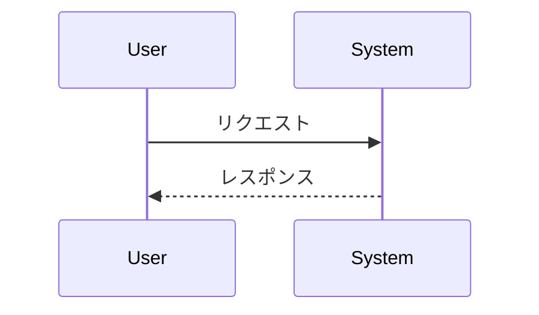

# 設計書

## 1. 概要

## 2. アーキテクチャ

```mermaid
flowchart LR
  Client --> Server --> Storage
```

## 3. データ設計

## 4. 画面 / API設計

## 5. 処理フロー

```mermaid
sequenceDiagram
  participant U as User
  participant S as System
  U->>S: リクエスト
  S-->>U: レスポンス
```

## 6. エラー処理・例外

## 7. テスト方針
